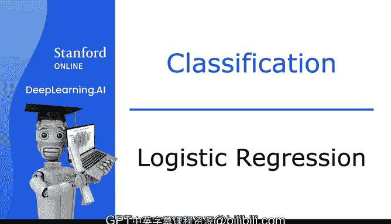
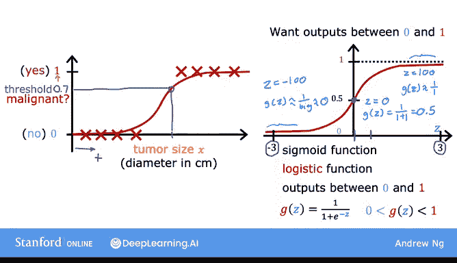
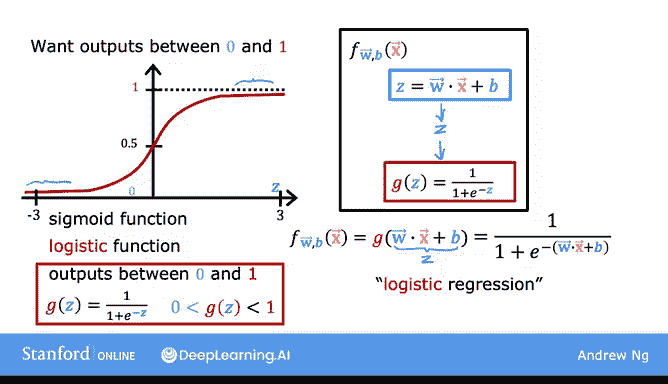
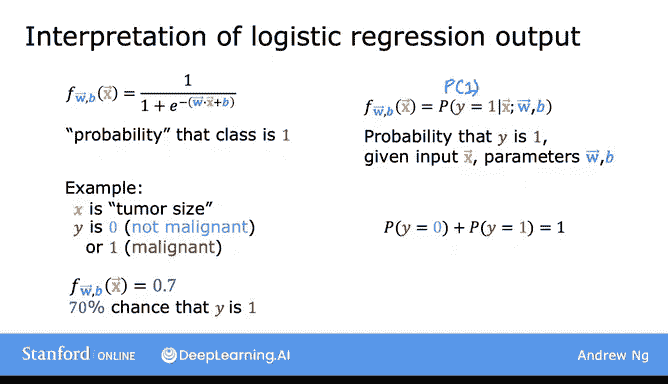
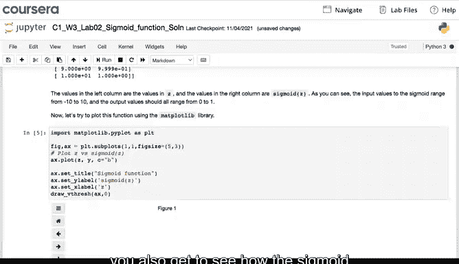
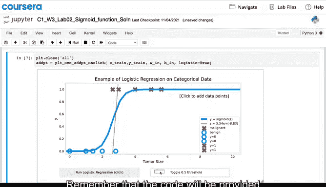
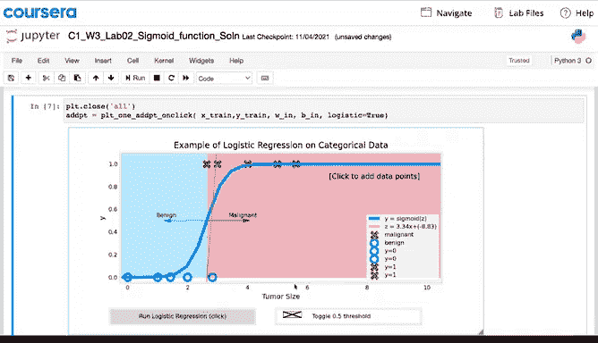

# 32：逻辑回归算法详解 🧠

在本节课中，我们将要学习逻辑回归算法。逻辑回归是应用最广泛的分类算法之一，常用于预测二元结果（如是/否、恶性/良性等）。我们将从线性回归的局限性出发，逐步构建逻辑回归模型，并解释其输出含义。

---

## 从线性回归到逻辑回归

上一节我们介绍了线性回归在分类问题上的局限性。本节中我们来看看逻辑回归如何解决这个问题。

逻辑回归会为数据集拟合一条S形曲线。例如，在肿瘤分类问题中，横轴表示肿瘤大小，纵轴表示分类结果（0代表良性，1代表恶性）。逻辑回归模型会输出一个介于0和1之间的值，表示肿瘤为恶性的概率。

---

## Sigmoid函数：逻辑回归的核心

逻辑回归算法的核心是一个重要的数学函数，称为Sigmoid函数（或Logistic函数）。

Sigmoid函数的形状呈S形，其输出值始终在0和1之间。如果用`g(z)`表示该函数，其公式为：

**`g(z) = 1 / (1 + e^(-z))`**

其中，`e`是自然常数，约等于2.7。

以下是Sigmoid函数的关键特性：
*   当`z`非常大时，`e^(-z)`趋近于0，因此`g(z)`趋近于1。
*   当`z`非常小（负值很大）时，`e^(-z)`变得非常大，因此`g(z)`趋近于0。
*   当`z = 0`时，`g(z)`等于0.5。

---

## 构建逻辑回归模型

现在，我们使用Sigmoid函数来构建逻辑回归模型。这个过程分为两步。

第一步，我们计算线性函数：
**`z = w · x + b`**

第二步，将`z`的值传递给Sigmoid函数`g`：
**`f(x) = g(z) = g(w · x + b)`**

将两个公式结合，就得到了逻辑回归模型：
**`f(x) = 1 / (1 + e^(- (w · x + b)))`**

该模型输入特征`x`，输出一个介于0和1之间的数字。

---

## 理解逻辑回归的输出

让我们回到肿瘤分类的例子，理解逻辑回归输出的含义。

逻辑回归的输出`f(x)`可以解释为：在给定输入特征`x`的条件下，标签`y`等于1的概率。在数学上，这可以表示为：
**`f(x) = P(y = 1 | x; w, b)`**

例如，如果一位患者的肿瘤大小为某个值`x`，模型输出0.7。这意味着模型预测该患者的肿瘤有70%的可能性是恶性的（即`y=1`）。相应地，肿瘤为良性（`y=0`）的概率就是30%，因为两者概率之和必须为1。

---

## 代码实现与可视化

在紧随本视频的选修实验课中，你将看到Sigmoid函数在代码中是如何实现的。

你将看到使用Sigmoid函数绘制的图形，它能在分类任务上取得比之前实验更好的效果。代码已提供，你只需运行即可。

建议你查看并熟悉这些代码，以加深对算法的理解。

---

## 总结与预告

本节课中我们一起学习了逻辑回归模型及其数学定义。逻辑回归是一个强大且应用广泛的算法，历史上甚至主导了相当长时间的互联网广告投放决策。

关于这个算法还有更多内容需要学习。在下一个视频中，我们将深入探讨逻辑回归的细节，观察一些可视化结果，并研究一个称为“决策边界”的概念。这将帮助我们理解如何将模型输出的数字（如0.3、0.7）映射到实际的预测类别（0或1）。

让我们进入下一个视频，继续学习逻辑回归。😊