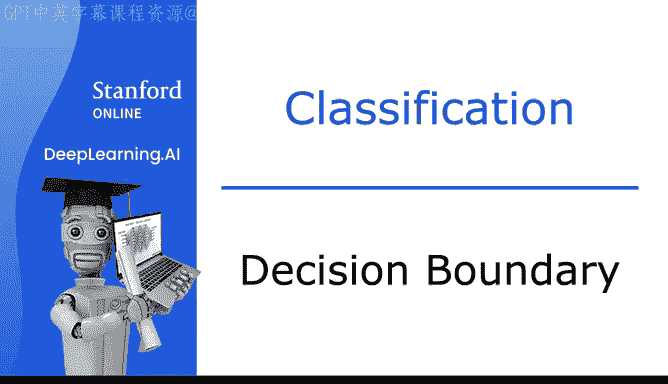
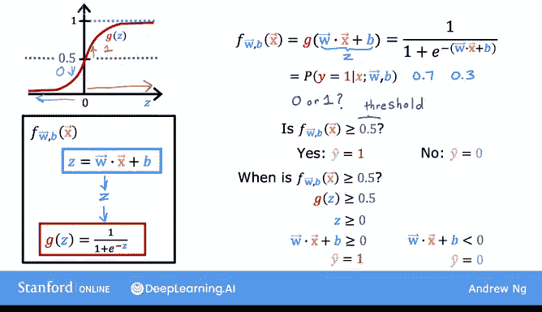
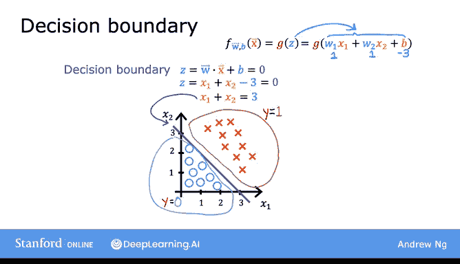
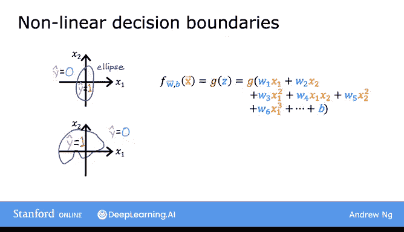
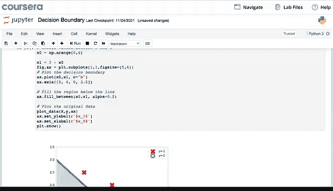
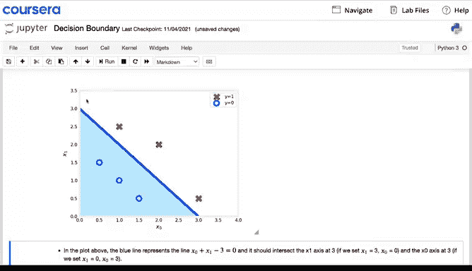

# 33：决策边界 🧠

在本节课中，我们将学习逻辑回归模型中的**决策边界**概念。我们将探讨模型如何根据输入特征预测输出类别（0或1），并理解决策边界如何随模型参数和特征形式的变化而变化。

---

## 概述

上一节我们介绍了逻辑回归模型的基本原理。本节中，我们将深入探讨**决策边界**，以更好地理解逻辑回归模型如何进行预测计算。

逻辑回归模型的输出计算分为两步：

1.  计算 **z = w·x + b**
2.  将 **sigmoid函数 g(z)** 应用于 z 值

sigmoid函数的公式为：
**g(z) = 1 / (1 + e^{-z})**

因此，模型的输出可以写为：
**f(x) = g(z) = g(w·x + b)**

我们将其解释为在给定输入 x 和参数 w、b 的条件下，y=1 的概率。

---

## 预测规则

为了将概率输出转换为具体的类别预测（0或1），我们需要设定一个阈值。常见的做法是选择 **0.5** 作为阈值。

以下是预测规则：
*   如果 **f(x) ≥ 0.5**，则预测 **ŷ = 1**。
*   如果 **f(x) < 0.5**，则预测 **ŷ = 0**。

接下来，我们分析模型何时会预测 y=1。

---

## 决策边界的推导

由于 f(x) = g(z)，因此 f(x) ≥ 0.5 等价于 g(z) ≥ 0.5。

观察 sigmoid 函数图像可知，当 **z ≥ 0** 时，g(z) ≥ 0.5。
而 z = w·x + b，所以条件 z ≥ 0 等价于 **w·x + b ≥ 0**。

由此，我们得到核心预测规则：
*   模型预测 **ŷ = 1**，当且仅当 **w·x + b ≥ 0**。
*   模型预测 **ŷ = 0**，当且仅当 **w·x + b < 0**。

**决策边界** 正是由方程 **w·x + b = 0** 定义的直线（或曲线），它将特征空间划分为预测为1和预测为0的两个区域。

---

## 线性决策边界示例

假设我们有一个包含两个特征（x1, x2）的分类问题训练集。红色叉号代表正例（y=1），蓝色圆圈代表负例（y=0）。

逻辑回归模型使用函数 **f(x) = g(z)** 进行预测，其中 **z = w1·x1 + w2·x2 + b**。

假设参数值为：**w1 = 1, w2 = 1, b = -3**。

那么，决策边界由下式决定：
**w·x + b = 0 → x1 + x2 - 3 = 0 → x1 + x2 = 3**

在二维平面上，这是一条直线。模型预测如下：
*   在直线 **x1 + x2 = 3** 的**右侧**区域，模型预测 **ŷ = 1**。
*   在直线**左侧**区域，模型预测 **ŷ = 0**。

这个例子展示了当使用线性特征时，逻辑回归的决策边界是一条直线。

---

## 非线性决策边界

通过引入多项式特征，逻辑回归可以学习更复杂的非线性决策边界。

考虑一个更复杂的例子，我们定义 z 为：
**z = w1·x1² + w2·x2² + b**

假设我们选择参数：**w1 = 1, w2 = 1, b = -1**。

那么，决策边界（z=0）由下式决定：
**x1² + x2² - 1 = 0 → x1² + x2² = 1**

在二维平面上，这是一个**圆形**。
*   在圆**外**（x1² + x2² ≥ 1），模型预测 **ŷ = 1**。
*   在圆**内**（x1² + x2² < 1），模型预测 **ŷ = 0**。

---

## 更复杂的决策边界

通过使用更高阶的多项式特征，我们可以得到更复杂的决策边界。

例如，定义 z 为：
**z = w1·x1 + w2·x2 + w3·x1² + w4·x1·x2 + w5·x2² + b**

通过调整参数，决策边界可以变成**椭圆**或其他更复杂的形状。模型可以预测 y=1 在形状内部，y=0 在形状外部。

**关键点**：如果只使用原始特征（如 x1, x2），决策边界将始终是线性的（一条直线）。只有引入多项式特征，才能获得非线性的决策边界。

---

## 总结

本节课中，我们一起学习了逻辑回归中的**决策边界**。

*   决策边界是模型用于区分预测类别（0或1）的分界线，由方程 **w·x + b = 0** 定义。
*   预测规则很简单：在边界一侧预测1，另一侧预测0。
*   决策边界的形状取决于**模型参数 (w, b)** 和所使用的**特征形式**。
*   使用原始线性特征时，决策边界是**直线**。
*   通过引入**多项式特征**，逻辑回归可以学习**圆形、椭圆形**等复杂的非线性决策边界，从而拟合更复杂的数据模式。

理解决策边界有助于我们直观地看到逻辑回归模型是如何根据输入做出决策的。在接下来的课程中，我们将学习如何通过定义成本函数和应用梯度下降来训练逻辑回归模型。