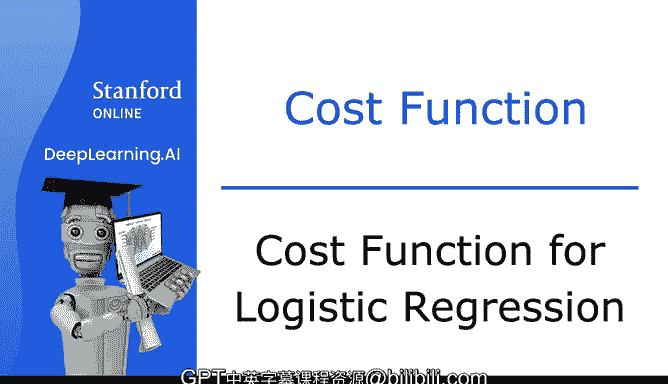
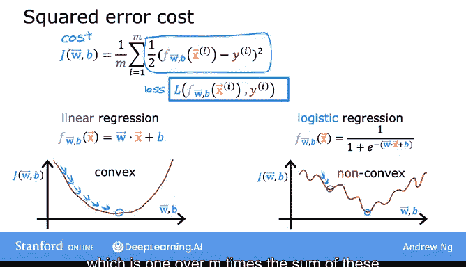
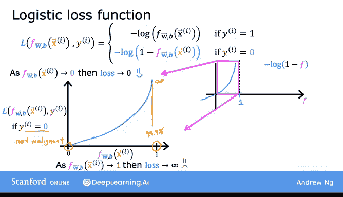
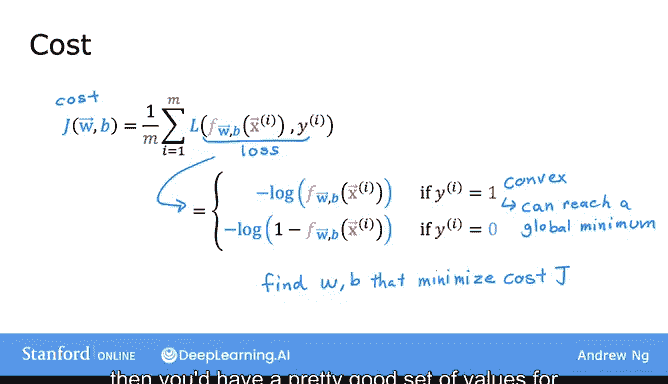
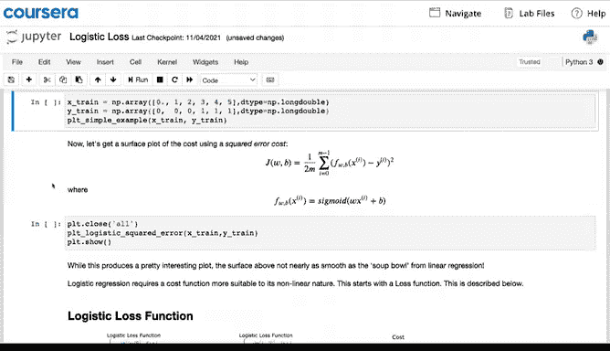
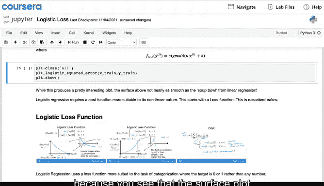
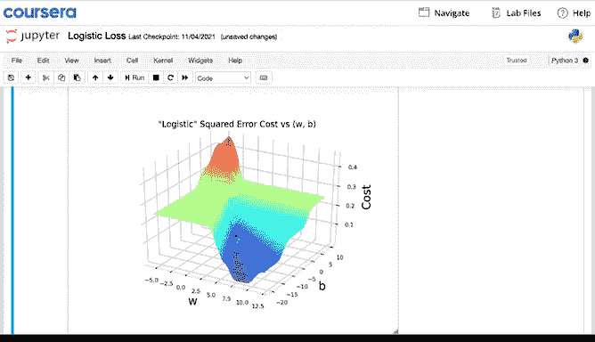

# 34：逻辑回归的成本函数 📊

在本节课中，我们将学习逻辑回归的成本函数。我们将了解为什么线性回归中使用的平方误差成本函数不适用于逻辑回归，并引入一个新的、更合适的成本函数。这个新的成本函数能确保梯度下降法可以有效地找到全局最优解。

---

## 为什么平方误差成本函数不适用？🤔

上一节我们介绍了逻辑回归模型。本节中我们来看看如何为它选择合适的成本函数。

成本函数用于衡量模型参数与训练数据的拟合程度，并指导我们选择更好的参数。在线性回归中，我们使用**平方误差成本函数**，其公式如下（为简化后续数学推导，将1/2置于求和符号内）：

$$J(w,b) = \frac{1}{m} \sum_{i=1}^{m} \frac{1}{2}(f_{w,b}(x^{(i)}) - y^{(i)})^2$$

对于线性模型 $f_{w,b}(x) = w \cdot x + b$，这个成本函数是**凸函数**（呈碗状），梯度下降可以顺利找到全局最小值。

然而，如果将其直接用于逻辑回归模型 $f_{w,b}(x) = \frac{1}{1 + e^{-(w \cdot x + b)}}$，绘制出的成本函数图像将不再是凸函数，而是**非凸函数**，表面崎岖不平，存在许多局部最小值。这会导致梯度下降算法容易陷入局部最优，而无法找到全局最佳参数。

因此，我们需要为逻辑回归设计一个不同的成本函数，使其保持凸性。

---

## 构建逻辑回归的损失函数 🧱

为了构建新的成本函数，我们首先定义**单个训练样本的损失**。损失函数 $L$ 衡量模型预测值 $f(x)$ 与真实标签 $y$ 之间的差异。

对于逻辑回归，我们使用以下损失函数定义：
- 当真实标签 $y = 1$ 时，损失为：$L(f(x), y) = -\log(f(x))$
- 当真实标签 $y = 0$ 时，损失为：$L(f(x), y) = -\log(1 - f(x))$

以下是关于这个损失函数工作原理的详细解释。

### 情况一：当 $y = 1$ 时 📈

我们首先分析当真实标签为1时，损失函数 $-\log(f(x))$ 的行为。

由于逻辑回归的输出 $f(x)$ 始终在0到1之间（表示概率），我们只需关注该区间内的函数图像。当 $f(x)$ 接近1（即预测正确）时，损失值非常小，接近0。随着 $f(x)$ 减小（预测准确性下降），损失值迅速增大。例如：
- 若模型预测 $f(x)=0.9$，损失很小。
- 若模型预测 $f(x)=0.1$，损失会非常大。

这激励模型在面对 $y=1$ 的样本时，做出更接近1的预测。

### 情况二：当 $y = 0$ 时 📉

接下来，我们分析当真实标签为0时，损失函数 $-\log(1 - f(x))$ 的行为。

此时，逻辑与 $y=1$ 时相反。当 $f(x)$ 接近0（预测正确）时，损失值很小。当 $f(x)$ 接近1（预测完全错误）时，损失值会变得极大，甚至趋近于无穷大。

这同样激励模型在面对 $y=0$ 的样本时，做出更接近0的预测。

综上所述，这个损失函数有效地惩罚了错误的预测，并且惩罚力度随着错误程度的增加而增大。

---

## 从损失函数到成本函数 ⚙️

上一节我们定义了单个样本的损失。本节中，我们将基于此定义整个训练集的成本函数。

成本函数 $J(w, b)$ 是所有训练样本损失的平均值：

$$J(w,b) = \frac{1}{m} \sum_{i=1}^{m} L(f_{w,b}(x^{(i)}), y^{(i)})$$

其中，损失 $L$ 根据 $y$ 的值采用我们刚刚定义的两部分形式。

可以证明，选择这样的损失函数形式，能够使得最终的整体成本函数 $J(w, b)$ 是一个**凸函数**。这意味着梯度下降法可以可靠地收敛到全局最小值（严格的凸性证明超出了本课程范围）。

在后续的编程练习中，你将直观地看到：
- 使用平方误差成本函数会导致一个布满局部最小值的、不平滑的成本曲面。
- 而使用新的逻辑回归损失函数，则会得到一个**平滑的凸曲面**，非常适合梯度下降优化。

---

## 总结 🎯

本节课中我们一起学习了逻辑回归的成本函数。

1.  **核心问题**：线性回归的平方误差成本函数不适用于逻辑回归，因为它会导致非凸的成本曲面，阻碍梯度下降找到最优解。
2.  **解决方案**：为逻辑回归引入了新的损失函数：
    - 当 $y=1$ 时：$L = -\log(f(x))$
    - 当 $y=0$ 时：$L = -\log(1 - f(x))$
3.  **最终成本函数**：整个训练集的成本是每个样本损失的平均值：$J(w,b) = \frac{1}{m} \sum_{i=1}^{m} L(f_{w,b}(x^{(i)}), y^{(i)})$。
4.  **优势**：此成本函数是凸函数，确保了梯度下降法的有效性。

在下一节课中，我们将对这个成本函数进行简化书写，并推导出梯度下降的更新公式，从而实际应用于逻辑回归的参数训练。