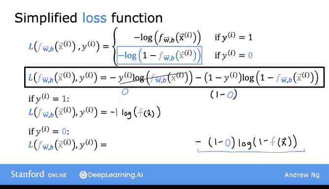
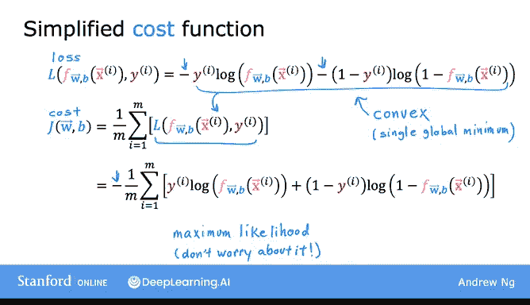
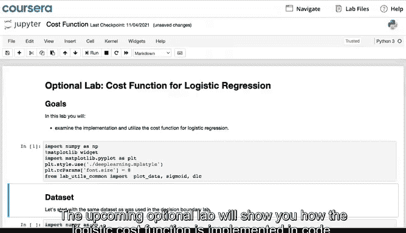
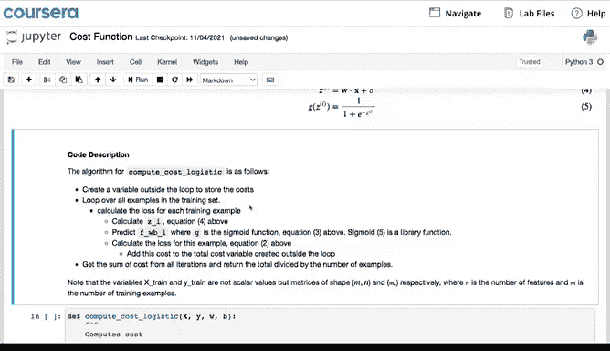
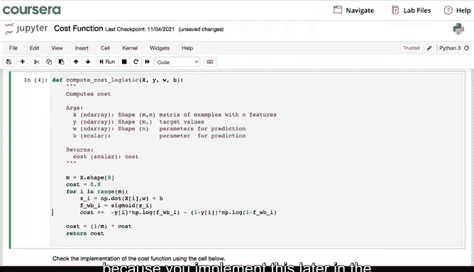
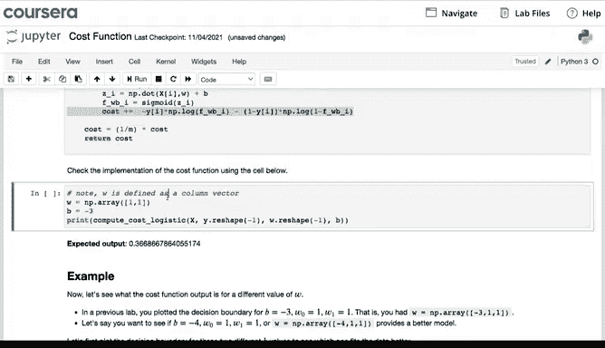
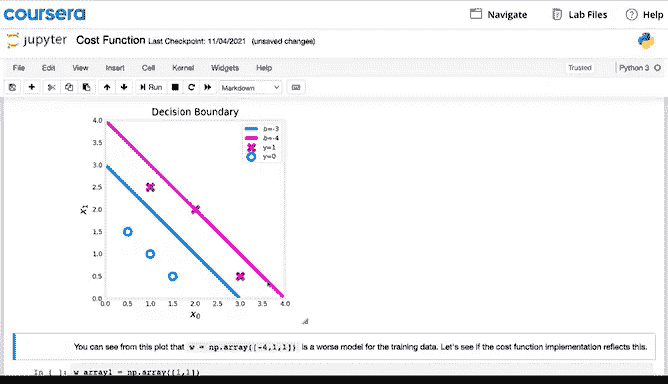

# 35：逻辑回归的简化成本函数 📉

## 概述

在本节课中，我们将学习如何用一种更简洁的方式来表达逻辑回归的损失函数和成本函数。这种简化形式将使我们在后续使用梯度下降法拟合逻辑回归模型参数时，实现起来更加简便。

---

## 回顾：逻辑回归的损失函数

上一节我们介绍了逻辑回归的损失函数。作为回顾，其原始定义如下：

**当 y=1 时：**
`loss = -log(f(x))`

**当 y=0 时：**
`loss = -log(1 - f(x))`

其中，`f(x)` 是模型的预测值（即 `g(z)`，sigmoid函数的输出），`y` 是真实标签（0 或 1）。

---

## 简化损失函数

由于我们处理的是二元分类问题，`y` 的值只能是 0 或 1。利用这个特性，我们可以将上述分段定义的损失函数合并成一个统一的表达式。

给定预测值 `f(x)` 和真实标签 `y`，简化的损失函数可以写为：

**损失函数公式：**
`loss = -[ y * log(f(x)) + (1 - y) * log(1 - f(x)) ]`

这个单行表达式与之前的分段定义是完全等价的。下面我们来验证一下。

以下是验证过程：

*   **情况一：当 y = 1 时**
    公式变为：`loss = -[ 1 * log(f(x)) + 0 * log(1 - f(x)) ] = -log(f(x))`
    这与原始定义中 `y=1` 的情况一致。

*   **情况二：当 y = 0 时**
    公式变为：`loss = -[ 0 * log(f(x)) + 1 * log(1 - f(x)) ] = -log(1 - f(x))`
    这与原始定义中 `y=0` 的情况一致。

由此可见，无论 `y` 是 1 还是 0，这个统一的简化公式都能给出正确的结果，从而避免了分段讨论的复杂性。

---

## 推导逻辑回归的成本函数

上一节我们介绍了损失函数是针对单个训练样本的，本节我们来看看如何基于简化的损失函数，推导出整个训练集的成本函数。

成本函数 `J` 是全部 `m` 个训练样本损失的平均值。将我们刚刚得到的简化损失函数代入，可以得到：

**成本函数公式：**
`J(w, b) = -(1/m) * Σ [ y^(i) * log(f(x^(i))) + (1 - y^(i)) * log(1 - f(x^(i))) ]`

其中，求和符号 `Σ` 表示对 `i` 从 1 到 `m` 的所有训练样本进行累加。

这个公式就是逻辑回归最常用的成本函数。你可能会问，为什么选择这个特定的函数？这里简要说明一下，这个成本函数源于统计学中的**最大似然估计**原理，它能有效地为模型寻找参数，并且具有**凸函数**的良好性质，这确保了梯度下降等优化算法能找到全局最优解。关于最大似然估计的细节，本课程不做深入探讨。

---

## 代码实现与可视化

在接下来的可选实验课中，你将看到如何在代码中实现这个逻辑回归成本函数。强烈建议你查看该实验，因为你将在本周的练习中亲自实现它。

该实验还会展示，选择不同的参数会导致不同的成本计算结果。例如，在图中你可以看到，拟合效果更好的蓝色决策边界所对应的成本，要低于品红色决策边界所对应的成本。这直观地验证了成本函数作为模型性能评估指标的有效性。

---

## 总结

本节课中我们一起学习了：
1.  如何将逻辑回归的分段损失函数，统一简化为一个简洁的表达式：`loss = -[ y * log(f(x)) + (1 - y) * log(1 - f(x)) ]`。
2.  如何基于简化损失函数，推导出逻辑回归的成本函数：`J = -(1/m) * Σ [ y^(i) * log(f(x^(i))) + (1 - y^(i)) * log(1 - f(x^(i))) ]`。
3.  了解到该成本函数源于最大似然估计，并具有凸性质。

掌握了这个简化的成本函数，我们现在已经准备好进入下一阶段：**应用梯度下降法来训练逻辑回归模型**。让我们在下一个视频中继续学习。