# 36：逻辑回归的梯度下降实现 🚀

在本节课中，我们将要学习如何使用梯度下降算法来训练逻辑回归模型。我们将找到能够最小化成本函数的参数 **W** 和 **B**，并理解其与线性回归在实现上的关键区别。

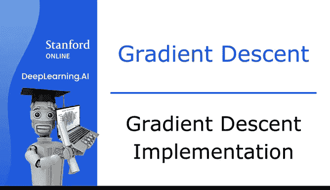

---

## 概述 📋

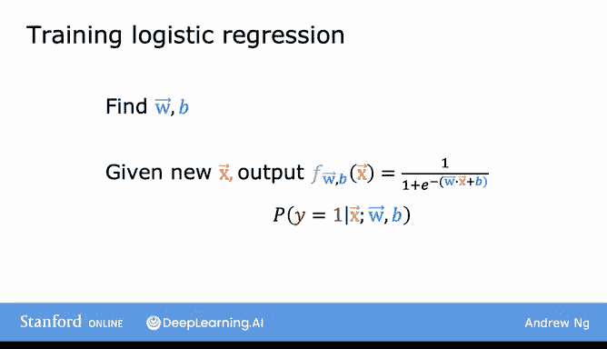

为了拟合逻辑回归模型的参数，我们需要找到能够最小化成本函数 **J(W, B)** 的参数 **W** 和 **B** 的值。我们将再次应用梯度下降算法来实现这一目标。

上一节我们介绍了逻辑回归的成本函数，本节中我们来看看如何通过梯度下降来优化参数。

## 梯度下降算法 🔄

可用于最小化成本函数的算法是梯度下降。

成本函数如下，如果你想将成本 **J** 作为 **W** 和 **B** 的函数最小化，那么通常的梯度下降算法是：重复更新每个参数，新值等于旧值减去学习率 **α** 乘以对应的导数项。

以下是参数更新公式：
*   **W** 的更新：`W_j := W_j - α * (∂J/∂W_j)`
*   **B** 的更新：`b := b - α * (∂J/∂b)`

让我们具体看看这些导数项。

## 计算导数 🧮

首先，我们来看成本函数 **J** 对 **W_j** 的导数。

经过微积分运算可以证明，成本函数 **J** 对 **W_j** 的导数等于以下表达式：
`∂J/∂W_j = (1/m) * Σ (f(x^(i)) - y^(i)) * x_j^(i)`
其中，求和从 `i=1` 到 `m`（`m` 是训练样本数）。这里的 `x_j^(i)` 是第 `i` 个训练样本的第 `j` 个特征。

接下来，我们看成本函数 **J** 对参数 **B** 的导数。

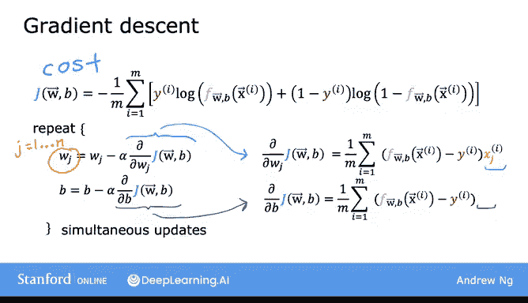

结果如下，它与上面的表达式非常相似，只是末尾没有乘以 `x_j^(i)`：
`∂J/∂b = (1/m) * Σ (f(x^(i)) - y^(i))`

需要提醒的是，与线性回归类似，执行这些更新的方式是使用**同步更新**。这意味着你需要首先为所有更新计算等式的右边部分，然后同时覆盖左边所有的值。

## 逻辑回归的梯度下降公式 📝

现在，让我将这些导数表达式代入到更新项中，就得到了逻辑回归的梯度下降算法。

以下是完整的更新规则：
*   **W_j 更新**：`W_j := W_j - α * [(1/m) * Σ (f(x^(i)) - y^(i)) * x_j^(i)]`
*   **B 更新**：`b := b - α * [(1/m) * Σ (f(x^(i)) - y^(i))]`

你可能会觉得奇怪：这两个方程看起来和之前线性回归的方程一模一样。那么，线性回归和逻辑回归实际上是一样的吗？

## 与线性回归的关键区别 ⚠️

尽管这些方程看起来相同，但这**不是**线性回归，因为函数 **f(x)** 的定义发生了变化。

*   在线性回归中：`f(x) = w·x + b`
*   在逻辑回归中：`f(x) = sigmoid(w·x + b)`

因此，虽然为线性回归和逻辑回归写出的算法看起来相同，但它们实际上是两个非常不同的算法，因为 **f(x)** 的定义不同。

## 监控收敛与加速技巧 ⚡

之前讨论线性回归的梯度下降时，你看到了如何监控梯度下降以确保其收敛。你可以将相同的方法应用于逻辑回归，以确保它也能收敛。

我之前写出的更新公式看起来像是每次更新一个参数 **W_j**。与讨论线性回归的向量化实现类似，你也可以使用**向量化**来使逻辑回归的梯度下降运行得更快。本视频不深入探讨向量化实现的细节，但你可以在可选实验中学到更多并查看代码。

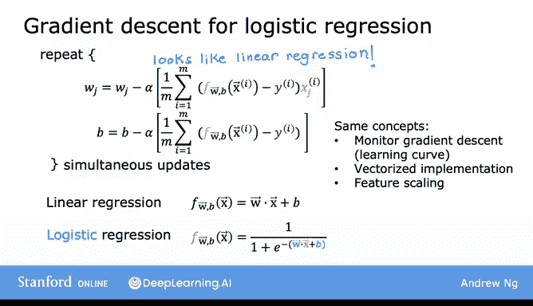

你可能还记得在线性回归中使用过的**特征缩放**。特征缩放（即将所有特征缩放到相似的值范围，例如在 -1 和 +1 之间）可以帮助梯度下降更快地收敛。以相同方式应用特征缩放来使不同特征具有相似的值范围，也可以加速逻辑回归的梯度下降。

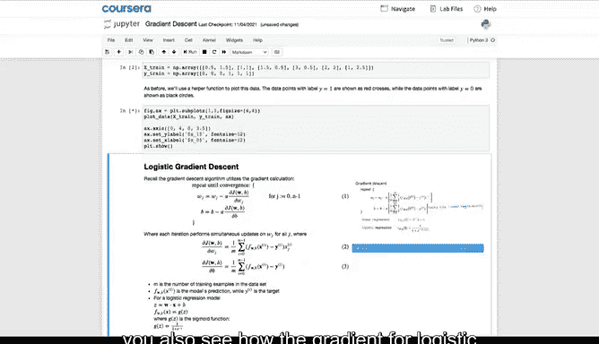

## 实验与实践 🔬

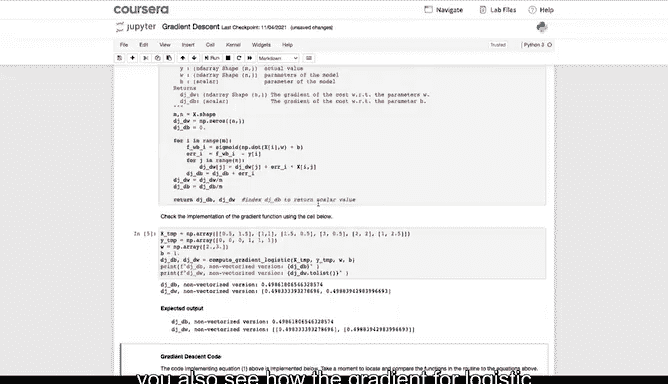

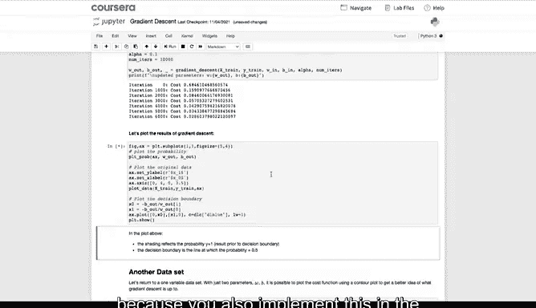

在即将进行的可选实验中，你将看到如何在代码中计算逻辑回归的梯度。这非常有用，因为你将在本周的练习实验中实现它。

在实验室中运行梯度下降后，将会有一组漂亮的动画图展示梯度下降的运行过程。你将看到 Sigmoid 函数、成本函数的等高线图、成本函数的三维曲面图以及学习曲线随着梯度下降运行而演变。

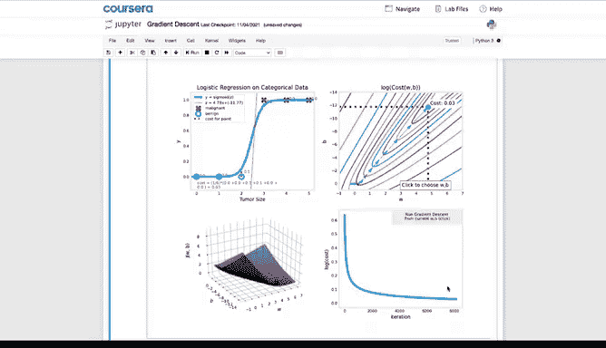

之后还会有另一个简短而实用的可选实验，我将向你展示如何使用流行的 **Scikit-learn** 库来训练用于分类的逻辑回归模型。

如今，许多机器学习从业者和公司都经常使用 Scikit-learn 作为工作的一部分。因此，我希望你也能查看 Scikit-learn 的相关功能，并了解它是如何使用的。

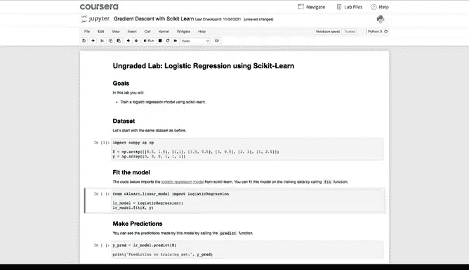

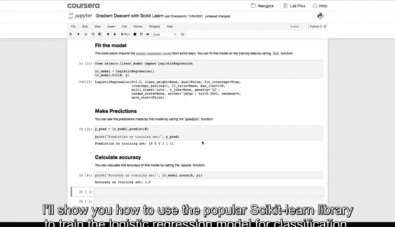

---

## 总结 🎯

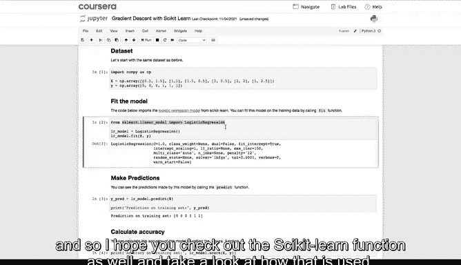

本节课中我们一起学习了如何实现逻辑回归的梯度下降。这是一个非常强大且广泛使用的学习算法，你现在已经知道如何让它为你工作了。恭喜！

逻辑回归的实现核心在于：
1.  定义正确的假设函数：`f(x) = sigmoid(w·x + b)`
2.  应用梯度下降公式更新参数，其形式与线性回归相似，但内涵因 `f(x)` 不同而不同。
3.  利用特征缩放和向量化等技术来优化算法性能。
4.  掌握使用像 Scikit-learn 这样的高级工具库来简化模型训练过程。