# 37：过拟合问题 🎯

在本节课中，我们将要学习机器学习中两个常见且重要的问题：**过拟合**与**欠拟合**。理解这两个概念对于构建有效的机器学习模型至关重要。我们将通过线性回归和逻辑回归的例子，直观地展示它们是什么，以及它们如何影响模型的性能。

## 概述：什么是过拟合与欠拟合？

你已经学习了线性回归和逻辑回归等算法，它们对许多任务效果良好。但有时，算法会遇到一个称为**过拟合**的问题，这会导致其性能变差。本节课将向你展示什么是过拟合，以及一个密切相关的、几乎相反的问题——**欠拟合**。

在接下来的课程中，我将分享一些专门用于解决过拟合问题的技术，特别是称为**正则化**的方法。这是一种非常有用的技术，我一直在使用它。正则化将帮助你最小化过拟合问题，使你的学习算法工作得更好。现在，让我们先来看看什么是过拟合。

## 通过线性回归例子理解过拟合

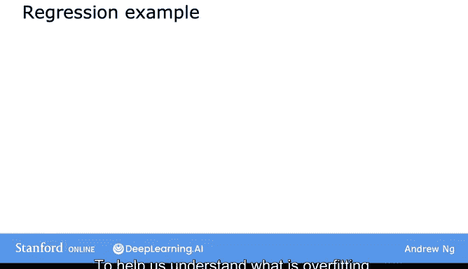

为了帮助我们理解什么是过拟合，让我们看一个线性回归的例子。我将回到我们最初的例子：使用线性回归预测房价，其中你想根据房屋的大小来预测价格。

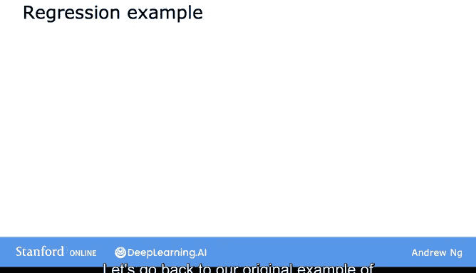

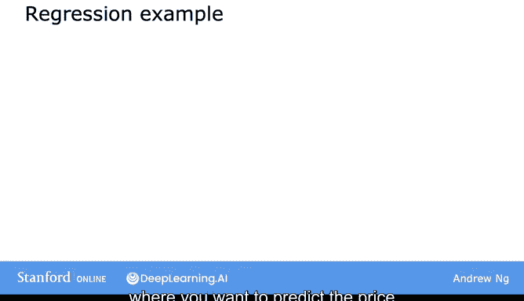

假设你的数据集看起来像这样，输入特征 `x` 是房屋的大小，目标值 `y` 是试图预测的房屋价格。

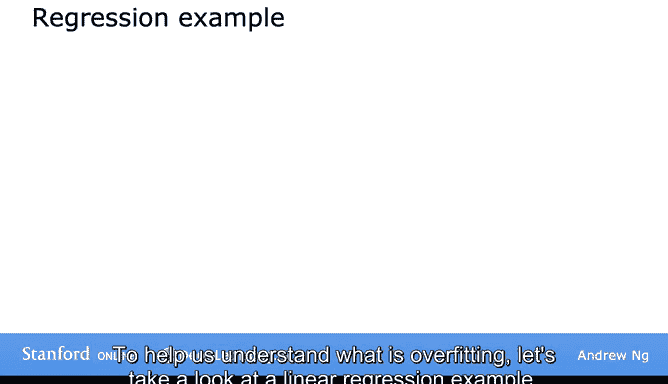

你可以做的一件事是将线性函数拟合到这个数据上。

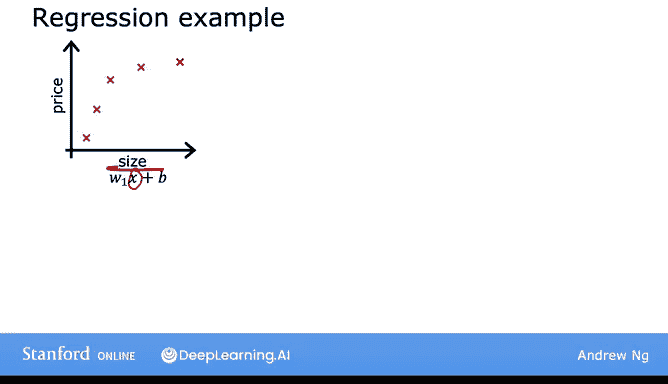

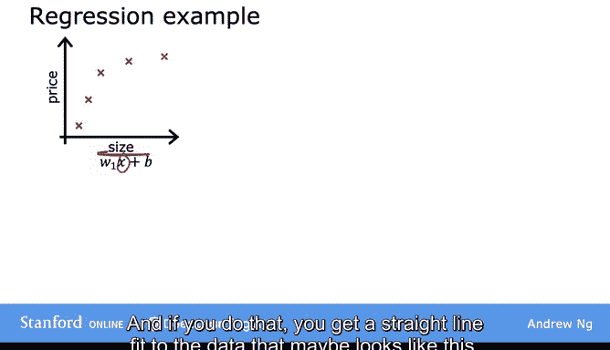

如果你这样做，你会得到一条拟合数据的直线，可能看起来像这样。但这并不是一个很好的模型。

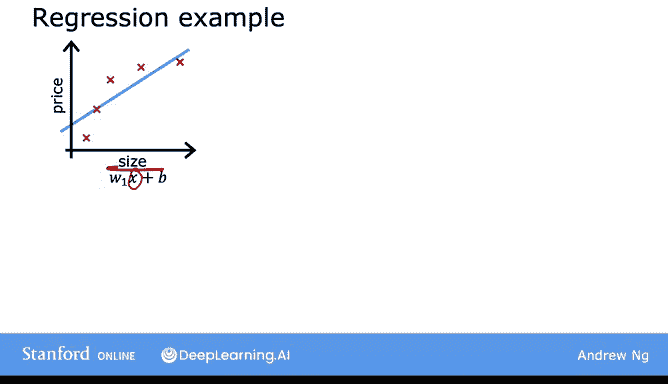

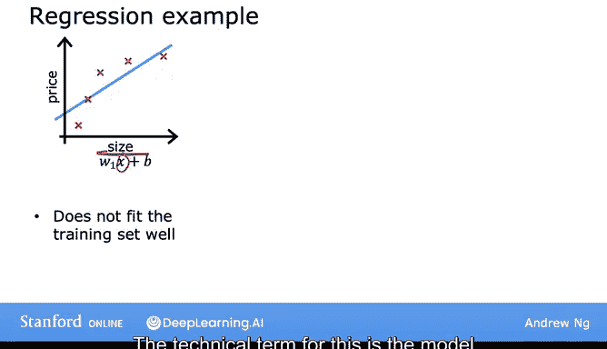

观察数据，似乎很明显，随着房屋面积的增加，房价趋于平缓。所以这个算法不能很好地拟合训练数据。这种情况的技术术语是模型**欠拟合**了训练数据。

另一个术语是算法具有**高偏差**。你可能在新闻中读到过一些学习算法不幸地表现出对某些种族或性别的偏见。术语“偏差”有多种含义。检查学习算法是否存在基于性别或种族等特征的偏见绝对至关重要。

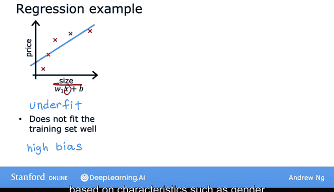

但术语“偏差”也有第二个技术含义，这就是我在这里使用的含义，即如果算法欠拟合数据，意味着它甚至不能很好地拟合训练集，训练数据中存在一个清晰的模式，而算法却无法捕捉到。

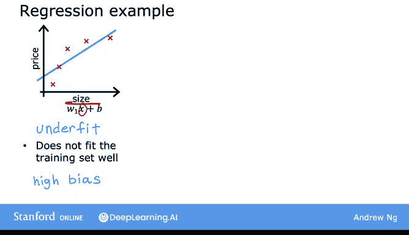

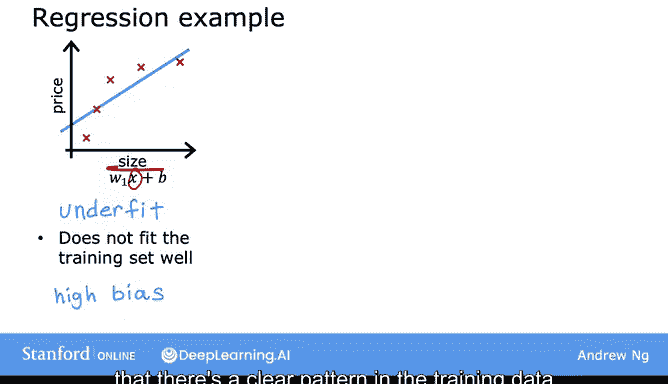

思考这种偏差的另一种方式是，学习算法有一个非常强烈的先入之见，或者说一个非常强的**偏差**，认为房价完全是房屋大小的线性函数。

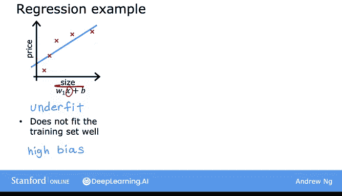

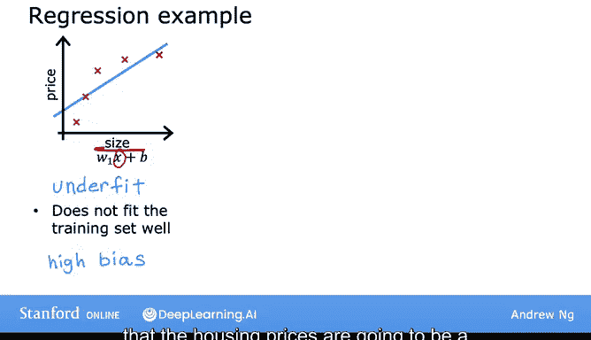

尽管有相反的数据，但这种认为数据是线性的先入之见导致它拟合了一条与数据匹配得很差的直线，从而导致它欠拟合数据。

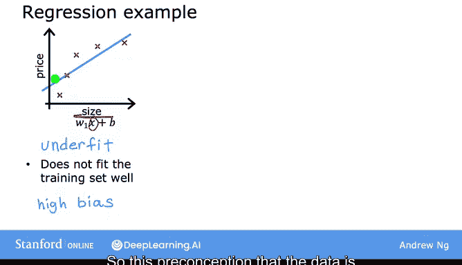

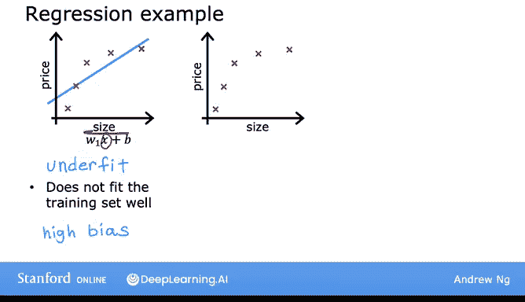

现在，让我们看看模型的第二种变体。

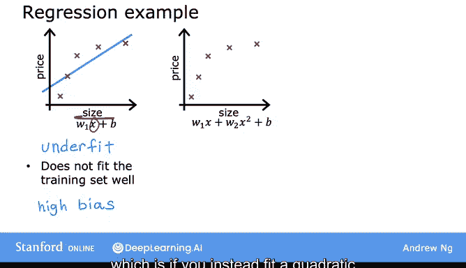

如果你对数据拟合一个二次函数，使用两个特征 `x` 和 `x²`，那么当你拟合参数 `w1` 和 `w2` 时，你可以得到一条能更好地拟合数据的曲线，可能看起来像这样。

此外，如果你有一个不在五个训练样本中的新房子，这个模型可能在那所新房子上表现得相当好。所以，如果你是一个房地产经纪人，你希望你的学习算法即使在不在训练集中的例子上也能表现良好。这被称为**泛化**。从技术上讲，我们希望学习算法能够**泛化**得很好，这意味着即使是对它从未见过的新例子，也能做出好的预测。

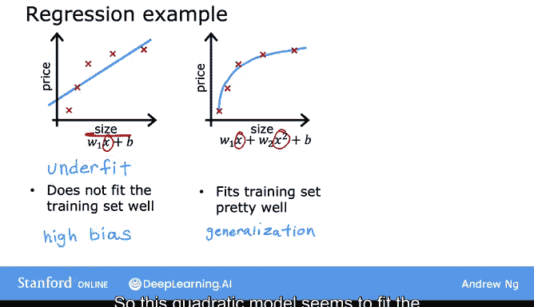

所以这个二次模型似乎对训练集的拟合虽然不是完美，但相当好，并且我认为它能很好地泛化到新例子。

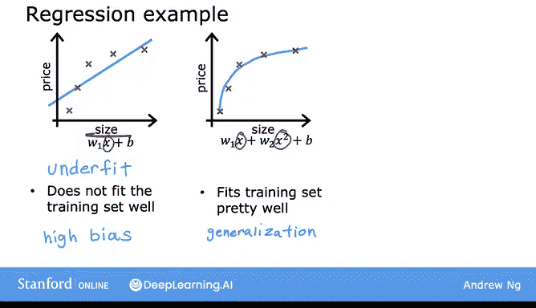

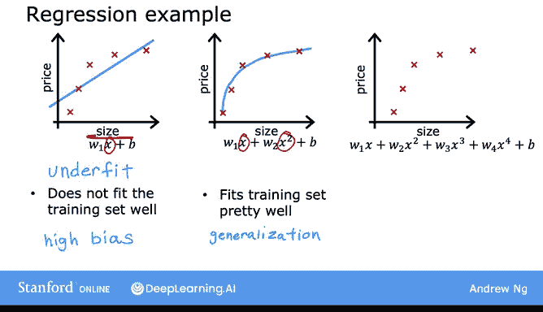

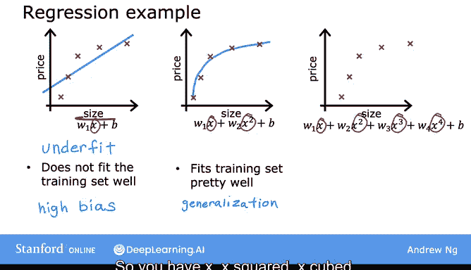

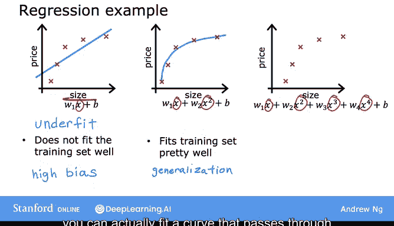

现在，让我们看看另一个极端，如果你对数据拟合一个四次多项式，那么你就有 `x`、`x²`、`x³` 和 `x⁴` 作为特征。

使用这个四次多项式，你实际上可以拟合一条恰好穿过所有五个训练样本的曲线。

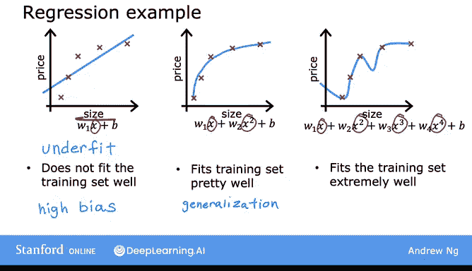

你可能会得到一条看起来像这样的曲线。一方面，这似乎在拟合训练数据方面做得非常好，因为它完美地穿过了所有的训练数据。事实上，你可以选择使成本函数恰好等于零的参数，因为所有五个训练样本的误差都为零。

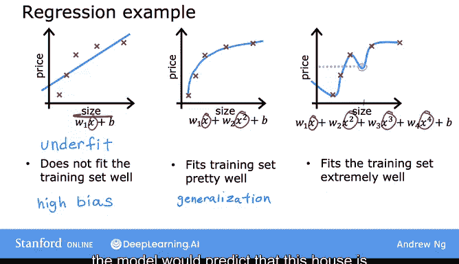

但这是一条非常曲折的曲线，它上下起伏。如果你在这里有一所房子，模型会预测这所房子比它小的房子更便宜。

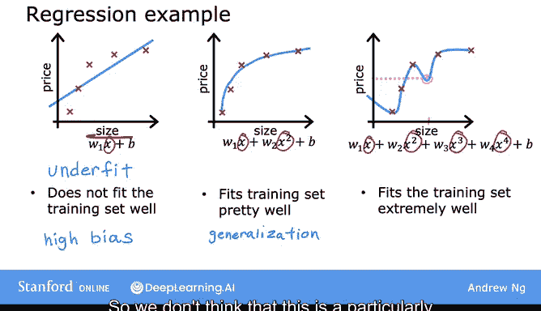

所以我们不认为这是一个特别好的预测房价的模型。技术术语是，我们会说这个模型**过拟合**了数据，或者说这个模型有**过拟合**问题。

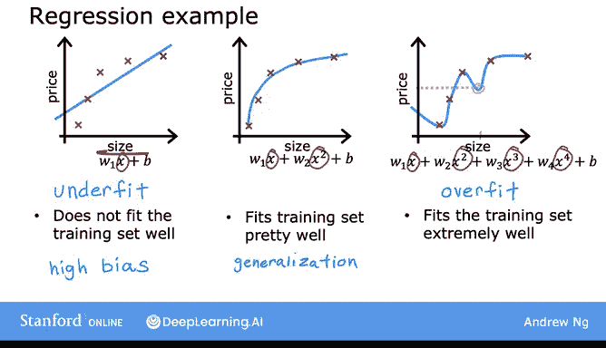

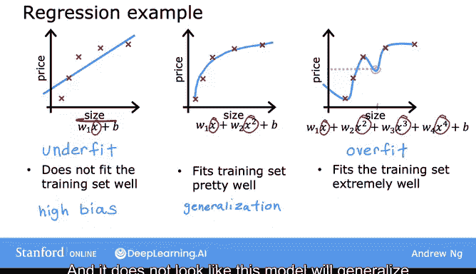

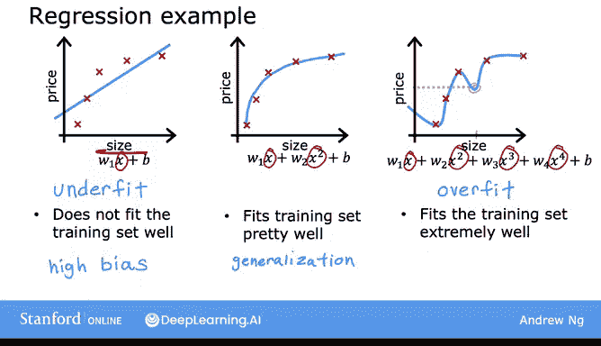

因为即使它非常地拟合训练集，但它拟合得“太好”了，因此它是过拟合的，而且看起来这个模型不会泛化到它从未见过的新例子。

这种情况的另一个术语是算法具有**高方差**。

在机器学习中，许多人几乎可以互换地使用术语“过拟合”和“高方差”，也几乎可以互换地使用术语“欠拟合”和“高偏差”。过拟合或高方差背后的直觉是，算法非常、非常努力地试图拟合每一个训练样本。事实证明，如果你的训练集即使只有一点点不同，比如一所房子的价格只是高了一点点或低了一点点，那么算法拟合的函数最终可能会完全不同。

因此，如果两个不同的机器学习工程师将这个四次多项式模型拟合到只是略有不同的数据集上，他们最终可能会得到完全不同的预测，或者说高度可变的预测，这就是为什么我们说算法具有高方差。

将最右边的模型与中间的模型对比。对于同一所房子，似乎中间模型给出了更合理的价格预测。对于中间这种情况并没有一个特定的名称，但我将称之为“恰到好处”，因为它既没有欠拟合也没有过拟合。

所以你可以说，机器学习的目标是找到一个既没有欠拟合也没有过拟合的模型，换句话说，希望找到一个既没有高偏差也没有高方差的模型。

当我思考欠拟合和过拟合、高偏差和高方差时，我有时会想起儿童故事《金发姑娘和三只熊》。在这个儿童故事中，一个叫金发姑娘的女孩拜访了一个熊家庭。有一碗粥太冷了，不好吃。还有一碗粥太热了，也不能吃。但有一碗粥既不太冷也不太热，温度适中，正好可以吃。

所以总结一下，如果你有太多的特征，比如右边的四次多项式，那么模型可能很好地拟合训练集，但几乎是“太好”了，或者说**过拟合**且具有**高方差**。另一方面，如果你有太少的特征，那么就像左边的例子一样，它会**欠拟合**并具有**高偏差**。而在使用二次特征 `x` 和 `x²` 的这个例子中，似乎是恰到好处的。

## 分类问题中的过拟合与欠拟合

到目前为止，我们看了线性回归模型中的欠拟合和过拟合。同样，过拟合也适用于分类问题。

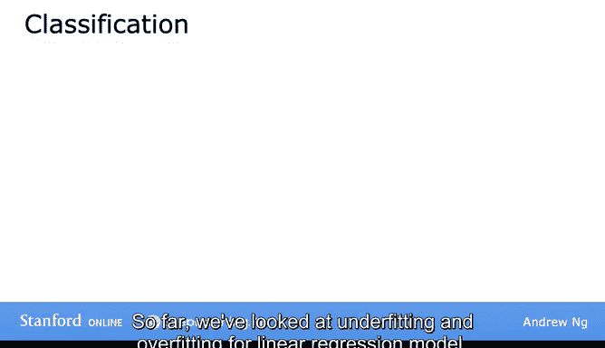

这是一个有两个特征 `x1` 和 `x2` 的分类例子。其中 `x1` 可能是肿瘤大小，`x2` 是患者年龄，我们试图将肿瘤分类为恶性（用叉号表示）或良性（用圆圈表示）。

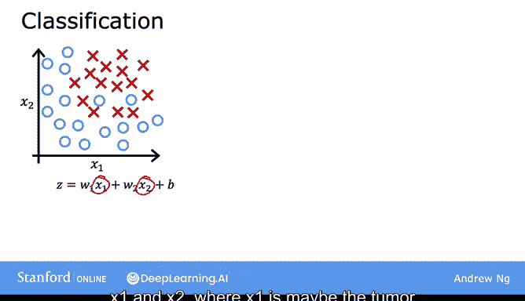

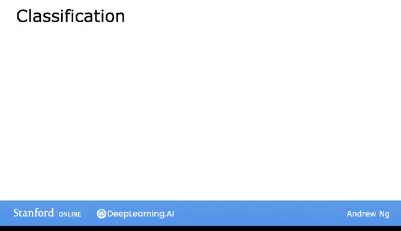

你可以做的一件事是拟合一个逻辑回归模型，一个像这样的简单模型，其中 `g` 是 sigmoid 函数，里面的项是 `z`。

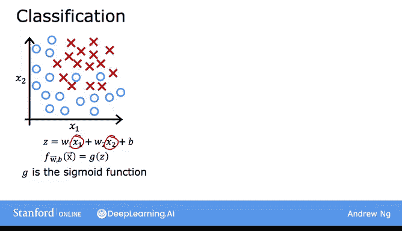

如果你这样做，最终会得到一条直线作为决策边界，这是 `z` 等于零的线，它将正例和负例分开。

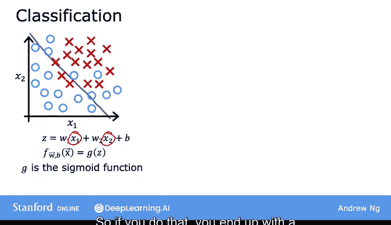

这条直线看起来并不糟糕，看起来还行，但看起来也不是对数据的很好拟合。所以这是一个**欠拟合**或**高偏差**的例子。

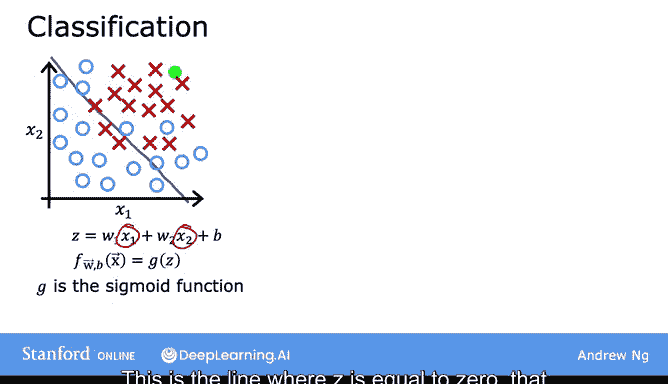

让我们看另一个例子。如果你在特征中加入这些二次项，那么 `z` 就变成了中间这个新项，而决策边界（即 `z` 等于零的地方）看起来可能更像这样，更像一个椭圆或椭圆的一部分。

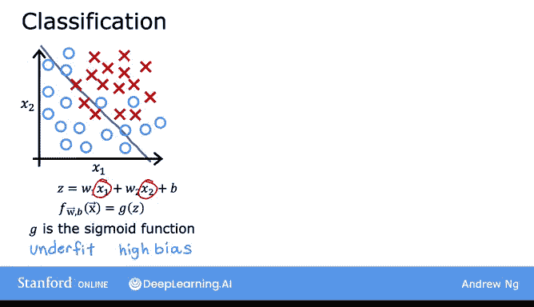

这是对数据的一个相当好的拟合，尽管它没有完美地分类训练集中的每一个训练样本。

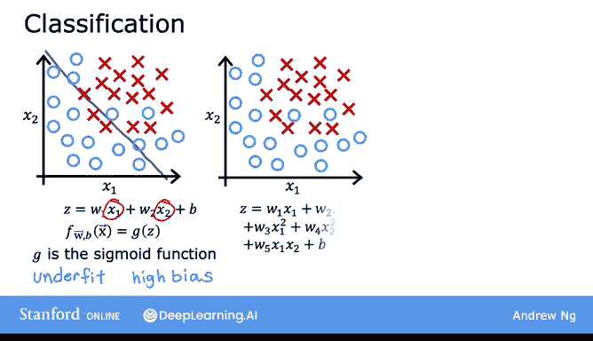

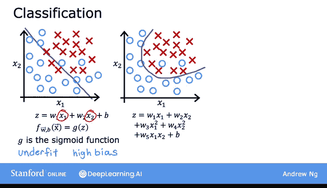

注意一些叉号被错误地分类在圆圈之中。

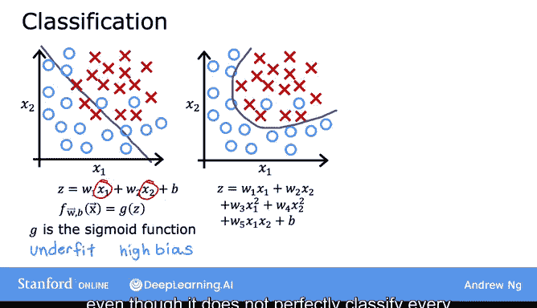

但这个模型看起来相当不错，我称之为“恰到好处”，而且看起来它能很好地泛化到新患者。

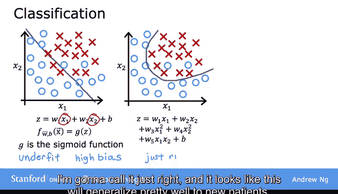

最后，在另一个极端，如果你拟合一个非常高阶的多项式，带有许多许多像这样的特征，那么模型可能会非常努力地扭曲自己，以找到一个完美拟合你训练数据的决策边界。拥有所有这些高阶多项式特征允许算法选择这个真正过于复杂的决策边界。

如果特征是肿瘤大小和年龄，并且你试图将肿瘤分类为恶性或良性，那么这看起来并不是一个很好的预测模型。所以，这再次是**过拟合**和**高方差**的一个实例，因为这个模型尽管在训练集上做得很好，但看起来不会很好地泛化到新例子。

## 总结

本节课中，我们一起学习了机器学习中的两个核心问题：

1.  **欠拟合**：模型过于简单，无法捕捉数据中的基本模式，表现为**高偏差**。它甚至在训练数据上表现不佳。
2.  **过拟合**：模型过于复杂，不仅学习了数据中的基本模式，还学习了噪声和随机波动，表现为**高方差**。它在训练数据上表现极好，但在新数据上泛化能力差。

我们的目标是找到一个“恰到好处”的模型，它既能很好地拟合训练数据，又能对新数据做出准确的预测。在下一节课中，我们将探讨如何解决过拟合问题，特别是通过**正则化**技术，并简要提及一些解决欠拟合的思路。