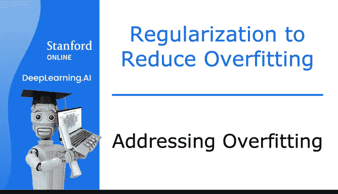
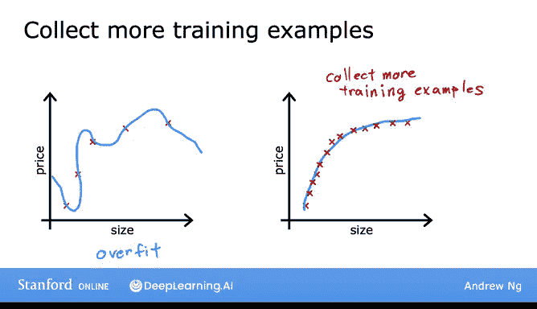
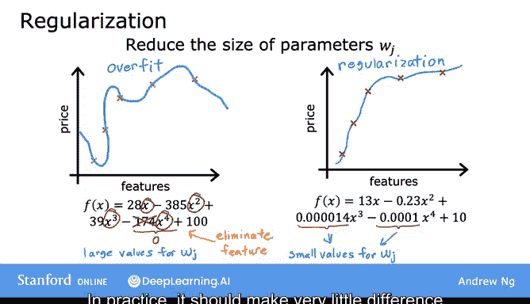
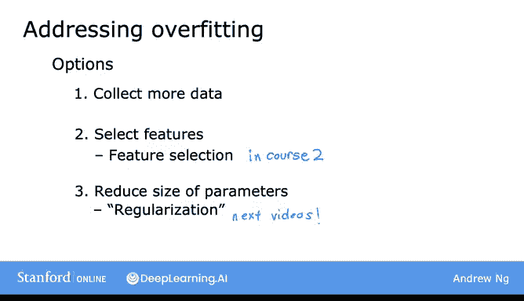
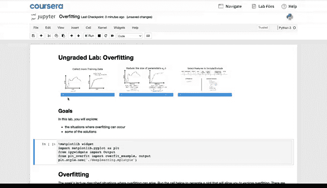
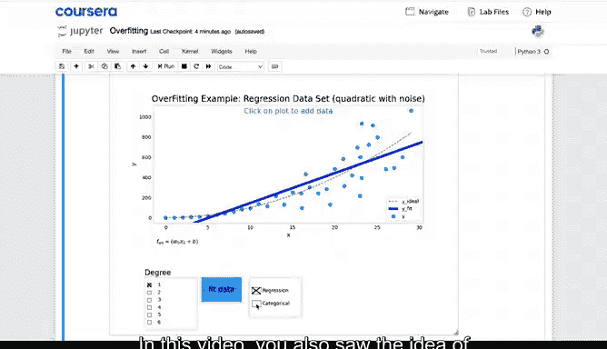

# 38：解决过拟合问题 🎯

在本节课中，我们将要学习机器学习中一个常见且重要的问题——过拟合，并探讨三种解决过拟合问题的核心方法。过拟合是指模型在训练数据上表现很好，但在新数据上表现不佳的现象。理解并解决过拟合是构建高效机器学习模型的关键一步。

## 概述 📋

在上一节中，我们介绍了过拟合和欠拟合的概念。本节中，我们来看看当发生过拟合时，可以采取哪些具体措施来应对。我们将重点讨论三种主要策略：获取更多训练数据、减少特征数量以及使用正则化技术。

## 解决过拟合的三种方法 🔧

以下是三种应对过拟合问题的核心策略。

### 1. 获取更多训练数据 📈

当模型出现高方差（即过拟合）时，最直接的方法是收集更多的训练数据。例如，在房价预测模型中，如果我们能获得更多关于房屋面积和价格的数据，学习算法就能学习到一个波动更小的函数。

**核心思想**：即使继续使用高阶多项式或包含大量特征的函数，只要有足够的训练样本，模型仍然可以表现良好。

**总结**：对抗过拟合的首要工具是获取更多训练数据。虽然这并非总是可行，但在数据可用时，这种方法通常效果显著。

### 2. 使用更少的特征 🎯

第二种解决过拟合的方法是减少使用的特征数量。在之前的例子中，模型特征包括尺寸 `x`、`x²`、`x³` 等多项式特征。减少这些特征的使用可以降低过拟合风险。

**特征选择**：在拥有大量特征（如房屋面积、卧室数量、房龄、社区平均收入、到最近咖啡店的距离等）但训练数据不足的情况下，模型容易过拟合。通过直觉或算法选择最相关的特征子集（如仅使用面积、卧室数量和房龄），可以减轻过拟合问题。

**局限性**：特征选择的缺点在于，它丢弃了部分可能对预测有用的信息。例如，也许所有100个特征都对房价预测有贡献。

**后续学习**：在课程2中，我们将看到一些自动选择最合适特征集的算法。

### 3. 应用正则化技术 ⚖️

第三种减少过拟合的方法是正则化。正则化不是直接消除特征（即将某些参数设为0），而是鼓励学习算法缩小参数值，从而更温和地减少某些特征的影响。

**核心概念**：即使拟合高阶多项式，只要能让算法使用较小的参数值（`w₁, w₂, w₃, w₄`...），最终得到的曲线就能更好地拟合训练数据。

**公式表示**：正则化通常通过修改代价函数来实现，例如在线性回归中加入正则化项：
`J(w, b) = (1/2m) * Σ(ŷ⁽ⁱ⁾ - y⁽ⁱ⁾)² + (λ/2m) * Σ wⱼ²`
其中，`λ` 是正则化参数，控制正则化的强度。

**惯例**：通常我们只减小 `wⱼ` 参数（`w₁` 到 `wₙ`）的大小，是否对参数 `b` 进行正则化影响不大。在实践中，我经常使用正则化，这是一种非常有用的技术，也适用于后续将学到的神经网络。

## 总结与回顾 📝

本节课中我们一起学习了解决过拟合的三种主要方法：

1.  **收集更多数据**：如果可能，获取更多训练数据是减少过拟合的有效方式。
2.  **特征选择**：尝试选择并使用特征的一个子集。我们将在课程2中深入学习特征选择。
3.  **正则化**：通过减小参数规模来减少过拟合。这将是下一视频的重点。

就个人而言，我经常使用正则化，这是一种训练学习算法（包括后续专业课程中将学到的神经网络）的非常有用的技术。

## 实践建议：可选实验 🧪

我建议大家查看关于过拟合的可选实验。在实验中，你将看到不同的过拟合示例，并通过点击图中的选项来调整这些示例。你还可以通过点击图表添加自己的数据点，观察拟合曲线的变化。实验涵盖了回归和分类的例子，你可以尝试改变多项式的阶数（如 `x`, `x²`, `x³` 等）。实验还提供了两种应对过拟合的选项：添加额外训练数据以减少过拟合，以及选择包含或排除哪些特征作为另一种减少过拟合的方法。希望这个实验能帮助你建立关于过拟合及其解决方法的直觉。

## 下节预告 🔮

本视频从较高层次介绍了正则化的思想。我意识到所有这些关于正则化的细节可能尚未完全明晰。在下一个视频中，我们将开始具体阐述如何应用正则化、正则化的确切含义，并探讨如何将正则化与我们的学习算法（线性回归、逻辑回归及未来的其他算法）结合，以避免过拟合。让我们在下一个视频中详细探讨。