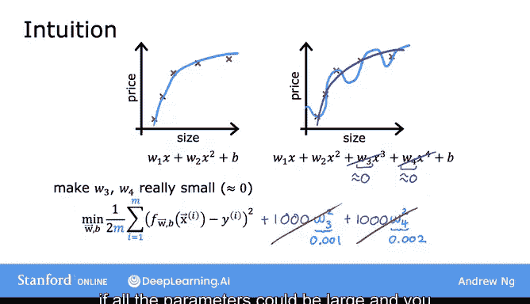
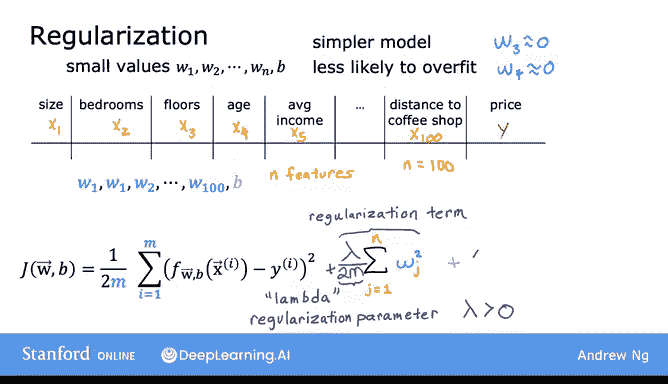
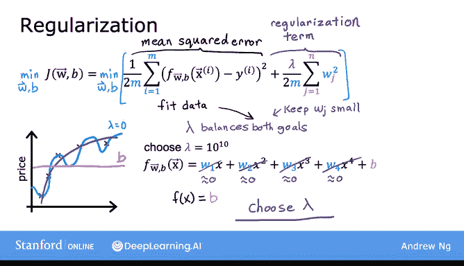

# 39：正则化成本函数 📉

在本节课中，我们将学习如何通过修改成本函数来应用正则化，从而减少过拟合。正则化的核心思想是通过惩罚较大的参数值，促使模型学习更简单、更平滑的函数，提高泛化能力。

---

## 概述

上一节我们介绍了正则化的基本概念，即通过减小参数值来降低模型复杂度，从而减少过拟合。本节中，我们将基于这一直觉，为学习算法开发一个修改后的成本函数，以实际应用正则化。

---

## 从直觉到公式

回忆上一节的例子：如果我们用二次函数拟合数据，效果不错；但如果使用高阶多项式，则容易导致过拟合。

现在考虑以下情况：假设我们能够使参数 **W3** 和 **W4** 变得非常小，接近于零。具体来说，我们在线性回归的成本函数中添加两项：**1000 × W3²** 和 **1000 × W4²**。这里选择 1000 是因为它是一个较大的数，但任何其他大数也可以。

通过这个修改后的成本函数，如果 **W3** 和 **W4** 较大，模型将受到惩罚。因为要最小化这个新函数，唯一的方法是使 **W3** 和 **W4** 都变小，否则这两项会变得非常大。

因此，在最小化这个函数时，**W3** 和 **W4** 将趋近于零，从而几乎抵消了特征 **x³** 和 **x⁴** 的影响。这样，我们最终得到的拟合结果更接近二次函数，可能只包含来自 **x³** 和 **x⁴** 的微小贡献。这比所有参数都较大时得到的复杂多项式拟合要好得多。

更一般地，正则化的思想是：如果参数值较小，模型就更简单（可能包含更少的特征），因此更不容易过拟合。

---

## 一般化的正则化方法

上一张幻灯片中，我们只惩罚了 **W3** 和 **W4**。但更常见的实现方式是：如果你有很多特征（比如 100 个），你可能不知道哪些特征最重要、哪些应该被惩罚。

因此，正则化的典型实现方式是惩罚所有特征，更准确地说，是惩罚所有 **Wⱼ** 参数。可以证明，这通常会导致拟合出更平滑、更简单、更不易过拟合的函数。

例如，如果你有 100 个特征的数据，很难预先选择哪些特征应该包含或排除。因此，我们构建一个使用所有 100 个特征的模型，即参数 **W₁** 到 **W₁₀₀**，以及第 101 个参数 **b**。

由于我们不知道哪些参数重要，我们对所有参数进行轻微惩罚，通过添加以下新项来缩小它们：

**λ × Σⱼ₌₁ⁿ Wⱼ²**

其中 **n** 是特征数量（这里是 100）。这里的 **λ**（希腊字母 lambda）称为正则化参数。

类似于选择学习率 **α**，你现在也需要为 **λ** 选择一个值。

需要指出的是，按照惯例，我们通常将 **λ** 除以 **2m**，使得第一项和第二项都按 **1/(2m)** 缩放。这样做的好处是，更容易为 **λ** 选择一个合适的值。特别是，即使训练集大小增加（即 **m** 变大），之前选择的 **λ** 值也更可能继续有效。

另外，按照惯例，我们通常不惩罚参数 **b**。在实践中，是否惩罚 **b** 影响很小。一些机器学习工程师或算法实现可能会包含 **λ/(2m) × b²** 项，但在本课程中，我们采用更常见的惯例：只正则化参数 **W**，而不正则化参数 **b**。

---

## 正则化成本函数总结

在这个修改后的成本函数中，我们希望最小化原始成本（均方误差成本）加上额外的第二项（称为正则化项）。这个新的成本函数平衡了两个目标：

- 最小化第一项鼓励算法通过减小预测值与实际值之间的平方差来很好地拟合训练数据。
- 最小化第二项鼓励算法保持参数 **Wⱼ** 较小，从而减少过拟合。

你选择的 **λ** 值指定了这两个目标之间的相对重要性或平衡方式。

以下是不同 **λ** 值对学习算法的影响：

- 如果 **λ = 0**，则完全不使用正则化项，模型可能过拟合，拟合出过于复杂的曲线。
- 如果 **λ** 非常大（例如 **10¹⁰**），则正则化项权重极大，最小化成本的唯一方式是使所有 **W** 值接近零，此时 **f(x) ≈ b**，模型拟合一条水平直线，导致欠拟合。

因此，你需要一个介于两者之间的 **λ** 值，以更适当地平衡最小化均方误差和保持参数较小这两个目标。当 **λ** 值既不太小也不太大时，你最终可能拟合出一个保持所有特征但形状更合理的四次多项式。

---

## 总结

本节课中，我们一起学习了如何通过修改成本函数来应用正则化。正则化通过在成本函数中添加惩罚项，促使模型参数变小，从而降低模型复杂度，减少过拟合。我们讨论了正则化的一般化方法，以及如何通过选择合适的 **λ** 值来平衡拟合训练数据和保持模型简单这两个目标。

在接下来的两节中，我们将具体探讨如何将正则化应用于线性回归和逻辑回归，以及如何使用梯度下降训练这些模型，从而在实际中避免过拟合。