# 40：正则化线性回归的梯度下降 🧮

在本节课中，我们将学习如何将梯度下降算法应用于正则化线性回归。我们将推导更新规则，并解释正则化如何影响参数更新过程。

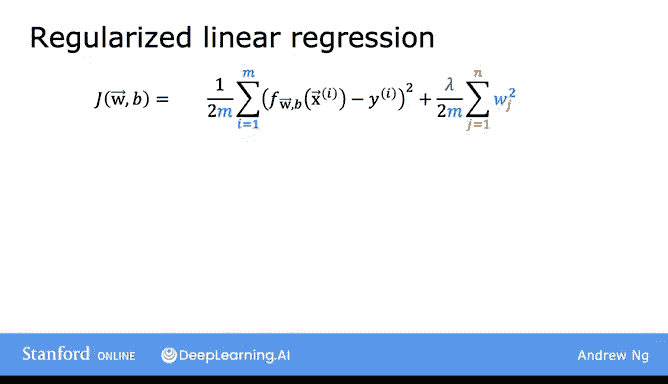

---

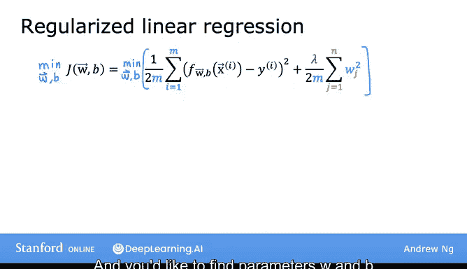

## 概述

在上一节视频中，我们介绍了正则化线性回归的成本函数。本节中，我们将探讨如何使用梯度下降来最小化这个成本函数，并理解正则化项如何改变参数的更新方式。

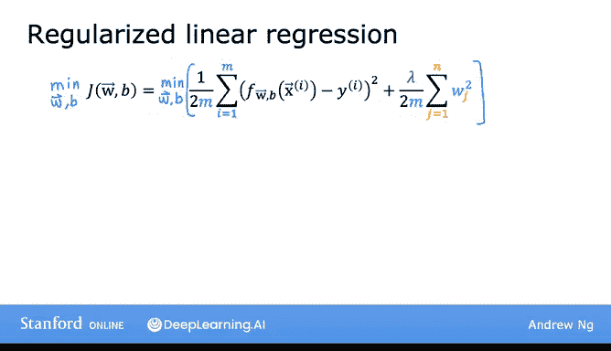

---

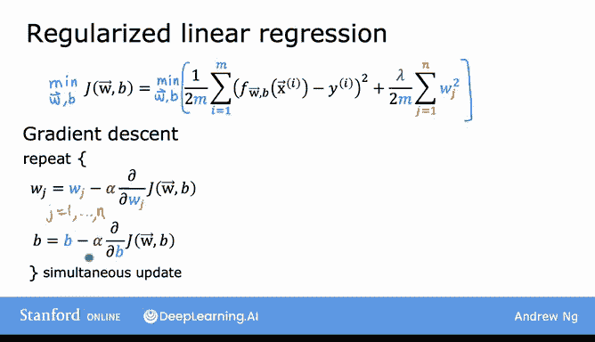

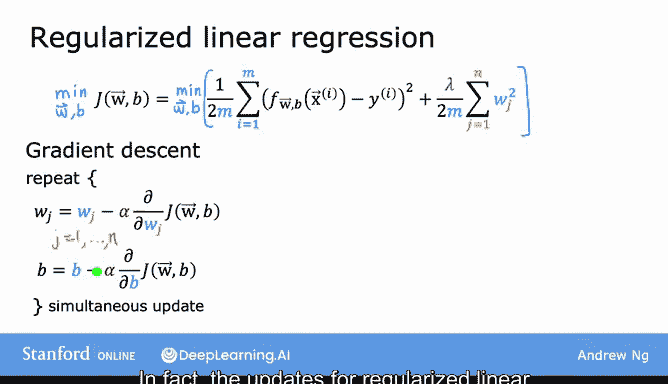


## 正则化线性回归的成本函数

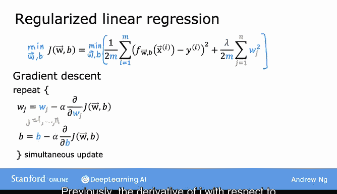

上一节我们得出的正则化线性回归成本函数如下：

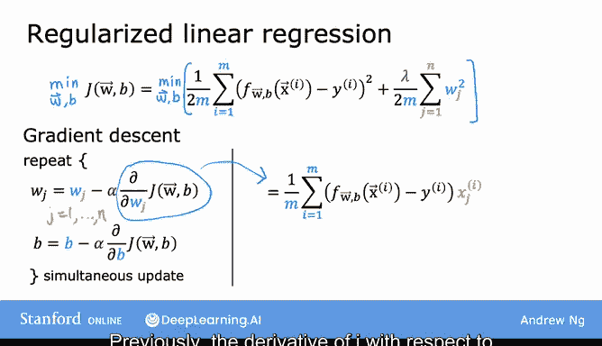

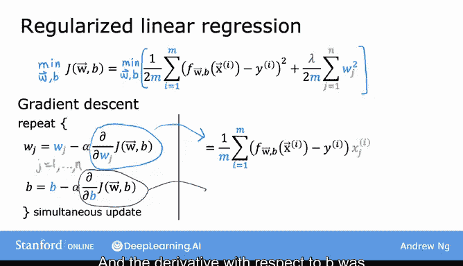

**公式：**
\[
J(\mathbf{w}, b) = \frac{1}{2m} \sum_{i=1}^{m} (f_{\mathbf{w},b}(\mathbf{x}^{(i)}) - y^{(i)})^2 + \frac{\lambda}{2m} \sum_{j=1}^{n} w_j^2
\]

其中：
- 第一部分是标准的平方误差成本函数。
- 第二部分是额外的正则化项，\(\lambda\) 是正则化参数。
- 目标是找到最小化正则化成本函数的参数 \(\mathbf{w}\) 和 \(b\)。

---

## 梯度下降回顾

在引入正则化之前，我们使用梯度下降来优化原始成本函数（仅第一部分）。其算法如下：

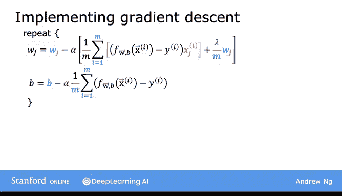

**代码：**
```python
# 原始线性回归的梯度下降更新规则
repeat until convergence {
    w_j = w_j - α * (∂J/∂w_j)  # 对于 j = 1 到 n
    b = b - α * (∂J/∂b)
}
```

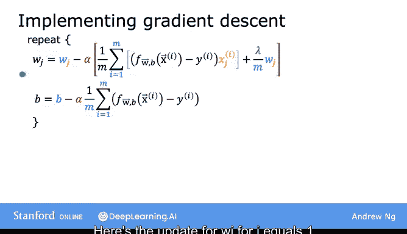

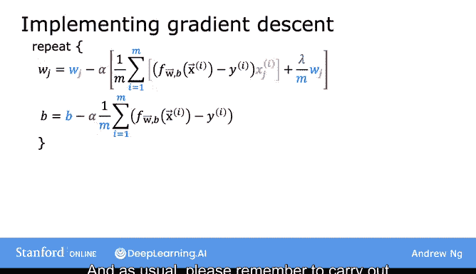

其中 \(\alpha\) 是一个很小的正数，称为学习率。

---

## 正则化后的梯度下降

对于正则化线性回归，梯度下降的更新规则看起来非常相似，只是成本函数 \(J\) 的定义有所不同。

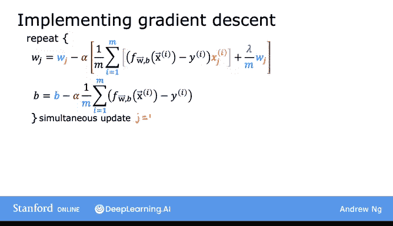

**公式：**
\[
\frac{\partial J}{\partial w_j} = \frac{1}{m} \sum_{i=1}^{m} (f_{\mathbf{w},b}(\mathbf{x}^{(i)}) - y^{(i)}) x_j^{(i)} + \frac{\lambda}{m} w_j
\]
\[
\frac{\partial J}{\partial b} = \frac{1}{m} \sum_{i=1}^{m} (f_{\mathbf{w},b}(\mathbf{x}^{(i)}) - y^{(i)})
\]

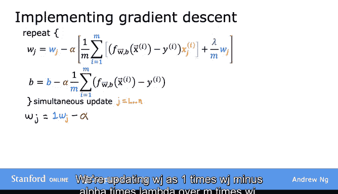

请注意：
- 对于 \(w_j\) 的导数增加了一项 \(\frac{\lambda}{m} w_j\)。
- 对于 \(b\) 的导数保持不变，因为我们不对 \(b\) 进行正则化（不试图缩小 \(b\)）。

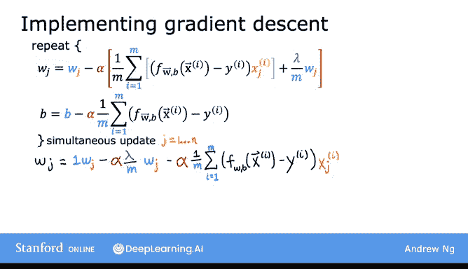

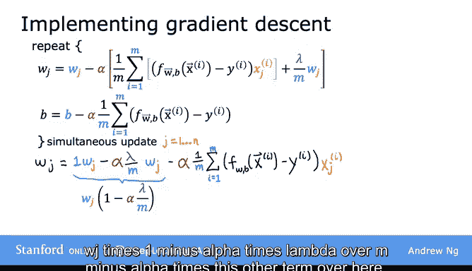

---

## 正则化梯度下降算法

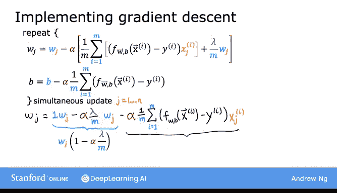

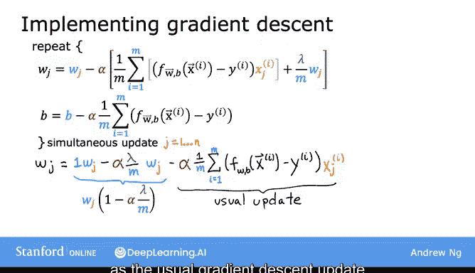

将上述导数代入梯度下降公式，我们得到正则化线性回归的完整算法。

以下是实现步骤：

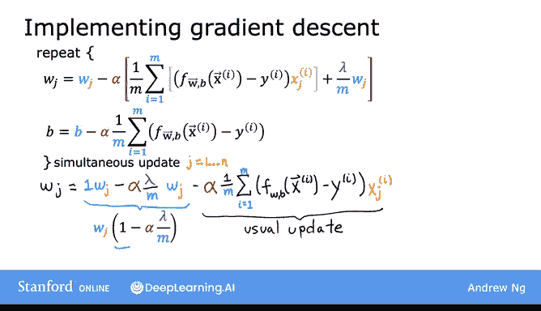

**代码：**
```python
# 正则化线性回归的梯度下降更新规则
repeat until convergence {
    w_j = w_j - α * [ (1/m) * Σ (f(xⁱ) - yⁱ) * x_jⁱ + (λ/m) * w_j ]  # 对于 j = 1 到 n
    b = b - α * (1/m) * Σ (f(xⁱ) - yⁱ)
}
```

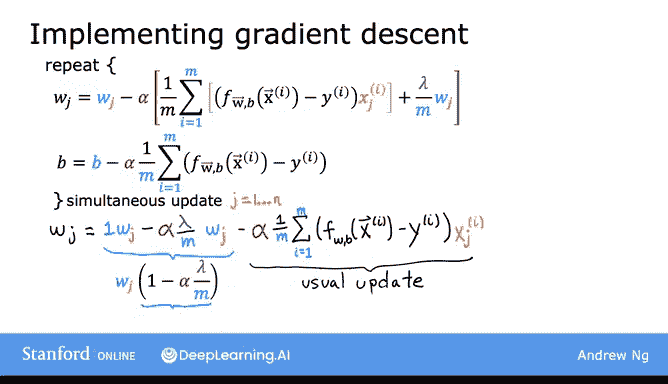

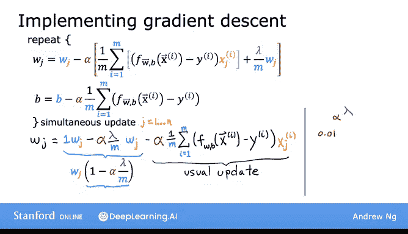

请记住，所有参数的更新必须同步进行。

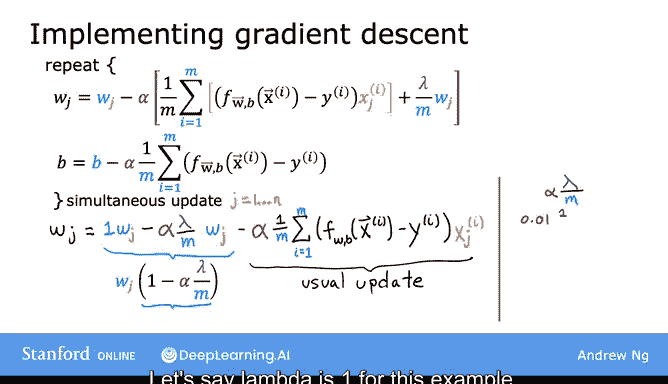

---

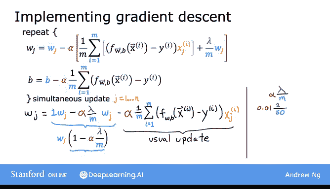

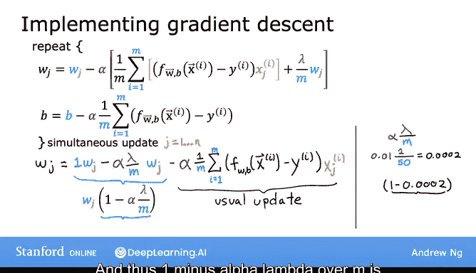

## 直观理解更新规则（可选）

为了更深入地理解公式的作用，我们可以重写 \(w_j\) 的更新规则。

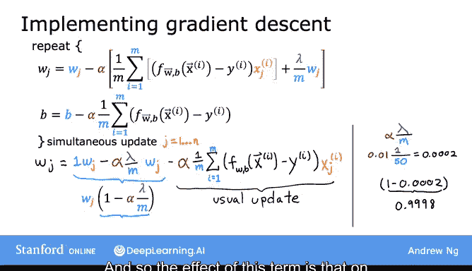

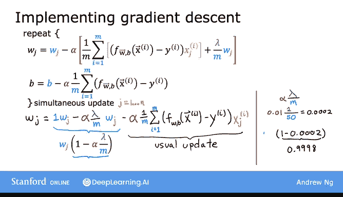

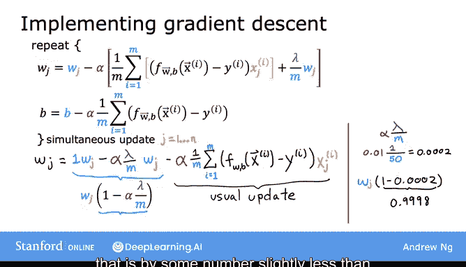

**公式：**
\[
w_j := w_j (1 - \alpha \frac{\lambda}{m}) - \alpha \frac{1}{m} \sum_{i=1}^{m} (f(\mathbf{x}^{(i)}) - y^{(i)}) x_j^{(i)}
\]

第二项是未正则化线性回归的常规梯度下降更新。第一项中，\((1 - \alpha \frac{\lambda}{m})\) 是一个略小于 1 的数。

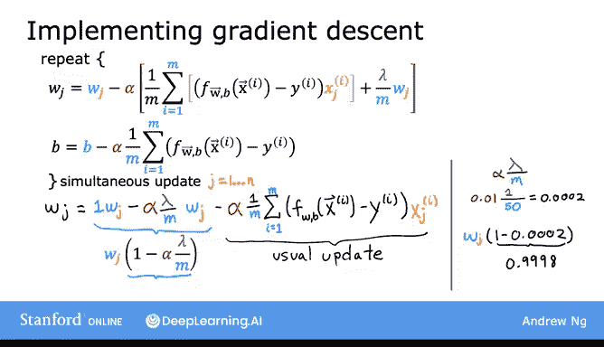

例如，设 \(\alpha = 0.01\)，\(\lambda = 1\)，\(m = 50\)，则：
\[
1 - \alpha \frac{\lambda}{m} = 1 - 0.01 \times \frac{1}{50} = 0.9998
\]

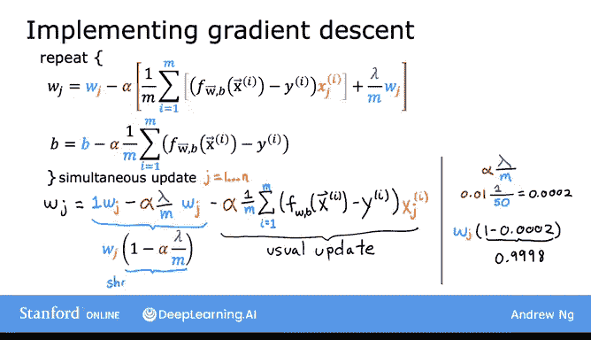

因此，在每次迭代中，正则化的效果是先将 \(w_j\) 乘以一个略小于 1 的数（使其略微缩小），然后再进行常规更新。这解释了为什么正则化会持续地、轻微地缩小参数 \(w_j\) 的值。

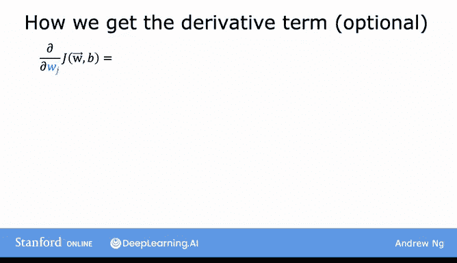

---


## 导数计算推导（可选）

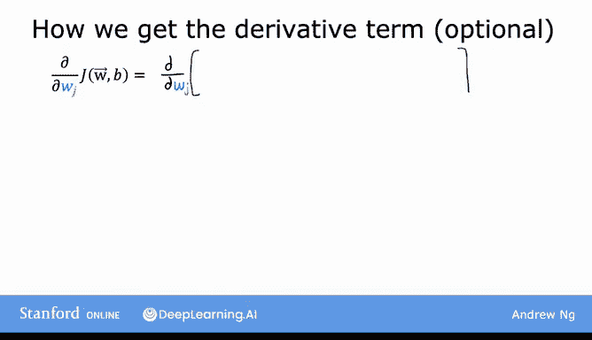

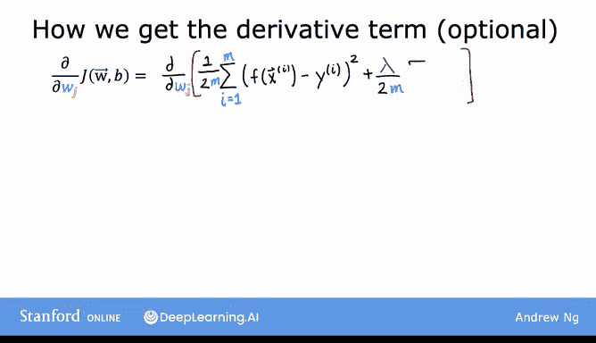

如果你对导数项的推导过程感兴趣，这里有一个简要说明。

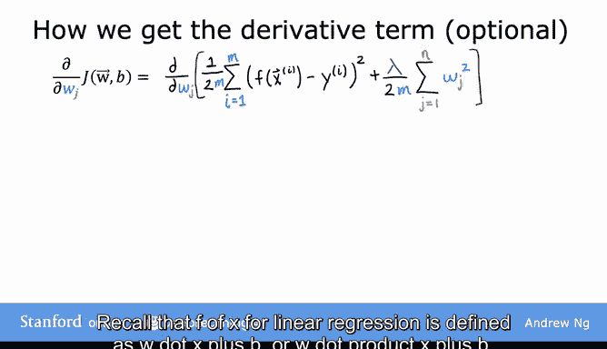

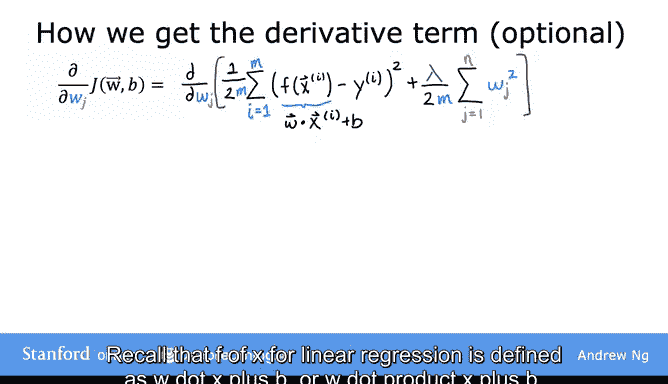

对于线性回归，\(f_{\mathbf{w},b}(\mathbf{x}) = \mathbf{w} \cdot \mathbf{x} + b\)。

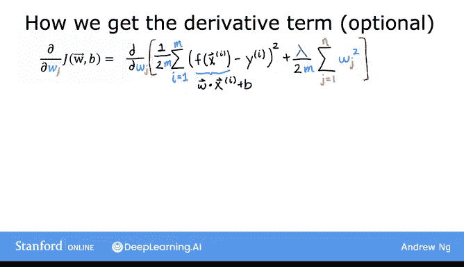

根据微积分规则，对 \(w_j\) 的导数计算如下：
\[
\frac{\partial J}{\partial w_j} = \frac{1}{2m} \sum_{i=1}^{m} 2(\mathbf{w} \cdot \mathbf{x}^{(i)} + b - y^{(i)}) x_j^{(i)} + \frac{\lambda}{2m} \cdot 2 w_j
\]

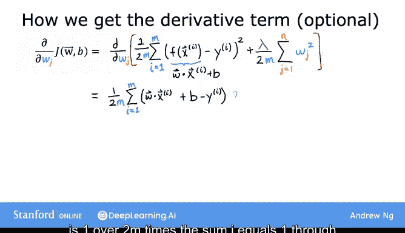

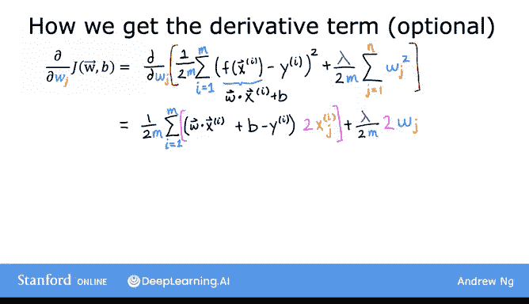

化简后（2 被约去），得到我们之前使用的表达式：
\[
\frac{\partial J}{\partial w_j} = \frac{1}{m} \sum_{i=1}^{m} (f(\mathbf{x}^{(i)}) - y^{(i)}) x_j^{(i)} + \frac{\lambda}{m} w_j
\]

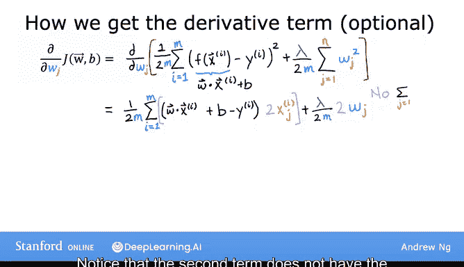

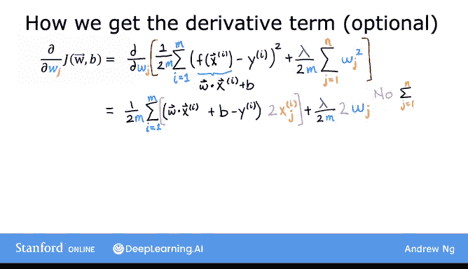

---


## 总结

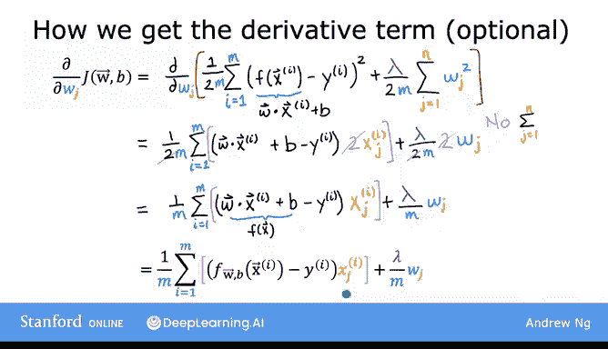

本节课中，我们一起学习了如何将梯度下降应用于正则化线性回归。

**核心要点：**
1.  正则化成本函数在标准平方误差项基础上增加了 \(\frac{\lambda}{2m} \sum w_j^2\)。
2.  梯度下降更新规则中，\(w_j\) 的导数增加了一项 \(\frac{\lambda}{m} w_j\)，而 \(b\) 的更新不变。
3.  从更新公式 \(w_j := w_j (1 - \alpha \frac{\lambda}{m}) - ...\) 可以直观看出，每次迭代正则化都会使 \(w_j\) 略微缩小。
4.  掌握这些更新规则，你就能在特征多而训练样本相对较少时，使用正则化线性回归有效减少过拟合，从而在许多问题上获得更好的性能。

在下一个视频中，我们将把正则化的思想应用到逻辑回归中，以避免逻辑回归的过拟合问题。