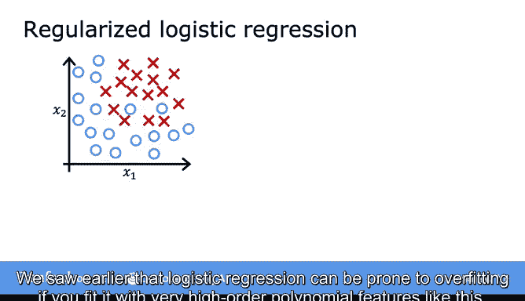
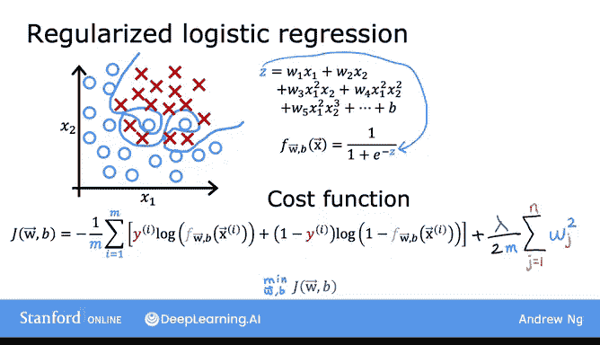
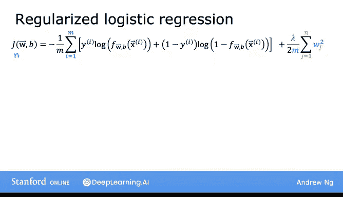
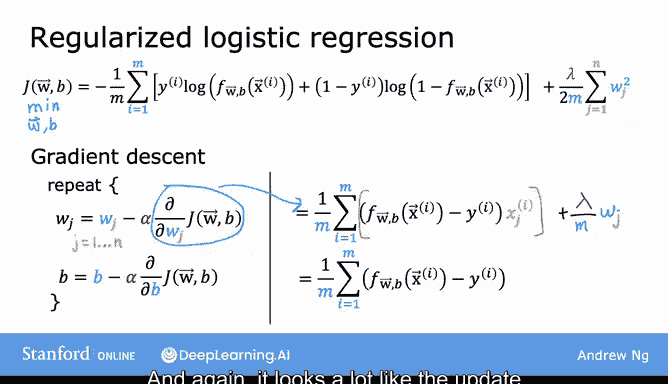
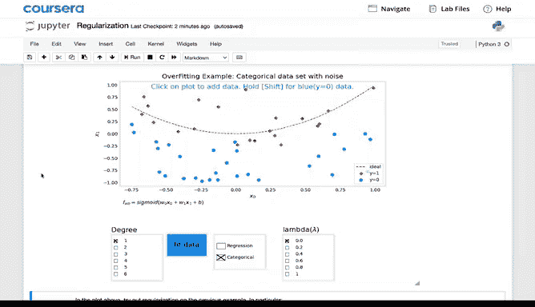
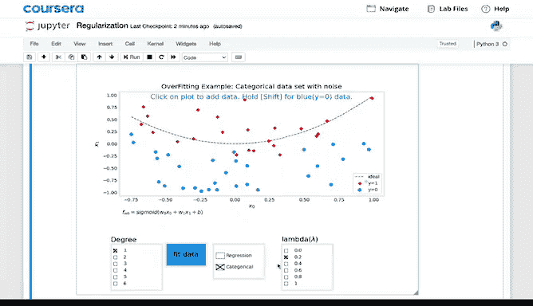
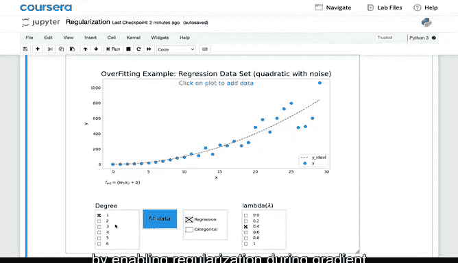
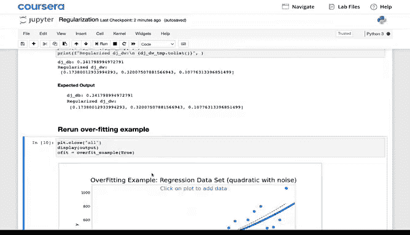
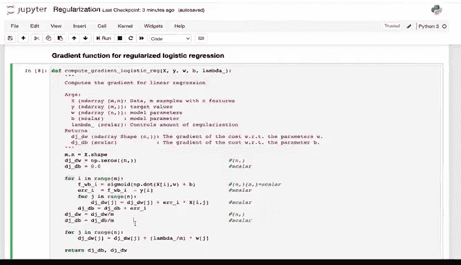
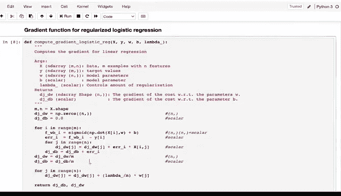

# 41：正则化逻辑回归 🧠

在本节课中，我们将学习如何实现**正则化逻辑回归**。你将看到，其梯度下降更新规则与正则化线性回归非常相似。我们还将探讨正则化如何帮助逻辑回归模型避免过拟合，并介绍如何在代码中实现它。

---

## 过拟合问题与正则化的引入

上一节我们介绍了逻辑回归。本节中我们来看看当逻辑回归模型使用高阶多项式特征时，可能会遇到的问题。

如果使用非常高阶的多项式特征来拟合逻辑回归模型，模型可能会变得**过拟合**。

上图中，`Z` 是一个高阶多项式，它被传入 **Sigmoid 函数** 来计算预测值 `f`。这可能导致决策边界过于复杂，完美地拟合了训练集，但泛化能力很差。

更普遍地说，当你用大量特征（无论是多项式特征还是其他特征）训练逻辑回归时，过拟合的风险会更高。

---

## 正则化逻辑回归的成本函数

为了解决过拟合问题，我们需要修改逻辑回归的成本函数，为其加入**正则化项**。

逻辑回归原本的成本函数是：
`J(w,b) = (1/m) * Σ L(f(x^(i)), y^(i))`

要对其进行正则化，只需添加以下项：
`+ (λ / (2m)) * Σ (w_j^2)`，其中求和从 `j=1` 到 `n`（`n` 是特征数量）。

因此，正则化后的成本函数为：

**`J_regularized(w,b) = (1/m) * Σ L(f(x^(i)), y^(i)) + (λ / (2m)) * Σ (w_j^2)`**

当我们最小化这个关于 `w` 和 `b` 的成本函数时，它会**惩罚参数 w1, w2, ..., wn**，防止它们变得过大。

这样做之后，即使你使用带有很多参数的高阶多项式进行拟合，你仍然能得到一个更合理的决策边界，如上图所示。这个边界能有效区分正负样本，并且有望更好地泛化到训练集之外的新样本。

---

## 实现：梯度下降更新规则

现在我们知道需要最小化包含正则化项的成本函数 `J(w,b)`。那么如何实现呢？和之前一样，我们可以使用**梯度下降法**。

以下是需要最小化的成本函数，梯度下降将执行以下同步更新：

对 `w_j` 和 `b` 的更新规则如下。这些是梯度下降的常规更新规则。与正则化线性回归类似，当你计算这些导数项时，唯一的变化是**对 `w_j` 的导数**在末尾增加了一项 `(λ/m) * w_j`。

以下是具体的更新公式：

*   **对 `w_j` 的更新**：
    `w_j := w_j - α * [ (1/m) * Σ ( (f(x^(i)) - y^(i)) * x_j^(i) ) + (λ/m) * w_j ]`
*   **对 `b` 的更新**：
    `b := b - α * [ (1/m) * Σ (f(x^(i)) - y^(i)) ]`

这个更新规则看起来与正则化线性回归非常相似。事实上，**方程是完全相同的**，唯一的区别是 `f` 的定义不再是线性函数，而是应用于 `z` 的 **Sigmoid 函数**：

**`f = g(z) = 1 / (1 + e^(-z))`**

与线性回归类似，我们**只正则化参数 `w_j`，而不正则化参数 `b`**。这就是为什么 `b` 的更新规则没有变化。

---

## 代码实现与本周实验

在本周最后的可选实验中，你将重新审视过拟合问题。在实验的交互式图表中，你现在可以通过在梯度下降过程中启用正则化并选择 `λ` 值，来正则化你的回归和分类模型。

以下是实现过程中的一些关键代码片段图示：

请务必查看实现正则化逻辑回归的代码，因为在本周结束的实践实验中，你将需要自己实现它。

---

## 总结与展望 🎉

本节课中我们一起学习了如何实现**正则化逻辑回归**。你现在已经知道，通过向成本函数添加正则化项并相应调整梯度下降更新规则（特别是对 `w_j` 的更新），可以有效控制模型复杂度，防止过拟合。

掌握线性回归和逻辑回归，以及如何减少过拟合等技能，对于构建有价值的机器学习应用至关重要。恭喜你完成了第一门课程第三周也是最后一周的学习！

希望你能完成实践实验和测验。接下来还有更多令人兴奋的内容：在本专项的第二门课程中，你将学习**神经网络**（也称为深度学习算法）。神经网络是当今许多AI最新突破的核心。构建神经网络实际上运用了许多你已经学过的知识，如成本函数、梯度下降和Sigmoid函数。

再次祝贺你完成课程一的学习。希望你觉得实验很有帮助，我们将在下周关于神经网络的课程中再见。