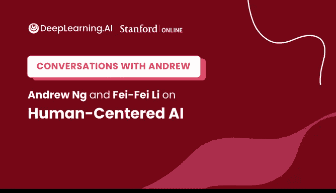
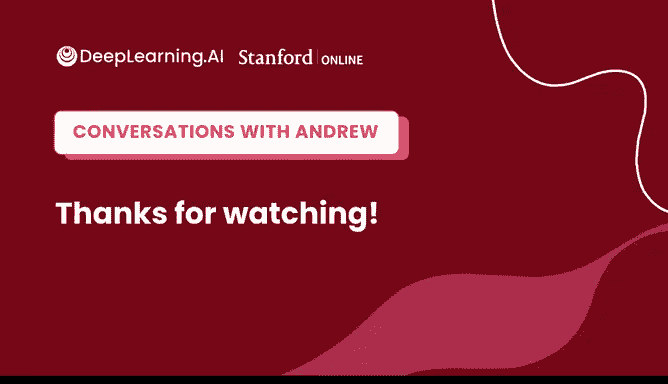

# 42：以人为本的人工智能访谈 🧠💬

## 概述
在本节课中，我们将一起学习吴恩达教授与李飞飞教授关于“以人为本的人工智能”的对话。我们将了解李飞飞教授从物理学转向人工智能的历程、ImageNet项目的起源、人工智能在医疗等领域的应用，以及她对初学者进入AI领域的建议。本教程将对话内容整理成结构化的知识，帮助你理解人工智能发展的宏大愿景与个人成长路径。

---

## 从物理学到人工智能的转变 🔄
上一节我们概述了本次访谈的主题，本节中我们来看看李飞飞教授如何从物理学背景转向人工智能领域。

李飞飞教授最初在普林斯顿大学主修物理学。物理学培养了她提出宏大问题、追寻“北极星”目标的热情。在阅读爱因斯坦、罗杰·彭罗斯等伟大物理学家的著作时，她发现他们后期都在思考生命、智能等同样大胆的问题。这激发了她对智能这一主题的好奇心。

在本科期间，她在几个神经科学实验室实习，特别是与视觉相关的研究。她意识到，探究智能的本质与探究宇宙起源或物质构成一样，是一个极其大胆的问题。这促使她在研究生阶段从物理学转向了人工智能，尽管当时正值“AI寒冬”，该领域更多地被称为机器学习、计算机视觉或计算神经科学。

李飞飞教授认为，当前人工智能已成为一项普及且具有全球影响力的技术，任何人都有可能进入这个领域。她自身的经历表明，只要有热情，背景并非障碍。

---

## ImageNet的起源故事 🖼️
上一节我们了解了李飞飞教授的学术转型，本节中我们来看看她主导的、对深度学习发展至关重要的ImageNet项目是如何诞生的。

ImageNet的起源并非简单地标注海量图片，而是源于对一个“北极星”级问题的追求。李飞飞教授在研究生阶段进入加州理工学院的计算机视觉与计算神经科学实验室。当时，机器学习作为新工具开始应用于计算机视觉领域，同时，数十年认知科学关于人类视觉处理的研究确立了一些关键规范问题，其中之一便是对自然物体的识别与理解。

她的博士研究很快遇到了一个持续至今的挑战：**机器学习模型的泛化能力不足**。模型容易过拟合，且缺乏足够的数据。当时整个领域依赖于手工设计特征。在博士阶段后期，她与导师意识到，如果相信物体识别这个“北极星”问题，就需要更多数据。

于是，他们先创建了**Caltech-101**数据集。当时互联网兴起，他们利用谷歌图片搜索下载图像，与母亲和几名本科生共同标注，建立了包含101个物体类别、约数千张图片的数据集。这个数据集为许多早期研究者（包括吴恩达教授和他的学生）提供了帮助。

然而，从数学角度，Caltech-101仍不足以支撑更强大的算法。成为助理教授后，李飞飞教授决定启动ImageNet项目——一个下载整个互联网图片并映射所有英语名词的宏大计划。这个想法最初遭到了许多质疑，例如有研究者公开质问：“如果你连一把椅子都识别不好，拥有22000个类别、1500万张图片的数据集有什么用？”但最终，这个庞大的数据集为全球无数研究者解锁了巨大价值，推动了深度学习的复兴。

李飞飞教授总结，ImageNet的成功是**押注正确的“北极星”问题**与**驱动它的数据**相结合的结果。

---

## 人工智能在医疗与机器人领域的应用 🏥🤖
上一节我们探讨了基础研究的突破，本节中我们来看看李飞飞教授如何将计算机视觉与神经科学的基础应用于医疗保健和机器人等实际领域。

李飞飞教授的研究演化也遵循着动物视觉智能的演化路径。有两个方向令她特别兴奋：一是寻找能改善人类生活的真正有影响力的应用领域（如医疗保健），二是探究视觉的终极意义（这引导她尝试闭合感知与机器人学习之间的循环）。

在医疗保健方面，大约十年前，她与斯坦福医学院的Arnold Milstein博士合作时，得知一个令人震惊的数据：**每年约有25万美国人死于医疗差错**。其中，每年因医院获得性感染导致的死亡人数超过9.5万，是交通事故死亡人数的2.5倍以上，而这很大程度上与临床手部卫生实践不佳有关。另一个事实是，每年因跌倒导致的伤害和死亡花费超过700亿美元，主要发生在老年人家庭或医院。

2012年左右，正值硅谷对自动驾驶汽车技术兴奋不已之时，李飞飞教授观察了智能传感摄像头、激光雷达、机器学习算法以及对复杂高风险环境的整体理解技术。她意识到，在医疗保健服务中，许多人类行为过程处于“黑暗”中，如果能在病房或老年公寓部署智能传感器来帮助医护人员和患者更安全，将意义重大。于是，她与Arnold Milstein博士共同开启了“环境智能”研究议程。

然而，将AI应用于真实人类环境时，会面临许多**人类层面的问题**，例如隐私。她们最初使用不捕获RGB信息的深度摄像头来保护隐私。过去十年，技术发展为隐私保护计算提供了更强大的工具集，例如：
*   **设备端推理**：随着芯片越来越强大，无需通过网络传输数据到中央服务器。
*   **联邦学习**：虽然仍处于早期阶段，但这是另一个潜在的隐私保护工具。
*   **差分隐私**
*   **加密技术**

李飞飞教授指出，人类对隐私等问题的需求，实际上正在推动医疗保健领域环境智能的新一轮机器学习技术发展。

---

## 人工智能政策与生态系统建设 🏛️
上一节我们讨论了AI的技术应用与挑战，本节中我们来看看李飞飞教授在人工智能政策制定和生态系统建设方面所做的工作。

大约四年前，李飞飞教授与斯坦福大学的许多教职领导意识到，斯坦福大学在AI发展中有其历史角色和责任。他们认为，下一代AI的教育、研究和政策需要是**以人为本**的。

为此，他们成立了**以人为本人工智能研究所**。其中一项让她走出舒适区的工作便是更深入地参与政策思考与制定。她认为，AI对人类生活的影响（有时是负面影响）如此迅速，如果专家不参与政策讨论，对任何人都不利。这涉及到公平性、隐私、AI人才向产业流失、数据和计算资源集中在少数科技公司等问题。

斯坦福HAI参与的一项政策工作是牵头游说了一项名为《国家人工智能研究资源任务力量法案》的议案。该法案呼吁成立一个任务小组，为美国公共部门（尤其是高等教育和研究机构）制定路线图，以增加其获取AI计算和AI数据资源的机会，旨在重振美国AI创新与研究的生态系统。李飞飞教授是该法案下拜登政府任命的12人任务小组成员之一。她希望这项政策能起到激励作用，建设和 rejuvenate 生态系统。

---

## 给机器学习初学者的建议 🎓
上一节我们探讨了宏观的政策层面，本节中我们回到个人成长，看看李飞飞教授对刚刚开始机器学习之旅的人有何建议。

李飞飞教授认为，当今AI的入口比他们当年要宽广得多。对于有技术兴趣的人，互联网上有极其丰富的资源（如Coursera、YouTube、GitHub），鼓励年轻人利用这些资源学习，因为其中充满乐趣。

对于非技术背景但仍对AI充满热情的人，无论是下游应用、其激发的创造力、政策与社会角度，还是重要的社会问题（如数字经济、治理、历史、伦理、政治科学），她都邀请大家加入。因为有许多未知问题有待探索，例如：
*   在数字时代如何定义和衡量我们的经济？
*   当机器人和软件越来越多地参与工作流程时，这意味着什么？
*   生成式AI的惊人进步对从音乐到艺术到写作的创作者意味着什么？

她认为，这是一个非常激动人心的时代，只要你对这个领域充满热情，无论来自何种背景，都能找到自己的角色。

此外，李飞飞教授还发起了名为“AI4ALL”（最初为“SAILORS”）的项目，旨在鼓励来自各行各业（尤其是传统上服务不足和代表性不足的社区）的高中生乃至更年轻的学生参与AI，通过夏令营、在线课程和大学途径项目，培养塑造未来AI的明日领袖。

---

## 总结
本节课中，我们一起学习了吴恩达教授与李飞飞教授的对话精华。我们回顾了李飞飞教授从物理学到AI的跨界历程，了解了ImageNet这一关键数据集背后的宏大愿景与迭代过程，探讨了AI在医疗保健等领域的实际应用与隐私挑战，认识了在政策层面构建健康AI生态系统的重要性，最后收获了给初学者的宝贵建议：AI领域依然年轻，充满无数待解的问题与机遇，无论你的背景如何，都可以找到参与并塑造未来AI的方式。保持好奇心，追寻自己的“北极星”问题。