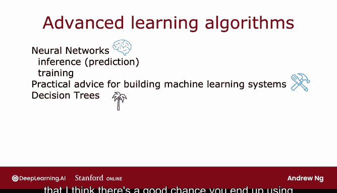

# 43：欢迎 🎉

在本节课中，我们将要学习吴恩达《机器学习》专项课程第一门课的核心内容与学习路径。课程将重点介绍神经网络（深度学习）和决策树这两种强大且广泛应用的机器学习算法，并提供构建实用机器学习系统的宝贵建议。

## 课程概述 📋

欢迎来到机器学习专项课程的第一门课。在本课程中，你将学习神经网络（也称为深度学习算法）以及决策树。这些是当前最强大、应用最广泛的机器学习算法之一。你将有机会亲自实现它们，并让它们为你工作。

本课程的一个独特之处在于，它提供了关于如何构建机器学习系统的实用建议。在构建一个实用的机器学习系统时，你需要做出许多决策，例如：是应该花更多时间收集数据，还是应该购买更强大的GPU来构建更大的神经网络。

## 课程结构详解 🗓️

上一节我们介绍了课程的整体目标，本节中我们来看看为期四周的课程具体安排。

以下是本课程四周的详细学习内容：

*   **第一周：神经网络与推理**
    我们将学习神经网络的工作原理以及如何进行推理或预测。例如，如果你从互联网下载了他人训练好并公开参数的神经网络，那么使用该网络进行预测的过程就称为推理。你将在第一周学习神经网络如何工作以及如何进行推理。

*   **第二周：训练神经网络**
    接下来的一周，你将学习如何训练自己的神经网络。具体来说，如果你有一个带标签的训练样本集 `(X, Y)`，你将学习如何为神经网络训练参数。

*   **第三周：构建机器学习系统的实用建议**
    在第三周，我们将深入探讨构建机器学习系统的实用建议。我将与你分享一些技巧，我认为即使是当今高薪且成功构建机器学习系统的工程师，也并非总能始终如一地应用这些技巧。这些建议将帮助你更高效、更快速地构建自己的系统。

*   **第四周：决策树**
    在课程的最后一周，你将学习决策树。虽然决策树在媒体上的热度不如神经网络，但它同样是应用广泛且非常强大的学习算法之一。如果你最终要构建一个应用，很可能会用到它。

## 学习起点：神经网络与人脑 🧠

以上我们了解了整个课程的框架，现在让我们正式进入学习。我们将从神经网络开始，并首先快速了解一下人类大脑（即生物大脑）是如何工作的。

让我们进入下一个视频。

---

**本节课中我们一起学习了**：机器学习专项课程第一门课的核心目标、独特价值（提供实用系统构建建议）以及为期四周的详细课程安排（神经网络推理、神经网络训练、系统构建建议、决策树）。课程即将从探索神经网络与人脑的关联正式开始。