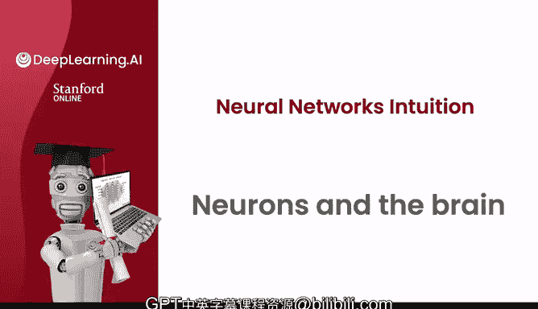
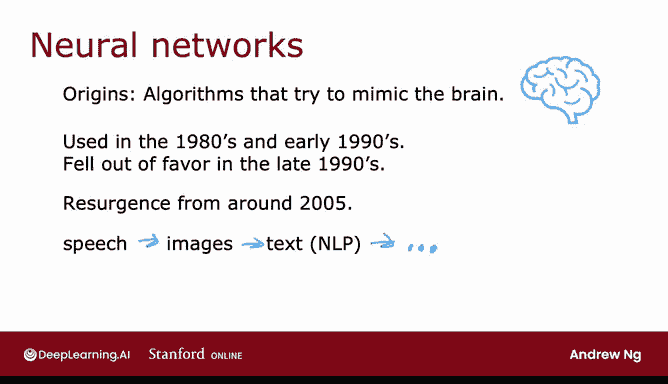
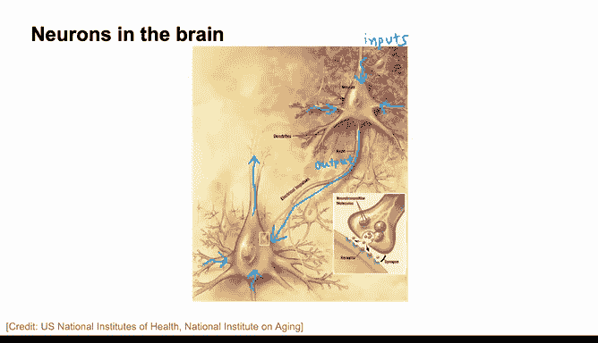
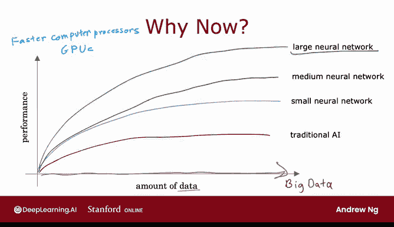

# 44：神经元与大脑 🧠

在本节课中，我们将要学习神经网络最初的灵感来源——生物大脑的工作原理，并了解神经网络如何从这一生物灵感出发，发展成今天强大的机器学习工具。我们还将探讨为什么神经网络在近年来取得了如此迅猛的发展。

## 从大脑到神经网络

上一节我们介绍了神经网络的起源。本节中我们来看看其最初的生物动机。

几十年前，当神经网络首次被发明时，最初的动机是编写能够模仿人类大脑或生物大脑如何学习和运作的软件。

尽管今天的神经网络（有时也称为人工神经网络）与我们任何人所认为的大脑实际工作和学习的方式已经大不相同，但一些生物动机仍然保留在我们今天思考人工神经网络或计算机神经网络的方式中。

因此，让我们通过观察大脑如何工作以及这与神经网络的关系来开始。

## 大脑的卓越智能

人类大脑，或者更广义地说生物大脑，展现出了比我们迄今为止能够构建的任何东西都更高水平或更强大的智能。

因此，神经网络始于尝试构建模仿大脑的软件这一动机。

## 神经网络的发展历程

以下是神经网络发展过程中的几个关键阶段：

*   **20世纪50年代**：神经网络研究开始。
*   **20世纪80年代和90年代初**：重新流行起来，并在手写数字识别等应用中显示出巨大的潜力，当时甚至用于读取邮政编码以路由邮件，以及读取手写支票上的金额数字。
*   **20世纪90年代末**：再次失宠。
*   **大约2005年**：开始复兴，并随着“深度学习”这一术语的出现而有所重塑。

当时让我感到惊讶的事情之一是，深度学习和神经网络的含义非常相似，但我当时可能低估了“深度学习”这个术语听起来要好得多，因为它“深”且是“学习”，因此这成为了过去十年或十五年里兴起的品牌。自那时起，神经网络在一个又一个应用领域引发了革命。

我认为现代神经网络或深度学习产生巨大影响的第一个应用领域可能是语音识别，由于现代深度学习，我们开始看到更好的语音识别系统，像Leang和Jeff Hinton这样的作者对此起到了重要作用。

然后它开始进入计算机视觉领域。有时人们仍然会提到2012年的“ImageNet时刻”，那可能是最大的轰动，当时它抓住了人们的想象力，并对计算机视觉产生了巨大影响。

在接下来的几年里，它开始进入文本或自然语言处理等领域。现在，神经网络被用于从气候变化到医学成像，再到在线广告和更广泛的推荐系统等方方面面，现在机器学习的许多应用领域都使用神经网络，尽管今天的神经网络与大脑的学习方式几乎没有任何关系。

## 生物神经元的工作原理

上一节我们回顾了神经网络的历史。本节中我们来看看其灵感来源——生物神经元的具体结构。

这是一张说明大脑中神经元样子的示意图。

所有的人类思想都来自于你大脑和思维中像这样的神经元，它们发送电脉冲，有时与其他神经元形成新的连接。

给定一个像这样的神经元，它有许多输入，从其他神经元接收电脉冲，然后我圈出的这个神经元执行一些计算，并会发送其输出。

通过这些电脉冲传递给其他神经元，而这个上部神经元的输出又成为下面这个神经元的输入，它再次聚合来自多个其他神经元的输入，然后可能将其自己的输出发送给其他神经元，这就是构成人类思想的东西。

这是一张生物神经元的简化图。

一个神经元包含一个细胞体，如左图所示，如果你上过生物课，你可能会认出这是神经元的细胞核。正如我们在上一张幻灯片中看到的，神经元有不同的输入，在生物神经元中，输入线被称为树突，然后它偶尔会通过输出线（称为轴突）向其他神经元发送电脉冲。

不用担心这些生物学术语，如果你在生物课上见过它们，你可能记得它们，但为了构建人工神经网络，你实际上不需要记住任何这些术语。

但这个生物神经元可能会发送电脉冲，成为另一个神经元的输入。

## 人工神经元的数学模型

上一节我们了解了生物神经元。本节中我们来看看其简化的人工模型。

人工神经网络使用了一个非常简化的生物神经元数学模型，我在这里画一个小圆圈来表示单个神经元，神经元所做的是接收一些输入（一个或多个，只是数字），进行一些计算，并输出另一个数字，然后这个数字可以成为右边显示的第二个神经元的输入。

当你构建人工神经网络或深度学习算法时，通常希望同时模拟许多这样的神经元，而不是一次构建一个神经元，所以在这张图中，我画了三个神经元。

这些神经元集体所做的是输入几个数字，执行一些计算，并输出其他一些数字。

## 重要说明：生物与人工的差异

在这一点上，我想给出一个重要的告诫，尽管我在生物神经元和人工神经元之间做了一个松散的类比，但我认为今天我们对人类大脑如何工作几乎一无所知。事实上，每隔几年神经科学家就会在大脑如何工作方面取得一些根本性的突破，我认为在可预见的未来将继续如此，这对我来说是一个迹象，表明关于大脑实际如何工作还有许多突破有待发现，因此，盲目模仿我们今天所知的关于人类大脑的知识（坦率地说，这非常少）可能不会在构建真正智能方面走得太远，当然不会以我们目前的神经科学知识水平。

话虽如此，即使使用我们将要讨论的这些极其简化的神经元模型，我们也能够构建真正强大的深度学习算法。因此，当你深入研究神经网络和深度学习时，尽管起源是受生物学启发的，但不要过于认真地对待生物学动机。事实上，我们这些从事深度学习研究的人已经不再那么关注生物学动机，而是仅仅使用工程原理来找出如何构建更有效的算法，但我认为偶尔推测和思考生物神经元如何工作可能仍然很有趣。

## 神经网络为何现在兴起？

神经网络的思想已经存在了几十年，所以有几个人问我：“嘿，Andrew，为什么是现在？为什么只有在过去几年里神经网络才真正兴起？”

当我被问到这个问题时，我会为他们画这张图，如果别人问你这个问题，也许你也可以为他们画这张图。

让我在横轴上绘制你针对某个问题所拥有的数据量，在纵轴上绘制应用于该问题的学习算法的性能或准确性。

在过去的几十年里，随着互联网的兴起、手机的兴起、我们社会的数字化，我们在许多应用领域的数据量稳步向右移动。许多过去记录在纸上的东西，比如你订购某物，现在更可能是数字记录，而不是在纸上；如果你看医生，你的健康记录现在更可能是数字化的，而不是在纸上。

因此，在许多应用领域，数字数据量已经爆炸式增长。

我们看到的是，对于传统的机器学习算法，如逻辑回归和线性回归，即使你向这些算法输入更多数据，也很难让性能持续上升。就好像传统的学习算法，如线性回归和逻辑回归，它们根本无法随着我们现在可以输入的数据量而扩展，也无法有效利用我们为不同应用所拥有的所有这些数据。

而人工智能研究开始观察到的是，如果你在这个数据集上训练一个小型神经网络，那么性能可能看起来像这样。如果你训练一个中等规模的神经网络（意味着其中有更多的神经元），性能可能看起来像那样。如果你训练一个非常大的神经网络（意味着有很多这些人工神经元），那么对于某些应用，性能会持续上升。

因此，这意味着两件事：对于某一类你确实拥有大量数据的应用（有时你会听到“大数据”这个词被抛来抛去），如果你能够训练一个非常大的神经网络来利用你所拥有的海量数据，那么你可以在从语音识别到图像识别，再到自然语言处理应用等许多方面达到以前几代学习算法无法达到的性能，这导致了深度学习算法的兴起。这也是为什么更快的计算机处理器（包括GPU或图形处理器单元的兴起）——这种最初设计用于生成漂亮计算机图形的硬件，但结果证明对深度学习也非常强大——也是推动深度学习算法发展到今天这个样子的主要力量。

## 总结

本节课中我们一起学习了神经网络如何从模仿生物大脑的动机开始，了解了生物神经元的基本结构及其简化的人工模型。我们回顾了神经网络跌宕起伏的发展历程，并重点探讨了其近年来迅猛发展的关键原因：海量数据的可用性以及大型神经网络模型能够有效利用这些数据，从而在性能上超越传统算法。下一节，我们将更深入地探讨神经网络实际工作的细节。