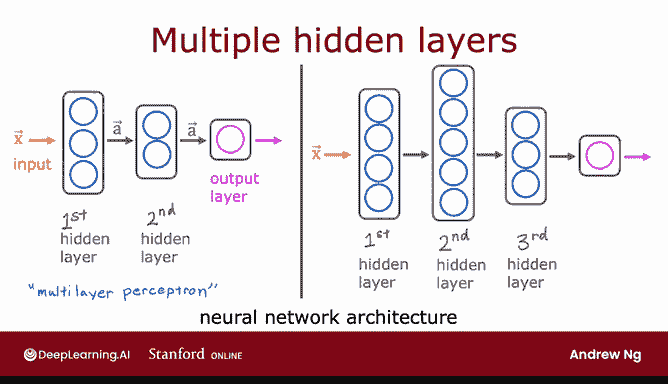

# 45：03_01_03_需求预测

## 概述

在本节课中，我们将学习神经网络的基本工作原理。我们将从一个简单的需求预测例子开始，逐步构建一个神经网络模型，并解释其核心概念，如神经元、层、激活值和网络架构。通过本课，你将理解神经网络如何自动学习特征并进行预测。

---

## 从单个神经元到逻辑回归

为了说明神经网络的工作原理，我们从一个例子开始。我们将使用需求预测的例子，在这个例子中，你观察一个产品并尝试预测它是否会成为畅销品。

我们来看一个销售T恤的例子。你想知道某件特定的T恤是否会成为畅销品。你收集了不同T恤在不同价格下的销售数据，以及哪些成为了畅销品。零售商今天使用这种类型的应用程序来更好地规划库存水平和营销活动。如果你知道什么可能成为畅销品，你就可以提前计划，例如采购更多该商品的库存。

在这个例子中，输入特征X是T恤的价格，这是学习算法的输入。如果你应用逻辑回归来拟合一个Sigmoid函数到数据上，它可能看起来像那样。

那么你的预测输出可能看起来像这样：`1 / (1 + e^(-(wx + b)))`。

之前，我们将此写作 `f(x)` 作为学习算法的输出。为了帮助我们构建神经网络，我将稍微改变一下术语，使用字母 `a` 来表示这个逻辑回归算法的输出。术语 `a` 代表激活，实际上是一个来自神经科学的术语，它指的是一个神经元向下游其他神经元发送高输出的程度。事实证明，这个逻辑回归单元或这个小逻辑回归算法可以被认为是大脑中单个神经元的非常简化的模型。

神经元所做的是将价格X作为输入，然后计算上面的公式，并输出数字 `a`，该数字通过此公式计算，它输出这件T恤成为畅销品的概率。

另一种思考神经元的方式是将其视为一台微型计算机，其唯一的工作是输入一个或几个数字（例如价格），然后输出一个或几个其他数字。在这种情况下，就是T恤成为畅销品的概率。正如我在上一个视频中提到的，逻辑回归算法比大脑中任何生物神经元所做的要简单得多，这就是为什么人工神经网络是人类大脑的一个极其简化的模型，尽管在实践中，正如你所知，深度学习算法确实工作得很好。

---

## 构建神经网络：层与激活

有了对单个神经元的描述，现在构建神经网络只需要将一堆这样的神经元连接或组合在一起。

现在让我们看一个更复杂的需求预测例子。在这个例子中，我们将有四个特征来预测一件T恤是否会成为畅销品。这些特征是：T恤的价格、运费、该特定T恤的营销量以及材料质量（是高质量厚棉布还是可能较低质量的材料）。

你可能会怀疑一件T恤是否会成为畅销品实际上取决于几个因素。首先是这件T恤的可负担性。其次是潜在买家对这件T恤的认知度。第三是感知质量，即买家是否认为这是一件高质量的T恤？

因此，我要做的是创建一个人工神经元来尝试估计这件T恤被认为高度可负担的概率。可负担性主要是价格和运费的函数，因为你必须支付的总金额是价格加上运费的总和。

所以我们将在这里使用一个小神经元，一个逻辑回归单元，输入价格和运费，并预测人们是否认为这是可负担的。

其次，我将在这里创建另一个人工神经元来估计这件T恤是否有很高的认知度。在这种情况下，认知度主要是T恤营销的函数。

最后，我将创建另一个神经元来估计人们是否认为这是高质量的。这可能主要是T恤价格和材料质量的函数。价格在这里是一个因素，因为幸运或不幸的是，如果一件T恤价格非常高，人们有时会认为它是高质量的，因为如果它非常昂贵，那么也许人们认为它必须是高质量的。

有了这些对可负担性、认知度和感知质量的估计，我们将这三个神经元的输出连接到右边这里的另一个神经元。然后，那里有另一个逻辑回归单元，最终输入这三个数字并输出这件T恤成为畅销品的概率。

在神经网络的术语中，我们将这三个神经元分组到一个所谓的层中。层是一组神经元的集合，它们接收相同或相似的特征作为输入，并一起输出几个数字。因此，左边的这三个神经元构成一个层，这就是我把它们画在彼此之上的原因。右边的单个神经元也是一个层。

左边的层有三个神经元，所以一个层可以有多个神经元，也可以像右边这个层一样只有一个神经元。右边的这个层也称为输出层，因为这个最终神经元的输出是神经网络预测的输出概率。

在神经网络的术语中，我们还将称可负担性、认知度和感知质量为激活值。术语“激活”来自生物神经元，指的是生物神经元向下游其他神经元发送高输出值或许多电脉冲的程度。因此，可负担性、认知度和感知质量上的这些数字就是这一层中这三个神经元的激活值。同样，这个输出概率是这里右边所示神经元的激活值。

---

## 神经网络的计算过程

因此，这个特定的神经网络进行如下计算：它输入四个数字，然后神经网络的这一层使用这四个数字来计算三个新的数字（也称为激活值），然后最终层（神经网络的输出层）使用这三个数字来计算一个数字。

在神经网络中，这四个数字的列表也称为输入层，它只是一个四个数字的列表。

现在我想对这个神经网络做一个简化。到目前为止我描述它的方式是，我们必须逐个检查神经元，并决定它从前一层接收哪些输入。例如，我们说可负担性只是价格和运费的函数，认知度只是营销的函数，等等。但是，如果你正在构建一个大型神经网络，手动决定哪些神经元应该接收哪些特征作为输入将是一项繁重的工作。

在实践中实现神经网络的方式是，某一层中的每个神经元，比如中间的这一层，将能够访问前一层（输入层）的每个特征、每个值。这就是为什么我现在从每个输入特征画箭头到中间这里显示的每个神经元。你可以想象，如果你试图预测可负担性，并且它知道价格、运费、营销和材料，也许它会学会忽略营销和材料，并通过适当设置参数来只关注与可负担性最相关的特征子集。

为了进一步简化这个神经网络的符号和描述，我将把这四个输入特征写成一个向量 `X`。我们将把神经网络视为拥有四个特征，它们构成了这个特征向量 `x`。这个特征向量被馈送到中间的这一层，然后该层计算三个激活值，也就是这三个数字。而这三个激活值反过来又成为另一个向量，被馈送到这个最终的输出层，最终输出这件T恤成为畅销品的概率。

---

## 神经网络的架构与术语

这就是神经网络的全部。它有几层，其中每一层输入一个向量并输出另一个数字向量。例如，中间的这一层输入四个数字 `x`，并输出三个对应于可负担性、认知度和感知质量的数字。

为了增加一点术语，你已经看到这一层被称为输出层，而这一层被称为输入层。为了也给中间的这一层起个名字，中间的这一层被称为隐藏层。

我知道这可能不是最好或最直观的名字，但这个术语来源于：当你有一个训练集时，在训练集中你可以观察到 `X` 和 `y`，你的数据集告诉你什么是 `X` 和什么是 `y`，所以你得到的数据告诉你正确的输入和正确的输出。但是你的数据集并没有告诉你可负担性、认知度和感知质量的正確值，因此这些的正确值是隐藏的，你在训练集中看不到它们，这就是为什么中间的这一层被称为隐藏层。

---

## 另一种视角：自动特征工程

我想与你分享另一种思考神经网络的方式，我发现这对建立我的直觉很有用。让我遮住这张图的左半部分，看看我们剩下什么。

你在这里看到的是一个逻辑回归算法或逻辑回归单元，它以一件T恤的可负担性、认知度和感知质量作为输入，并使用这三个特征来估计T恤成为畅销品的概率。所以这只是逻辑回归。但很酷的是，它没有使用原始特征（价格、运费、营销等），而是使用了新的、可能更好的特征——可负担性、认知度和感知质量——这些特征有望更好地预测这件T恤是否会成为畅销品。

所以，思考这个神经网络的一种方式是，它只是逻辑回归。但是，它是一个可以学习自己特征的逻辑回归版本，这使得它更容易做出准确的预测。

事实上，你可能还记得上一门课程中的这个住房例子，我们说如果你想预测房屋价格，你可能会取地块的前沿或宽度，乘以地块的深度，以构建一个更复杂的特征 `x1 * x2`，即地块的大小。所以我们在那里进行手动特征工程，我们必须查看特征 `x1` 和 `x2`，并手动决定如何将它们组合在一起以提出更好的特征。

神经网络所做的是，它不需要你手动设计特征，正如你稍后将看到的，它可以学习自己的特征，使学习问题对自己来说更容易。这就是使神经网络成为当今世界上最强大的学习算法之一的原因。

---

## 总结与扩展

总结一下，神经网络是这样工作的：输入层有一个特征向量（在这个例子中是四个数字），它被输入到隐藏层，隐藏层输出三个数字（我将使用一个向量来表示这个隐藏层输出的激活向量），然后输出层接收这三个数字作为输入并输出一个数字，这将是神经网络的最终激活值或最终预测。

有一点需要注意，尽管我之前将这个神经网络描述为计算可负担性、认知度和感知质量，但神经网络的一个非常好的特性是，当你从数据中训练它时，你不需要明确地决定神经网络应该计算哪些其他特征（如可负担性等）。相反，它会自己完全弄清楚它想在隐藏层中使用哪些其他特征，这就是使它成为如此强大的学习算法的原因。

所以，你在这里看到了一个神经网络的例子，这个神经网络有一个隐藏层。让我们看一些其他神经网络的例子，特别是有多个隐藏层的例子。

这是一个例子：这个神经网络有一个输入特征向量 `x`，它被馈送到一个隐藏层（我称之为第一个隐藏层）。如果这个隐藏层有三个神经元，那么它将输出一个包含三个激活值的向量。这三个数字然后可以被输入到第二个隐藏层。如果第二个隐藏层有两个神经元（两个逻辑单元），那么这个第二个隐藏层将输出另一个现在包含两个激活值的向量，这个向量可能进入输出层，然后输出神经网络的最终预测。

或者这里是另一个例子：这是一个神经网络，其输入进入第一个隐藏层，第一个隐藏层的输出进入第二个隐藏层，然后进入第三个隐藏层，最后进入输出层。

当你构建神经网络时，你需要做出的决定之一是你想要多少个隐藏层，以及你希望每个隐藏层有多少个神经元。关于有多少个隐藏层以及每个隐藏层有多少个神经元的问题，是你神经网络架构的问题。在本课程后面，你将学习一些为神经网络选择合适架构的技巧，但选择正确数量的隐藏层和每层隐藏单元的数量也会影响学习算法的性能。所以在本课程后面，你也会学习如何为你的神经网络选择一个好的架构。

顺便说一下，在一些文献中，你看到这种类型的有多层的神经网络被称为多层感知机。所以你看到那只是指看起来像你在幻灯片上看到的这样的神经网络。

---

## 结束语

我知道我们在这个视频中讲了很多内容，所以感谢你坚持看完。你现在知道了神经网络是如何工作的。在下一个视频中，让我们看看这些想法如何应用到其他应用中，特别是我们将看看人脸识别的计算机视觉应用。让我们继续看下一个视频。