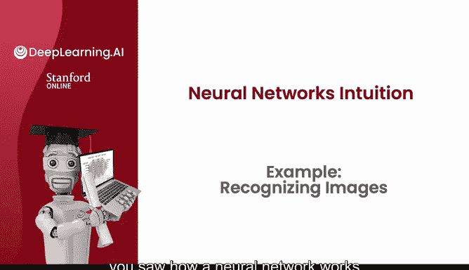
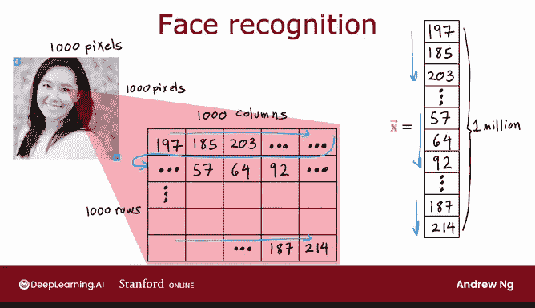
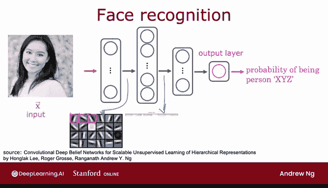
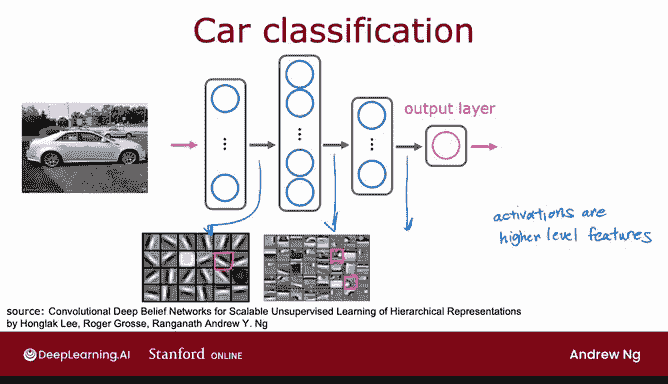

# 46：04_01_04_示例：图像识别 👁️

在本节课中，我们将学习神经网络如何应用于计算机视觉任务，特别是图像识别。我们将通过人脸识别的例子，了解神经网络如何从原始像素数据中自动学习并识别复杂的模式。

---

在上一节视频中，我们看到了神经网络在需求预测示例中的工作原理。本节中，我们来看看如何将类似的思想应用于计算机视觉应用。

如果你正在构建一个人脸识别应用程序，你可能希望训练一个神经网络。这个网络接收一张图片作为输入，并输出图片中人物的身份。

这张图片是1000x1000像素，因此它在计算机中的表示实际上是一个1000x1000的网格，也称为1000x1000的像素强度值矩阵。

在这个例子中，像素强度值或像素亮度值范围从0到255。因此，这里的197表示图像最左上角像素的亮度，185是旁边一个像素的亮度，依此类推。最右下角的像素亮度是214。

如果你将这些像素强度值展开成一个向量，最终会得到一个包含一百万个像素强度值的列表或向量。一百万是因为1000乘以1000等于一百万个数字。所以，人脸识别问题就是：能否训练一个神经网络，接收这个包含一百万个像素亮度值的特征向量作为输入，并输出图片中人物的身份？

以下是构建神经网络来执行此任务的一种方式。

输入图像X被送入第一层神经元，即第一个隐藏层。该层提取一些特征，其输出被送入第二个隐藏层。第二个隐藏层的输出再被送入第三个隐藏层，最后到达输出层。输出层会估计该图片是某个特定人物的概率。

一个有趣的现象是，观察一个在大量人脸图像上训练过的神经网络，并尝试可视化这些隐藏层在计算什么。事实证明，当你在大量人脸图片上训练这样一个系统，并观察隐藏层中不同神经元以了解它们可能计算什么时，你可能会发现以下情况。

以下是第一个隐藏层可能学习到的内容：
*   一个神经元可能负责寻找类似这样的垂直线条或垂直边缘。
*   第二个神经元可能寻找特定方向的线条或边缘。
*   第三个神经元可能寻找另一个方向的线条。

因此，在神经网络的最初几层，你可能会发现神经元在图像中寻找非常短的线条或边缘。

如果我们观察下一个隐藏层，会发现这些神经元可能学会将许多短小的线条或边缘片段组合在一起，以寻找面部的组成部分。

以下是第二个隐藏层可能学习到的内容：
*   第一个神经元看起来试图检测图像某个位置是否存在眼睛。
*   第二个神经元看起来试图检测鼻子的轮廓。
*   第三个神经元可能试图检测耳朵的底部。

接着，观察再下一层，在这个例子中，神经网络正在组合面部的不同部分，以尝试检测是否存在更大、更粗略的面部形状。最后，通过检测面部与不同面部形状的匹配程度，神经网络创建了一套丰富的特征，帮助输出层确定图片中人物的身份。

神经网络的一个显著特点是，在这个例子中，它可以完全自主地在不同的隐藏层学习这些特征检测器。没有人告诉它要在第一层寻找短小的边缘，在第二层寻找眼睛、鼻子和面部轮廓，在第三层寻找更完整的面部形状。神经网络能够仅从数据中自行找出这些模式。

需要注意的一点是，在这个可视化中，第一隐藏层的神经元被显示为观察相对较小的窗口以寻找边缘，第二隐藏层观察更大的窗口，第三隐藏层观察更大的窗口。因此，这些小小的神经元可视化实际上对应于图像中不同大小的区域。

为了更有趣，让我们看看如果在一个不同的数据集上训练这个神经网络会发生什么，比如大量汽车的侧面图片。

以下是训练汽车识别网络时各层可能学习的内容：
*   第一层学习检测边缘，这与之前非常相似。
*   第二隐藏层学习检测汽车的部件。
*   第三隐藏层学习检测更完整的汽车形状。

因此，仅仅通过输入不同的数据，神经网络就会自动学习检测非常不同的特征，以便对其所训练的特定任务（无论是汽车检测、人物识别还是其他任务）进行预测。

---

这就是神经网络在计算机视觉应用中工作的方式。事实上，在本周晚些时候，你将看到如何自己构建一个神经网络并将其应用于手写数字识别应用。

到目前为止，我们一直在介绍神经网络的直观描述，让你感受它们是如何工作的。在下一个视频中，我们将更深入地探讨具体的数学原理和实现细节，了解如何实际构建神经网络的一层或多层，从而让你能够自己实现这样的网络。让我们继续观看下一个视频。

在本节课中，我们一起学习了神经网络如何应用于图像识别。我们了解到，神经网络能够从原始像素数据开始，在隐藏层中自动学习从简单边缘到复杂物体部件的层次化特征，最终完成识别任务。这种自动特征学习的能力是神经网络在计算机视觉领域强大的关键。