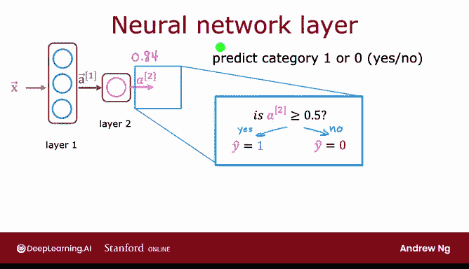

# 47：神经网络层 🧠

## 概述
在本节课中，我们将学习现代神经网络的基本构建模块——神经元层。我们将了解如何构建一个神经元层，并理解如何将这些构建模块组合起来，形成一个大型的神经网络。

---

## 神经元层的工作原理

上一节我们概述了神经网络的基本概念，本节中我们来看看一个具体的神经元层是如何工作的。

下图展示了一个需求预测的例子。该网络有四个输入特征，它们被输入到一个包含三个神经元的隐藏层。然后，隐藏层的输出被传递到一个仅包含一个神经元的输出层。

让我们放大隐藏层，观察其计算过程。这个隐藏层接收四个数字作为输入，这四个数字是层内三个神经元的共同输入。

每个神经元本质上都在实现一个小的逻辑回归单元或函数。

以下是第一个神经元的工作方式：
*   它有两个参数 **W** 和 **B**。为了表示这是第一个隐藏单元，我们将其下标标记为 **W₁** 和 **B₁**。
*   它的输出是一个激活值 **a**，计算公式为 **a = g(w₁ · x + b₁)**。其中，**w₁ · x + b₁** 是我们在之前逻辑回归课程中学到的熟悉的 **z** 值，而 **g(z)** 是熟悉的逻辑函数：**g(z) = 1 / (1 + e⁻ᶻ)**。
*   假设这个计算结果是数字 0.3，这就是第一个神经元的激活值 **a**。我们同样用下标将其标记为 **a₁**。因此，**a₁** 可能是一个像 0.3 这样的数字，表示基于输入特征，该商品具有高可负担性的概率。

现在来看第二个神经元：
*   第二个神经元有参数 **W₂** 和 **B₂**，这是第二个逻辑单元的专属参数。
*   它计算 **a₂ = g(w₂ · x + b₂)**。在这个例子中，假设结果为 0.7，表示我们认为潜在买家会注意到这件 T 恤的概率是 0.7。

同样地，第三个神经元：
*   它有第三组参数 **W₃** 和 **B₃**，并计算激活值 **a₃ = g(w₃ · x + b₃)**，假设结果为 0.2。

在这个例子中，这三个神经元输出了 0.3、0.7 和 0.2。这个由三个数字组成的向量，就成为了激活值向量 **a**，它将被传递给神经网络的最终输出层。

---

## 层的编号与符号约定

当构建具有多层的神经网络时，为不同层编号会很有用。按照惯例：
*   这个隐藏层被称为神经网络的 **第 1 层**。
*   输出层被称为 **第 2 层**。
*   输入层有时也被称为 **第 0 层**。

如今，神经网络可以拥有数十甚至数百层。为了引入符号来帮助我们区分不同的层，我们将使用上标方括号 `[l]` 来索引不同的层。

具体来说：
*   **a^[1]** 这个符号表示神经网络第一层（即这个隐藏层）的输出。
*   同样，**W₁^[1]** 和 **b₁^[1]** 是神经网络第一层中第一个单元的参数。
*   **W₂^[1]** 和 **b₂^[1]** 是第一层中第二个隐藏单元的参数。
*   这些激活值也可以加上标 `[1]`，表示它们属于神经网络的第一层。

这个符号可能看起来有点复杂，但要记住的关键点是：**每当看到上标 `[1]`，它就指的是与神经网络第一层相关的量**。如果看到上标 `[2]`，则指与第二层相关的量，对于更多层的网络，第三层、第四层等也依此类推。

---

## 第二层（输出层）的计算

我们已经了解了这个神经网络第一层的计算，其输出是激活向量 **a^[1]**。这个输出 **a^[1]** 将成为第二层的输入。

现在，让我们放大神经网络的第二层（即输出层）的计算过程。

第二层的输入是第一层的输出，即我们刚刚在幻灯片前一部分计算出的向量 **a^[1] = [0.3, 0.7, 0.2]**。

因为输出层只有一个神经元，它所做的是计算其第一个（也是唯一一个）神经元的输出 **a₁^[2]**，计算公式为：**a₁^[2] = g(w₁^[2] · a^[1] + b₁^[2])**。这里的 **a^[1]** 是输入到该层的向量，**g** 和之前一样是应用于计算结果 **z** 的 Sigmoid 函数。

假设这算出的数字是 0.84，那么它就成为神经网络输出层的输出。在这个例子中，由于输出层只有一个神经元，这个输出是一个标量（单个数字），而不是一个数字向量。

沿用我们之前的符号约定，我们将使用上标 `[2]` 来表示与该神经网络第二层相关的量。因此，**a^[2]** 是这一层的输出，也就是神经网络的最终输出。为了使符号一致，我们也可以给这些参数和激活值加上标 `[2]`，表示它们属于神经网络的第二层。

---

## 生成最终预测

神经网络计算出 **a^[2]** 后，还有一个可选的最终步骤：
*   如果你想要一个二元预测（例如，是或否，1 或 0），你可以取计算出的数字 **a₁^[2]**（本例中是 0.84），并以 0.5 为阈值进行判断。
*   如果它大于 0.5，你可以预测 **ŷ = 1**；如果小于 0.5，则预测 **ŷ = 0**。这个阈值处理过程在你学习专项课程第一门课的逻辑回归时也见过。

因此，如果你愿意，这个步骤可以给出最终预测 **ŷ**（1 或 0）；如果你只想要一个成为畅销品的概率，则可以省略这一步。

---

## 总结

本节课中，我们一起学习了神经网络的核心构建块——神经元层的工作原理。我们了解到：
1.  每一层接收一个数字向量作为输入。
2.  应用多个逻辑回归单元（神经元）对其进行计算。
3.  生成另一个数字向量，该向量在层与层之间传递。
4.  直到最终输出层完成计算，得到神经网络的预测输出。
5.  这个输出可以（可选地）通过 0.5 阈值处理来生成最终的二元预测。

这就是神经网络的工作方式。有了这个基础，我们就可以继续构建更复杂、更大型的神经网络模型。希望通过更多的例子，关于“层”的概念以及如何将它们组合起来构建神经网络的理解会更加清晰。