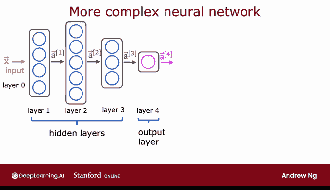
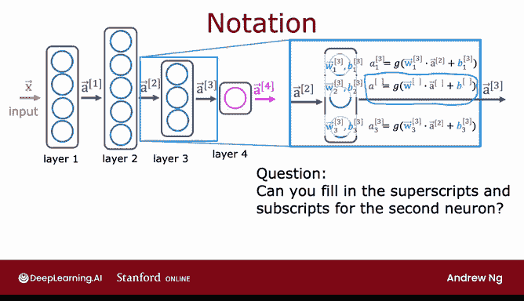
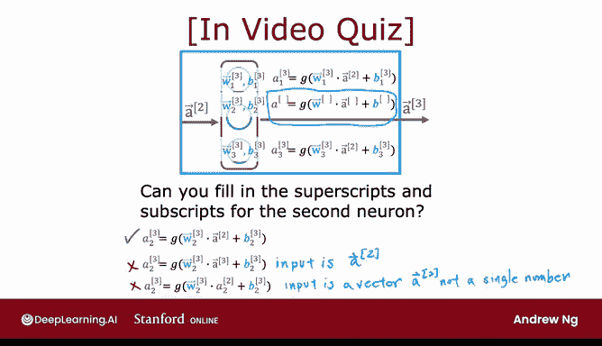
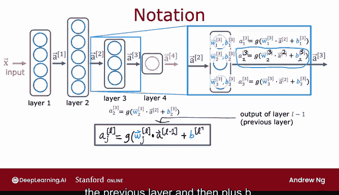

# 48：06_01_02 更复杂的神经网络 🧠

在本节课中，我们将学习如何将神经网络层组合起来，构建一个更复杂的多层神经网络。我们将详细介绍神经网络的层结构、各层之间的计算方式以及相关的数学符号，为后续理解神经网络的前向传播算法打下基础。

## 神经网络层结构回顾

在上一节视频中，我们学习了神经网络层的基本概念，它接收一个数字向量作为输入，并输出另一个数字向量。

本节中，我们来看看如何利用这种层结构来构建更复杂的神经网络。通过这个过程，我们希望使神经网络的符号表示变得更加清晰和具体。

## 一个四层神经网络的例子

让我们来看一个作为示例的更复杂的神经网络。这个网络包含四层（不计算输入层，即第0层）。其中，第1、2、3层是隐藏层，第4层是输出层。按照惯例，第0层是输入层。

**约定**：当我们说一个神经网络有“四层”时，这个数量包括了所有隐藏层和输出层，但不包括输入层。因此，按照网络层数的常规计数方式，这是一个四层神经网络。

## 聚焦第三层：计算过程详解

让我们放大观察第3层，也就是第三个（也是最后一个）隐藏层，来了解该层的计算过程。

第3层接收一个由前一层（第2层）计算出的向量 **a^[2]** 作为输入，并输出另一个向量 **a^[3]**。

那么，第3层是如何执行从 **a^[2]** 到 **a^[3]** 的计算呢？如果该层有3个神经元（或称为3个隐藏单元），那么它拥有参数 **W1, B1, W2, B2, W3, B3**。它的计算方式如下：

*   **a1** = sigmoid( **W1** · **a^[2]** + **B1** )
*   **a2** = sigmoid( **W2** · **a^[2]** + **B2** )
*   **a3** = sigmoid( **W3** · **a^[2]** + **B3** )

然后，该层的输出是一个由 **a1, a2, a3** 组成的向量。

按照惯例，为了更明确地表示这些与第3层相关的量，我们在所有符号的上标加上方括号 `[3]`，以表明这些 **W** 和 **B** 参数是与第3层的神经元相关联的，而这些激活值也是第3层的激活值。

请注意，上面公式中的项是 **W1^[3]**，表示与第3层相关的参数，它与 **a^[2]**（第2层的输出，即第3层的输入）进行点积。这就是为什么这里有 `[3]`（因为是第3层的参数）和 `[2]`（因为是第2层的输出）。

## 理解符号：一个小测验

现在，让我们快速检验一下对这些符号的理解。我将隐藏与第二个神经元相关的上标和下标。

在不回看视频的情况下（如果你想回看也可以，但建议先不要），你能思考并自行补全这个方程式中缺失的上标和下标吗？

请看看下面的方程式，并思考正确的上标和下标应该是什么。

以下是选项：
1.  **a2^[3]** = g( **W2^[3]** · **a^[2]** + **b2^[3]** )
2.  **a2^[3]** = g( **W2^[3]** · **a^[3]** + **b2^[3]** )
3.  **a2^[3]** = g( **W2^[3]** · **a2^[2]** + **b2^[3]** )

**答案分析**

如果你选择了第一个选项，那么你是正确的。

*   **a2^[3]** 表示第3层第二个神经元的激活值。
*   应用激活函数 **g** 时，我们使用同一个神经元的参数，因此 **W** 和 **B** 的下标都是 `2`，上标都是 `[3]`。
*   输入特征是来自前一层（第2层）的输出向量，即 **a^[2]**。
*   第二个选项使用了向量 **a^[3]**，但这并非前一层的输出向量。本层的输入是 **a^[2]**。
*   第三个选项使用 **a2^[2]** 作为输入，这只是一个单独的数字，而不是一个向量。请记住，正确的输入是向量 **a^[2]**（顶部有小箭头），而不仅仅是单个数字。

## 通用计算公式

总结一下，**a2^[3]** 是与第3层第二个神经元相关的激活值，因此下标是 `2`。参数 **W2^[3]** 和 **b2^[3]** 也是与第3层第二个神经元相关的。

以下是这个方程更通用的形式，适用于任意层 **l** 和任意单元 **j**：

**a_j^[l] = g( W_j^[l] · a^[l-1] + b_j^[l] )**

其中：
*   **a_j^[l]** 是第 **l** 层第 **j** 个单元（例如上面的 **a2^[3]**）的激活输出。
*   **g** 是激活函数（例如Sigmoid函数）。
*   **W_j^[l]** 是第 **l** 层第 **j** 个单元的权重向量。
*   **a^[l-1]** 是前一层的激活值向量（注意这里是 **l-1**，如上例中的 `2`）。
*   **b_j^[l]** 是该层该单元的偏置参数。

这个公式给出了第 **l** 层第 **j** 个单元的激活值。上标 `[l]` 表示第 **l** 层，下标 `j` 表示第 **j** 个单元。在构建神经网络时，“单元 **j**” 指的是第 **j** 个神经元，这两个术语可以互换使用，因为层中的每个单元就是一个单独的神经元。

这里的 **g** 是Sigmoid函数。在神经网络上下文中，**g** 有另一个名称，也叫**激活函数**，因为 **g** 输出这个激活值。所以当我说“激活函数”时，指的就是这里的函数 **g**。目前你只见过Sigmoid这一种激活函数，但在后续课程中我们将看到其他函数也可以替代 **g** 的位置。因此，激活函数就是输出这些激活值的函数。

## 保持符号一致：输入层的表示

为了使所有符号保持一致，我还将给输入向量 **x** 另一个名称：**a^[0]**。

这样，同一个方程式也适用于第一层。当 **l = 1** 时，第一层的激活值 **a^[1]** 就是 sigmoid( 权重 · **a^[0]** + 偏置 )，而 **a^[0]** 正是输入特征向量 **x**。

## 本节总结

通过引入这套符号体系，你现在知道了如何根据参数以及前一层的激活值，计算神经网络中任意一层的激活值。

具体来说，你现在知道了在给定前一层激活值的情况下，如何计算任何一层的激活值。在接下来的视频中，我们将把这些知识整合到神经网络的**推理算法**（即前向传播算法）中，也就是让神经网络进行预测的方法。

本节课中，我们一起学习了：
1.  多层神经网络的层结构定义和计数惯例。
2.  神经网络中单层的详细计算过程。
3.  神经网络中用于表示层、神经元、权重、偏置和激活值的标准数学符号。
4.  计算任意层激活值的通用公式：**a_j^[l] = g( W_j^[l] · a^[l-1] + b_j^[l] )**。
5.  将输入层统一表示为 **a^[0]**，以保持公式的一致性。

这些概念是理解神经网络如何工作的基础，下一节我们将利用它们来实现完整的预测过程。