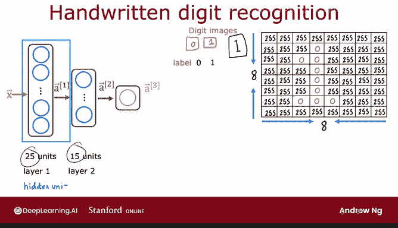
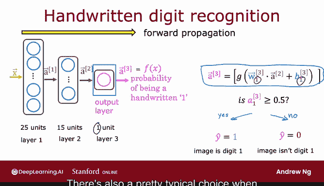

# 49：07_01_03_推理：进行预测与正向传播 🧠➡️

在本节课中，我们将学习如何将神经网络的知识整合成一个算法，使其能够进行推理或预测。这个算法被称为**正向传播**。我们将通过一个手写数字识别的例子来详细讲解其工作原理。

---

## 概述

我们将构建一个神经网络，用于区分手写数字0和1。这是一个二元分类问题。网络将接收一个图像作为输入，并输出该图像是数字1的概率。

为了简化，我们使用一个8x8像素的图像，即64个像素强度值作为输入特征。神经网络将包含两个隐藏层：第一层有25个神经元，第二层有15个神经元，最后是一个输出层。

---

## 正向传播算法详解

上一节我们介绍了神经网络的基本架构。本节中，我们来看看数据是如何从输入层，经过各隐藏层，最终到达输出层的。这个过程就是正向传播。

以下是正向传播的计算步骤：

1.  **从输入 x 计算第一层激活值 a¹**
    第一层（第一个隐藏层）执行以下计算：
    `a¹ = g(W¹·a⁰ + b¹)`
    其中，`a⁰` 是输入特征 `x`。`W¹` 和 `b¹` 是第一层的参数。由于该层有25个神经元，因此 `a¹` 是一个包含25个值的向量。

2.  **从 a¹ 计算第二层激活值 a²**
    第二层（第二个隐藏层）执行类似的计算：
    `a² = g(W²·a¹ + b²)`
    其中，`W²` 和 `b²` 是第二层的参数。该层有15个神经元，因此 `a²` 是一个包含15个值的向量。

3.  **从 a² 计算输出层激活值 a³**
    最后，输出层进行计算：
    `a³ = g(W³·a² + b³)`
    输出层只有一个神经元，因此 `a³` 是一个标量值，代表图像是数字1的概率。我们可以将其阈值设为0.5来进行最终的二元分类判断。

这个计算序列从 `x` 开始，依次计算 `a¹`、`a²`，最终得到 `a³`（即神经网络的输出 `f(x)`）。由于计算方向是从左到右、从前到后传播神经元的激活值，因此该算法被称为**正向传播**。

> 这与用于学习参数的**反向传播**算法形成对比，反向传播的内容将在下周学习。

---

## 网络架构特点

值得注意的是，本例中的神经网络架构（隐藏层神经元数量先多后少）是一种常见的选择。随着网络越接近输出层，隐藏单元的数量通常会减少。你在实践练习中会看到更多这样的例子。

掌握了正向传播算法，你就能下载他人训练好并发布在网上的神经网络参数，并利用他们的网络对你的数据进行推理预测。

---

## 总结

本节课中，我们一起学习了：
1.  如何将神经网络的层间计算组织成**正向传播**算法。
2.  该算法如何从输入 `x` 开始，通过逐层计算激活值，最终得到预测输出 `f(x)`。
3.  正向传播是进行神经网络**推理**（即利用已训练好的模型进行预测）的核心步骤。

在下一个视频中，我们将看看如何在 TensorFlow 中实际实现这个算法。