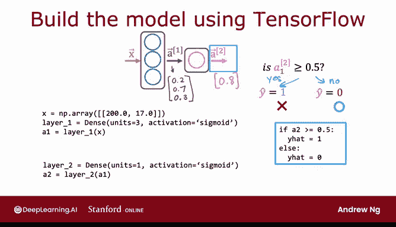
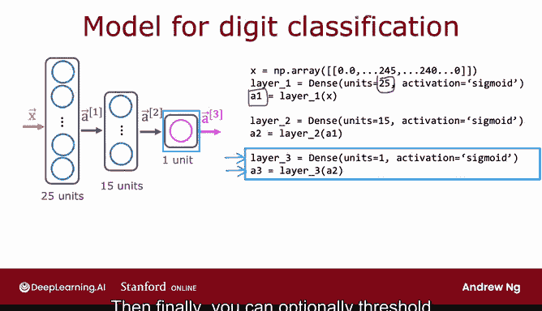

# 50：08_01_01_代码中的推理 🧠💻

在本节课中，我们将学习如何使用 TensorFlow 框架来实现神经网络的前向传播（推理）过程。我们将通过两个具体的例子——咖啡豆烘焙优化和手写数字识别——来演示如何在代码中构建网络层、计算激活值并得到预测结果。

---

## 神经网络推理的通用性


神经网络的一个显著特点是，相同的算法可以应用于许多不同的场景。为了清晰地展示神经网络的工作原理，本节将使用另一个例子来说明推理过程。


## 示例一：咖啡豆烘焙优化 ☕️

有时我喜欢在家烘焙咖啡豆，我最喜欢的是 Ash kungin 咖啡豆。那么，学习算法能否帮助优化烘焙过程以获得更高质量的咖啡豆呢？

在烘焙咖啡时，你可以控制两个参数：**温度**和**烘焙时长**。在这个简化的例子中，我们创建了一个数据集，包含了不同的温度、时长组合以及对应的标签（咖啡是否好喝）。其中，正类（y=1）代表好咖啡，负类代表坏咖啡。

观察数据集可以发现一个合理的模式：如果温度太低或时间太短，咖啡豆会烘烤不足；如果温度太高或时间太长，咖啡豆则会烘烤过度甚至烧焦。只有在这个小三角形区域内的参数组合，才能产出好咖啡。

尽管这是一个简化示例，但实际上已有严肃的机器学习项目被用于优化咖啡烘焙。我们的任务是：给定一个包含温度和时长的特征向量 X（例如 200 摄氏度，17 分钟），如何通过神经网络推理来判断这个设置是否能产出好咖啡？

以下是使用 TensorFlow 实现推理的关键步骤：

1.  **定义输入**：将输入特征 `X` 设置为一个包含两个数字的数组。
    ```python
    X = np.array([200, 17])
    ```

2.  **构建第一层（隐藏层）**：使用 `Dense` 层定义第一个隐藏层，包含 3 个神经元，激活函数为 `sigmoid`。
    ```python
    layer_1 = Dense(units=3, activation='sigmoid')
    a1 = layer_1(X)
    # 假设 a1 的值为 [0.2, 0.7, 0.3]
    ```

3.  **构建第二层（输出层）**：定义第二个 `Dense` 层，包含 1 个神经元，同样使用 `sigmoid` 激活函数。
    ```python
    layer_2 = Dense(units=1, activation='sigmoid')
    a2 = layer_2(a1)
    # 假设 a2 的值为 0.8
    ```

4.  **进行预测**：通过阈值（例如 0.5）将连续的激活值转换为二元预测。
    ```python
    y_hat = 1 if a2 >= 0.5 else 0
    ```

以上就是使用 TensorFlow 进行神经网络推理的核心步骤。其中涉及一些额外细节，例如如何加载 TensorFlow 库以及如何加载神经网络的参数 **W** 和 **B**，这些将在实验课中详细讲解。

---

## 示例二：手写数字识别 ✍️➡️🔢

上一节我们通过咖啡烘焙的例子了解了推理的基本流程，现在让我们回到手写数字分类问题，看看如何处理图像数据。



在这个例子中，输入 `X` 是代表图像像素强度值的列表。

以下是构建和进行推理的步骤：

1.  **定义输入**：`X` 是一个包含像素强度值的数组。
    ```python
    X = np.array([...]) # 像素值列表
    ```

2.  **构建并计算第一层**：第一层是一个包含 25 个神经元、使用 `sigmoid` 激活函数的 `Dense` 层。
    ```python
    layer_1 = Dense(units=25, activation='sigmoid')
    a1 = layer_1(X)
    ```

3.  **构建并计算第二层**：类似地，设置第二层。
    ```python
    layer_2 = Dense(units=15, activation='sigmoid')
    a2 = layer_2(a1)
    ```

4.  **构建并计算输出层**：第三层是最终的 `Dense` 层。
    ```python
    layer_3 = Dense(units=1, activation='sigmoid')
    a3 = layer_3(a2)
    ```


5.  **生成预测**：最后，可以选择对 `a3` 设置阈值来得到最终的二元预测结果 `y_hat`。



---

## 总结与下节预告 📝


本节课中，我们一起学习了在 TensorFlow 中实现神经网络前向传播（推理）的语法和步骤。我们通过咖啡烘焙和数字识别两个例子，演示了如何定义网络层、计算激活值并生成预测。

需要简要提及的是，TensorFlow 以特定的方式处理数据，理解其数据结构（如 NumPy 数组的格式）对于正确使用它至关重要。在下一个视频中，我们将具体看看 TensorFlow 是如何处理数据的。