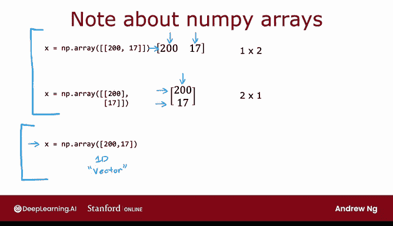
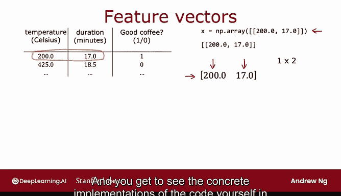
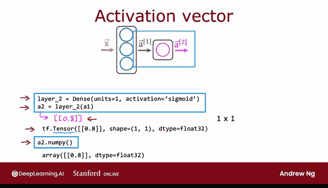

# 51：TensorFlow与NumPy数据表示详解 🧮

在本节课中，我们将学习数据在NumPy和TensorFlow中是如何表示的。理解这些表示方式对于正确实现神经网络至关重要。我们将通过具体示例，清晰地展示矩阵、向量的概念及其在代码中的存储方式，并解释两种库之间数据格式转换的必要性。


## TensorFlow中的数据表示

上一节我们介绍了课程目标，本节中我们来看看TensorFlow如何表示数据。假设你有一个来自咖啡预测示例的数据集，输入特征向量通常表示为：

```python
x = np.array([[200, 17]])
```

你可能会问，为什么这里使用了两层方括号？这与数据的矩阵表示有关。

## NumPy中的矩阵与向量

如果你觉得矩阵和向量是复杂的数学概念，请不要担心。我们将通过具体示例来讲解，你将掌握实现神经网络所需的所有矩阵和向量操作。

首先，让我们看一个矩阵的例子。

以下是一个具有两行三列的矩阵。注意，这里有两行和三个列。我们称之为一个2x3矩阵。

惯例是矩阵的维度写作“行数 x 列数”。在代码中存储这个2x3矩阵，你可以这样写：

```python
x = np.array([[1, 2, 3],
              [4, 5, 6]])
```

请注意，方括号表明`[1, 2, 3]`是这个矩阵的第一行，`[4, 5, 6]`是第二行。最外层的方括号将第一行和第二行组合在一起。因此，这行代码将`x`定义为此数字数组。矩阵本质上就是一个二维数字数组。

让我们再看一个例子。

这里我写出了另一个矩阵。它有多少行和多少列？我们可以数一下，它有四行和两列。因此，这是一个4x2矩阵。

在代码中存储它，你会这样写：

```python
x = np.array([[10, 20],
              [30, 40],
              [50, 60],
              [70, 80]])
```

这创建了一个包含这八个数字的二维数组。

矩阵可以有不同的维度。你看到了一个2x3矩阵和一个4x2矩阵的例子。矩阵也可以是其他维度，例如1x2或2x1。我们将在下一张幻灯片中看到这些例子。

因此，之前我们将输入特征向量`x`设置为`np.array([[200, 17]])`。这样做创建了一个1x2矩阵，即只有一行和两列。

让我们看一个不同的例子。如果你将`x`定义为：

```python
x = np.array([[200],
              [17]])
```

这将创建一个2x1矩阵，它有两行和一列。因为第一行只是数字200，第二行只是数字17。所以，这包含了相同的数字，但放在一个2x1矩阵中，而不是1x2矩阵。

在NumPy中，顶部的例子也称为行向量，它是一个只有单行的向量。而这个例子也称为列向量，因为它是一个只有单列的向量。

使用双层方括号（如`[[200, 17]]`）与单层方括号（如`[200, 17]`）的区别在于：

顶部的两个例子是二维数组，其中一个维度恰好为1。而这个例子（`[200, 17]`）产生的是一个一维向量。所以这只是一个一维数组，没有行或列的概念，尽管按照惯例我们可能将`X`写成这样的列形式。

为了与此对比，我们在第一门课程中曾将`x`写成带单层方括号的形式（`[200, 17]`），这在Python中产生的是一个一维向量，而不是二维矩阵。从技术上讲，这不是1x2或2x1，它只是一个没有行或列的线性数组，只是一个数字列表。

在第一门课程中，当我们处理线性回归和逻辑回归时，我们使用这些一维向量来表示输入特征`X`。而在TensorFlow中，惯例是使用矩阵来表示数据。

为什么会有这种惯例的转变？事实证明，TensorFlow被设计用于处理非常大的数据集。通过用矩阵而不是一维数组表示数据，TensorFlow可以在内部实现更高的计算效率。

回到我们最初的例子，对于数据集中第一个训练样本（特征为200摄氏度烘焙17分钟），我们是这样表示的：

```python
x = np.array([[200, 17]])
```

这实际上是一个1x2矩阵，恰好有一行两列来存储数字200和17。



如果这些细节和复杂的惯例看起来很多，请不要担心。当你自己在可选实验和实践实验中看到代码的具体实现时，所有这些都会变得更加清晰。

## 神经网络中的前向传播



回到在神经网络中执行前向传播或推理的代码。

当你计算`a1 = layer1(x)`时，`a1`是什么？因为这一层有三个神经元，`a1`实际上将是一个1x3矩阵。

如果你打印出`a1`，你会得到类似这样的结果：`tf.Tensor([[2.7, -1.2, 0.3]], shape=(1, 3), dtype=float32)`。

`shape=(1, 3)`指的是这是一个1x3矩阵。`dtype=float32`是TensorFlow的方式，表示这是一个浮点数，即一个可以有小数点的数字，在计算机中使用32位内存表示。

那么，什么是张量？这里的张量是TensorFlow团队创建的一种数据类型，用于高效存储矩阵并对其进行计算。所以，每当你看到“Tensor”，就把它看作是这几张幻灯片中讨论的矩阵。

从技术上讲，张量比矩阵更通用一些，但就本课程的目的而言，可以将张量视为表示矩阵的一种方式。

记得我在本视频开始时说过，TensorFlow有一种表示矩阵的方式，NumPy有另一种表示矩阵的方式。这是NumPy和TensorFlow创建历史留下的产物。不幸的是，有两种表示矩阵的方式被固化在了这两个系统中。

实际上，如果你想将`a1`（一个张量）转换回NumPy数组，你可以这样做：`a1.numpy()`。这将获取相同的数据，并以NumPy数组的形式返回，而不是TensorFlow数组或TensorFlow矩阵的形式。

现在，让我们看看第二层输出的激活值会是什么样子。

这是我们之前的代码：`layer2`是一个具有一个神经元和Sigmoid激活函数的密集层。`a2`通过将`layer2`应用于`a1`来计算：`a2 = layer2(a1)`。

那么`a2`是什么？`a2`可能是一个像0.8这样的数字。从技术上讲，这是一个1x1矩阵，是一个有一行一列的二维数组。

因此，`a2`等于这个数字0.8。如果你打印出`a2`，你会看到它是一个只有一个元素（数字0.8）的TensorFlow张量，并且它是一个1x1矩阵。同样，它是一个`float32`类型的小数点数字，在计算机内存中占用32位。

再次强调，你可以使用`a2.numpy()`将TensorFlow张量转换为NumPy矩阵，这将把它转换回看起来像这样的NumPy数组。

希望这能让你了解数据在TensorFlow和NumPy中是如何表示的。

## 数据转换与协同工作



我习惯于在NumPy中加载和操作数据。当你将一个NumPy数组传递给TensorFlow时，TensorFlow会将其转换为自己内部的格式——张量，然后使用张量进行高效操作。当你读取数据时，可以将其保留为张量，或转换回NumPy数组。

我认为有点遗憾的是，这些库的演进历史使我们不得不做这些额外的转换工作，而实际上这两个库可以很好地协同工作。但是，在编写代码时，无论你使用的是NumPy数组还是张量，来回转换只是需要注意的事情。

## 总结

本节课中我们一起学习了数据在NumPy和TensorFlow中的表示方式。我们了解到：

1.  **矩阵是二维数组**，维度表示为“行数 x 列数”。
2.  **向量可以表示为行向量（1xN矩阵）或列向量（Nx1矩阵）**。
3.  TensorFlow倾向于使用**矩阵**（即使是单样本）来表示数据以提高大规模计算效率，而早期课程中我们常用**一维数组**。
4.  **张量**是TensorFlow用于高效矩阵计算的核心数据结构。
5.  可以使用`.numpy()`方法在TensorFlow张量和NumPy数组之间进行转换。

理解这些表示差异和转换方法，是使用TensorFlow构建有效神经网络模型的重要基础。在接下来的课程中，我们将应用这些知识来实际构建一个神经网络。