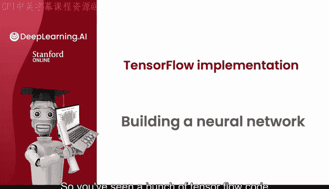
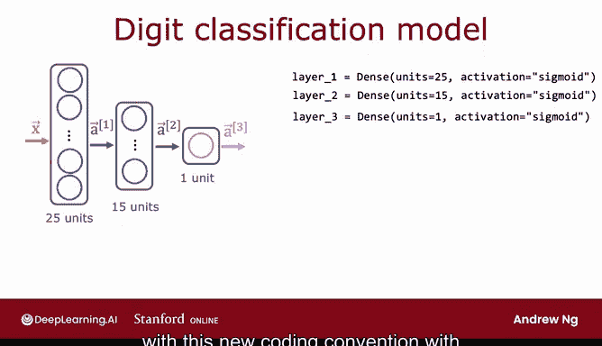

# 52：10_01_03_构建神经网络 🧠



## 概述

在本节课中，我们将学习如何在 TensorFlow 中构建一个完整的神经网络。我们将整合之前学到的关于层构建、前向传播和数据处理的零散知识，并介绍一种更简洁的构建方法。

## 整合知识：从层到网络

上一节我们介绍了如何在 TensorFlow 中构建单个层并进行前向传播。本节中，我们将把这些部分组合起来，构建一个完整的神经网络。

之前，我们手动地初始化数据 `X`，创建第一层，计算激活值 `a1`，然后创建第二层并计算 `a2`。这是一种显式的、逐层进行前向传播的方式。

```python
# 之前的显式方法示例
layer1 = tf.keras.layers.Dense(units=3, activation='sigmoid')
a1 = layer1(X)
layer2 = tf.keras.layers.Dense(units=1, activation='sigmoid')
a2 = layer2(a1)
```

## 更简洁的方法：Sequential 模型

TensorFlow 提供了一种更简洁的实现前向传播和学习的方式。我们可以让 TensorFlow 自动将各层连接起来形成一个神经网络，这通过 `Sequential` 函数实现。

以下是构建神经网络的新方法：
1.  创建第一层和第二层。
2.  使用 `Sequential` 函数告诉 TensorFlow 将这些层按顺序连接起来。

```python
model = tf.keras.Sequential([
    tf.keras.layers.Dense(units=3, activation='sigmoid'),
    tf.keras.layers.Dense(units=1, activation='sigmoid')
])
```

`Sequential` 框架可以为我们完成大量工作。

## 训练与推理

假设我们有一个如左图所示的训练集（以咖啡杯分类为例）。我们可以将训练数据输入 `X` 放入一个 NumPy 数组中（例如一个 4x2 的矩阵），目标标签 `y` 可以存储为一个长度为 4 的一维数组。

给定以矩阵 `X` 和数组 `y` 形式存储的数据，训练这个神经网络只需要调用两个函数：
1.  调用 `model.compile()` 并设置一些参数（下周将详细讨论）。
2.  调用 `model.fit(X, y)`，告诉 TensorFlow 使用数据 `X` 和 `y` 来训练这个由层1和层2顺序连接而成的神经网络。

```python
model.compile(...)  # 参数下周详述
model.fit(X, y)
```

最后，如何进行推理或前向传播？如果你有一个新样本 `x_new`（一个包含两个特征的 NumPy 数组），你只需调用 `model.predict(x_new)`。这将为你输出对应的 `a2` 值，而无需自己逐层计算。

```python
predictions = model.predict(x_new)
```

## 代码惯例简化

按照 TensorFlow 的编码惯例，我们通常不会显式地将两个层赋值给变量 `layer1` 和 `layer2`。更常见的写法是直接将层定义在 `Sequential` 函数内部，使代码更紧凑。

```python
model = tf.keras.Sequential([
    tf.keras.layers.Dense(units=3, activation='sigmoid'),
    tf.keras.layers.Dense(units=1, activation='sigmoid')
])
```

## 应用于手写数字分类示例



让我们将这个新方法也应用于手写数字分类的例子。之前，我们有输入 `X`，然后逐层应用 `layer1`、`layer2`、`layer3` 来尝试分类数字。

使用新的 `Sequential` 编码惯例，你可以指定 `layer1`、`layer2`、`layer3`，并告诉 TensorFlow 为你将它们连接成一个神经网络。同样，你可以将数据存储在矩阵中，运行 `compile` 函数并按如下方式拟合模型。最后，使用 `model.predict(x_new)` 进行推理或预测。

按照惯例，我们同样会采用更紧凑的代码形式，直接将这三个层放入 `Sequential` 函数中。

```python
model = tf.keras.Sequential([
    tf.keras.layers.Dense(units=25, activation='sigmoid'),
    tf.keras.layers.Dense(units=15, activation='sigmoid'),
    tf.keras.layers.Dense(units=1, activation='sigmoid')
])
```

## 理解与实现

有时，仅用几行代码就能构建一个复杂的、先进的神经网络，这可能会让人疑惑：这几行代码究竟做了什么？

机器学习专业课程的一个目标是让你能够使用像 TensorFlow 这样的前沿库高效地工作。但更重要的是，我希望你不仅会调用这几行代码，还能理解代码底层实际在做什么。

在实践中，大多数机器学习工程师并不经常用 Python 从头实现前向传播，我们只是使用 TensorFlow 和 PyTorch 等库。然而，理解这些算法的工作原理至关重要。这样，当出现问题时，你可以自己思考需要改变什么，什么可能有效，什么可能无效。

因此，在接下来的视频中，我们将回顾并分享如何用 Python 从头实现前向传播，以便你能自己理解整个过程。这样，即使你在调用库函数并让它高效运行、在你的应用中完成出色的工作时，你的脑海深处也能对你的代码实际在做什么有更深入的理解。

## 总结

本节课中，我们一起学习了在 TensorFlow 中构建神经网络的完整流程。我们首先回顾了逐层构建的显式方法，然后引入了更简洁的 `Sequential` 模型构建方式，它能够自动将各层连接起来。我们还介绍了如何使用 `compile`、`fit` 和 `predict` 方法来训练网络和进行预测，并了解了遵循代码惯例的简化写法。最后，我们强调了理解底层实现原理的重要性，为接下来的深入学习做好了准备。