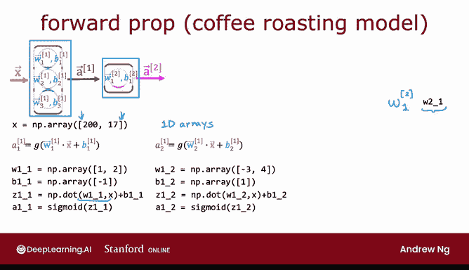

# 53：单层神经网络的正向传播实现 🧠

在本节课中，我们将学习如何仅使用 Python 和 NumPy 库，从零开始实现单层神经网络的正向传播过程。理解这一底层实现，有助于我们深入理解 TensorFlow 和 PyTorch 等高级框架背后的工作原理。

---

上一节我们介绍了神经网络的基本概念，本节中我们来看看如何用代码具体实现一个神经元和单层网络的计算。

我们将继续使用咖啡烘焙的模型作为示例。我们的目标是：给定一个输入特征向量 **x**，通过正向传播计算得到输出 **a²**。


在本次 Python 实现中，我将使用一维数组来表示所有的向量和参数，这就是为什么代码中只使用单层方括号，它代表一维数组，而非我们之前看到的二维矩阵。

## 计算第一个神经元激活值

首先，我们需要计算第一个激活值 **a₁¹**，即第一层的第一个神经元的输出。它由以下公式计算得出：

**a₁¹ = g(z₁¹)**

其中，**z₁¹** 的计算公式为：

**z₁¹ = w₁¹ · x + b₁¹**

遵循本幻灯片中的命名约定，像 **w₂₁** 这样的项，我将用变量 `W2_1` 来表示。下划线后的数字代表下标。因此，`W2_1` 即表示 **w²₁**。

假设参数 **w₁¹** = [1, 2]，**b₁¹** = -1。计算步骤如下：
1.  计算 **z₁¹** 为参数 **w₁¹** 与输入 **x** 的点积，再加上 **b₁¹**。
2.  将 Sigmoid 激活函数 **g** 应用于 **z₁¹**，得到 **a₁¹**。

## 计算同层其他神经元

接下来，我们以同样的方式计算 **a₁²**。

类似地，**w₁²** = [2, -4]，**b₁²** = 1。计算 **z₁²** 的中间项，然后应用 Sigmoid 函数，最终得到 **a₁²**。

最后，用相同的方法计算 **a₁³**。

## 组合第一层输出

现在我们已经计算出了三个标量值：**a₁¹**、**a₁²** 和 **a₁³**。我们需要将这三个数字组合成一个数组，作为第一层的输出 **a¹**。

我们可以使用 NumPy 数组将它们组合起来，代码如下：
```python
a1 = np.array([a11, a12, a13])
```

## 实现第二层计算

第一层的输出 **a¹** 将作为第二层的输入。现在让我们来实现第二层，以计算最终输出 **a²**。

**a²** 的计算公式为：



**a² = g(z²₁)**

其中，**z²₁** 的计算公式为：

**z²₁ = w²₁ · a¹ + b²₁**

我们将有对应的参数 **w²₁** 和 **b²₁**。计算步骤是：
1.  计算 **z²₁** 为参数 **w²₁** 与 **a¹** 的点积，再加上 **b²₁**。
2.  将 Sigmoid 激活函数应用于 **z²₁**，得到 **a²₁**（即最终的 **a²**）。

以上就是仅使用 Python 和 NumPy 实现正向传播的全部过程。

---

我们刚刚在这页代码中看到了许多表达式。在下一节视频中，我们将探讨如何简化这一过程，实现一个更通用的神经网络正向传播，而不是像刚才那样为每个神经元硬编码。

本节课中我们一起学习了如何从零开始实现单层神经网络的正向传播，包括单个神经元的计算、同层输出的组合以及向下一层的传递。理解这些基础步骤是掌握更复杂、更通用实现方式的基石。