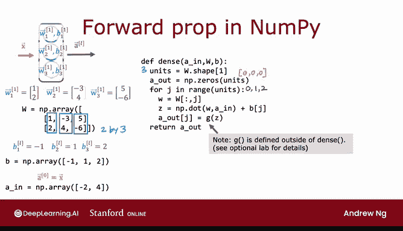

# 54：12_01_02_正向传播的通用实现 🧠➡️

## 概述
在本节课中，我们将学习如何用Python实现神经网络的正向传播。我们将不再为每个神经元编写硬编码，而是构建一个通用的、可复用的函数来实现一个完整的神经网络层。这将帮助我们理解深度学习框架（如TensorFlow）底层的工作原理，并提升我们调试代码的能力。


---

## 从硬编码到通用实现
上一节我们介绍了如何通过为每个神经元硬编码来计算正向传播。本节中我们来看看如何编写一个通用的函数来实现一个完整的神经网络层（也称为“密集层”或“全连接层”）。

我们将定义一个名为 `dense` 的函数，它接收来自前一层的激活值 `A_prev`，以及当前层神经元的参数 `W` 和 `B`。

## 参数的组织方式
为了通用化，我们需要将参数组织成矩阵和向量的形式。

假设当前层（第1层）有3个神经元。每个神经元都有自己的权重向量 `w` 和偏置 `b`。

*   权重 `w` 被组织成一个矩阵 `W`。如果输入特征有2个（即 `A_prev` 是2维向量），那么 `W` 将是一个 `2 x 3` 的矩阵。第一列是第一个神经元的权重 `w11`，第二列是第二个神经元的权重 `w12`，以此类推。
*   偏置 `b` 被组织成一个一维向量 `B`。例如，`B = [b1, b2, b3]`。

`dense` 函数将接收前一层的激活值 `A_prev`、权重矩阵 `W` 和偏置向量 `B`，并输出当前层的激活值 `A`。

## `dense` 函数的代码实现
以下是实现 `dense` 函数的Python代码。我们将逐步解析它。

```python
def dense(a_in, W, B):
    """
    实现一个神经网络层的正向传播。
    参数:
    a_in -- 来自前一层的激活值，形状为 (n_prev, )
    W -- 权重矩阵，形状为 (n_prev, n_units)
    B -- 偏置向量，形状为 (n_units, )
    返回:
    a_out -- 当前层的激活值，形状为 (n_units, )
    """
    units = W.shape[1]          # 获取当前层的神经元数量
    a_out = np.zeros(units)     # 初始化输出激活值向量

    for j in range(units):      # 遍历当前层的每个神经元
        w = W[:, j]             # 提取第j个神经元的权重列向量
        z = np.dot(w, a_in) + B[j] # 计算加权和z
        a_out[j] = g(z)         # 应用激活函数g（例如sigmoid）
    return a_out
```

以下是代码关键步骤的说明：



1.  **确定神经元数量**：`units = W.shape[1]` 通过权重矩阵 `W` 的列数获取当前层的神经元数量。
2.  **初始化输出**：`a_out = np.zeros(units)` 创建一个全零向量，用于存储即将计算的激活值。
3.  **循环计算每个神经元的激活值**：
    *   `for j in range(units):` 循环遍历每一个神经元（索引 `j`）。
    *   `w = W[:, j]` 从权重矩阵 `W` 中提取第 `j` 列，即第 `j` 个神经元的权重向量。
    *   `z = np.dot(w, a_in) + B[j]` 计算该神经元的加权输入 `z`。公式为：**`z_j = w_j · a_in + b_j`**。
    *   `a_out[j] = g(z)` 对 `z` 应用激活函数 `g`（例如sigmoid函数），得到该神经元的最终激活值 `a_j`。
4.  **返回结果**：函数返回计算得到的当前层激活值向量 `a_out`。

## 构建多层神经网络
有了 `dense` 函数，我们就可以像搭积木一样，将多个层串联起来，实现整个神经网络的正向传播。

假设我们有一个4层神经网络（输入层不计入层数），其正向传播过程可以如下实现：

```python
def sequential_forward_propagation(x, parameters):
    """
    实现一个多层神经网络的正向传播。
    参数:
    x -- 输入特征
    parameters -- 包含所有层W和B的字典
    返回:
    f_x -- 神经网络的最终输出
    """
    a1 = dense(x, parameters['W1'], parameters['b1'])  # 第一隐藏层
    a2 = dense(a1, parameters['W2'], parameters['b2']) # 第二隐藏层
    a3 = dense(a2, parameters['W3'], parameters['b3']) # 第三隐藏层
    f_x = dense(a3, parameters['W4'], parameters['b4']) # 输出层
    return f_x
```

在这个例子中：
*   `x` 是输入特征。
*   `a1` 是第一隐藏层的输出，它作为第二隐藏层的输入 `a_in`。
*   这个过程依次进行，直到计算出最终输出 `f_x`（即 `a4`）。

请注意，我们遵循线性代数的惯例，使用大写字母 `W` 表示矩阵，小写字母表示向量或标量。

## 理解底层原理的重要性
至此，你已经掌握了如何从零开始实现正向传播。即使在实践中你会使用强大的深度学习框架（如TensorFlow或PyTorch），理解其底层工作原理仍然至关重要。

当你的模型出现错误、运行缓慢或产生奇怪结果时，这种深入的理解能让你更有效地调试代码。机器学习代码很少能一次运行成功，因此调试能力是成为一名高效机器学习工程师的关键技能。

## 总结
本节课中我们一起学习了：
1.  **通用层函数**：我们构建了 `dense` 函数，它使用循环和矩阵操作，通用化地计算单个神经网络层的激活值。
2.  **网络构建**：我们展示了如何通过顺序调用 `dense` 函数，将多个层连接起来，实现完整神经网络的正向传播。
3.  **底层价值**：我们强调了理解算法底层实现的重要性，这不仅能加深对模型的理解，更是有效调试和解决实际问题的基石。

掌握这些基础概念，将为你在后续课程中使用更高级的框架打下坚实的基础。