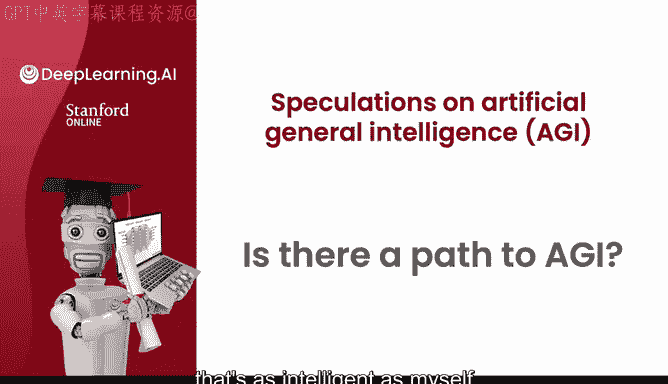
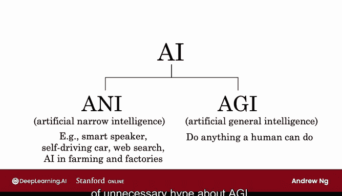
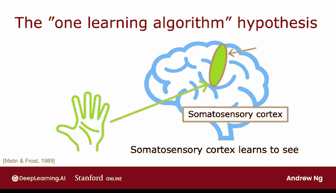
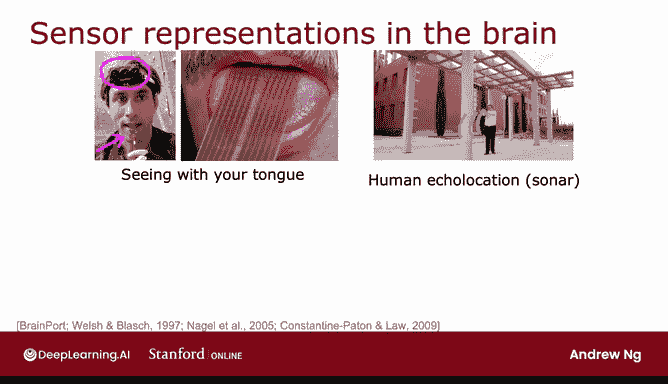

# 55：通往通用人工智能的路径 🧠

在本节课中，我们将探讨人工智能领域一个宏大而充满未知的梦想：通用人工智能。我们将了解其与当前主流人工智能的区别，分析实现它的潜在路径与挑战，并审视一些支持其可能性的有趣科学发现。

***

## 什么是AGI？🤔

自从我青少年时期开始接触神经网络以来，我一直怀揣着一个梦想：也许有一天能构建出一个与我自身或典型人类一样智能的人工智能系统。这至今仍是我心中最鼓舞人心的人工智能梦想之一。然而，我认为通往这个目标的路径并不清晰，可能非常困难。我不知道这需要仅仅几十年并在我们有生之年看到突破，还是需要几个世纪甚至更长时间才能实现。

让我们看看这个AGI（通用人工智能）梦想是什么样子，并稍微推测一下未来可能的发展方向。这是一条不清晰且艰难的道路。

***

## ANI与AGI：关键区别 🔍

我认为关于AGI存在很多不必要的炒作。其中一个原因可能是“人工智能”实际上包含两个截然不同的概念。

第一个是ANI，即**狭义人工智能**。这是一个执行单一、狭窄任务的AI系统，有时可以做得非常好，并具有巨大的价值，例如智能音箱、自动驾驶汽车、网络搜索，或应用于农业、工厂等特定领域的AI。过去几年，ANI取得了巨大进步，并在当今世界创造了巨大价值。由于ANI是AI的一个子集，ANI的快速进步在逻辑上意味着AI在过去十年也取得了巨大进步。

AI中的另一个不同概念是AGI，即**通用人工智能**。这是构建能够完成典型人类所能做的任何事情的AI系统的希望。尽管ANI（以及因此整个AI领域）取得了所有进步，但我不确定我们在AGI方面究竟取得了多少进展（如果有的话）。我认为ANI的所有进步让人们正确地得出结论：AI取得了巨大进步，但这导致一些人错误地认为，AI的许多进步必然意味着在AGI方面也取得了许多进步。

因此，当你被问及AI和AGI时，有时你可能会发现绘制下面这张图有助于解释AI领域的一些动态以及一些不必要的炒作来源。

***

## 模拟大脑的挑战 🧩

随着现代深度学习的兴起，我们开始模拟神经元。随着计算机（甚至GPU）速度越来越快，我们可以模拟更多的神经元。因此，多年前存在一种模糊的希望：如果我们能模拟大量神经元，也许就能模拟人脑或类似人脑的东西，从而得到真正智能的系统。遗憾的是，事实证明这并非那么简单。

我认为有两个原因。首先，我们构建的人工神经网络非常简单，一个逻辑回归单元所做的与任何生物神经元所做的完全不同，它比我们大脑中的任何神经元所做的都要简单得多。其次，即使到今天，我认为我们几乎不知道大脑是如何工作的。关于神经元究竟如何从输入映射到输出，存在许多我们至今仍不知道的基本问题。因此，试图在计算机中模拟这一点（更不用说用一个逻辑函数来模拟）距离准确模拟人脑的实际工作方式还非常遥远。

鉴于我们现在以及可预见的未来对人脑工作原理的理解非常有限，我认为仅仅试图模拟人脑作为通往AGI的路径将是一条极其困难的道路。

***

## 一线希望：大脑的可塑性实验 🐸

话虽如此，我们是否有希望在有生之年看到AGI的突破呢？让我分享一些证据，这些证据至少让我自己对这个希望保持信心。

在动物身上进行了一些引人入胜的实验，这些实验表明或强烈暗示，同一块生物脑组织可以执行范围惊人的广泛任务。这引出了“单一学习算法假说”：也许很多智能可以归因于一个或少数几个学习算法。如果我们能找出这一个或少数几个算法是什么，也许有一天我们就能在计算机中实现它。

让我分享一些这些实验的细节。

这是一个几十年前由罗·阿塔尔等人得出的结果。图中显示的是你大脑中的听觉皮层。你的大脑被连接成将来自耳朵的信号（以电脉冲的形式，取决于耳朵检测到的声音）传送到听觉皮层。事实证明，如果你重新连接动物的大脑，切断耳朵和听觉皮层之间的连接，转而将图像输入听觉皮层，那么听觉皮层就学会了“看”（听觉本指声音）。因此，这块在大多数人身上学会“听”的大脑组织，当被输入不同的数据时，它反而学会了“看”。

这是另一个例子。这部分大脑是你的体感皮层（体感指触觉处理）。如果你类似地重新连接大脑，切断触觉传感器与该大脑部分的连接，转而输入图像，那么体感皮层会学会“看”吗？已经有一系列这样的实验表明，大脑的许多不同部分，仅仅根据所给的数据，就可以学会看、感觉或听，就好像存在一个算法，根据所给的数据相应地学会处理输入。

***

## 人类感官替代的启示 👅

人们已经构建了一些系统，例如将一个摄像头（可能安装在某人额头上）映射到某人舌头上的电压网格模式。通过将灰度图像映射到舌头上的电压模式，这可以帮助视力受损的人用舌头“学会看”。

或者，有一些关于人类回声定位（或人类声纳）的迷人实验。像海豚和蝙蝠这样的动物使用声纳来“看”。研究人员发现，如果训练人类发出咔嗒声并聆听其如何从周围环境反射回来，人类有时可以学会一定程度的人类回声定位。

或者，这是一个触觉腰带。我在斯坦福的研究实验室以前也建造过类似的东西。如果你在腰间安装一圈振动器，并使用磁力罗盘进行编程，使得最北方向的振动器始终轻微振动，那么你不知何故就获得了一种方向感（一些动物有，但人类没有）。这感觉就像你走路时就知道北方在哪里，而不是感觉“哦，我腰的那个部位在振动”，而是感觉“哦，我知道北方在那里”。

还有给青蛙植入第三只眼的手术，大脑只是学会了处理这个输入。

一系列这样的实验表明，人脑具有惊人的适应性。神经科学家说它具有惊人的“可塑性”，这意味着它能适应处理令人眼花缭乱的各种感官输入。因此，问题是：如果同一块脑组织可以学会看、触摸、感觉甚至其他事情，它使用的是哪种算法？我们能否复制这个算法并在计算机中实现它？我为这些实验中使用的青蛙和其他动物感到难过，尽管我认为这些结论也相当引人入胜。

***

## 总结与展望 🚀

即使到今天，我认为研究AGI仍然是有史以来最迷人、最引人入胜的问题之一，也许有一天你会选择研究它。然而，我认为避免过度炒作很重要。我不知道大脑是否真的使用一个或少数几个算法，即使它是，我也不知道（我认为也没有人知道）这个算法是什么。但我仍然对这个希望保持信心，也许它确实存在，也许通过大量艰苦的工作，我们有一天能发现它的近似算法。

我仍然发现这是最迷人的话题之一，我仍然经常在空闲时间思考它，也许有一天你会成为为这个问题做出贡献的人。

**在短期内，我认为即使不追求AGI，机器学习和神经网络也是一个非常强大的工具。即使不试图一路构建人类水平的智能，你也会发现神经网络对于你可能构建的应用程序来说是一套极其强大和有用的工具。**

本周的必修视频到此结束，恭喜你学到这里！接下来的课程还会有一些可选视频，更深入地探讨神经网络的高效实现。特别是在接下来的可选视频中，我想与你分享一些关于如何实现神经网络向量化实现的细节，希望你也看看那些视频。