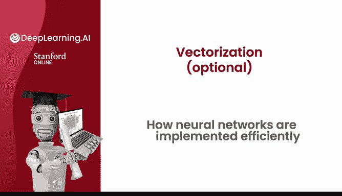
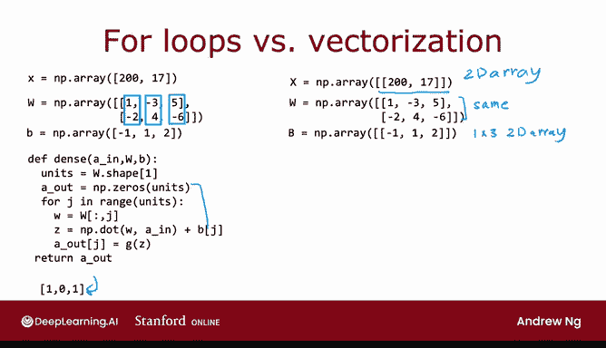

# 56：神经网络的高效向量化实现 🚀

在本节课中，我们将学习神经网络如何通过向量化和矩阵运算实现高效计算。理解这一概念对于掌握现代深度学习框架至关重要。



## 概述

深度学习研究者能够在过去十年中构建大规模神经网络，其中一个关键原因是神经网络可以被向量化。这意味着它们能够通过矩阵乘法高效实现。并行计算硬件（如GPU和某些CPU功能）非常擅长执行大型矩阵乘法运算。本节将探讨神经网络向量化实现的工作原理。

## 单层前向传播的原始实现

首先，回顾一下之前看到的单层前向传播（或正向传播）的实现代码。

以下是原始实现方式：

```python
x = [1, 2]  # 输入
W = [[1, -3, 5],
     [2, 4, -6]]  # 第一、第二和第三个神经元的权重参数
B = [-1, 1, 2]  # 偏置参数

def dense(a_in, W, B):
    units = W.shape[1]
    a_out = np.zeros(units)
    for j in range(units):
        w = W[:, j]
        z = np.dot(w, a_in) + B[j]
        a_out[j] = g(z)  # g为激活函数，例如sigmoid
    return a_out
```

在这段代码中，`x`是输入，`W`是权重，`B`是偏置。此代码会输出三个数字（例如`[1, 0, 1]`）。如果执行此计算，将得到类似`[1, 0, 1]`的结果。

## 向量化实现

接下来，我们可以开发此函数的向量化实现。



向量化实现如下：

```python
x = [[1, 2]]  # 注意是双层括号，现在是一个二维数组（类似TensorFlow中的张量）
W = [[1, -3, 5],
     [2, 4, -6]]  # 与之前相同
B = [[-1, 1, 2]]  # 现在使用大写B，也是一个1x3的二维数组

def dense(A_in, W, B):
    Z = np.matmul(A_in, W) + B  # np.matmul执行矩阵乘法
    A_out = g(Z)  # g为激活函数（如sigmoid），按元素应用于矩阵Z
    return A_out
```

结果表明，上述`for`循环中的所有代码行都可以被仅仅几行代码替代，从而得到该函数的向量化实现。

具体计算步骤如下：
1.  计算 `Z = np.matmul(A_in, W) + B`。这里`A_in`和`W`都是矩阵，`np.matmul`是NumPy执行矩阵乘法的方式。
2.  然后，`A_out`等于激活函数`g`（即sigmoid函数）按元素应用于矩阵`Z`。
3.  最后返回`A_out`。

## 向量化实现的特点

在向量化实现中，所有量——输入`X`（即`A_in`的值）、`W`、`B`，以及`Z`和`A_out`——现在都是二维数组（即矩阵。

这被证明是神经网络中稠密层单步前向传播的一种非常高效的实现方式，因此被称为神经网络前向传播的向量化实现。

## 后续内容预告

那么，这段代码在做什么？它实际上是如何工作的？`np.matmul`究竟在做什么？

在接下来的两个视频中（同样为可选内容），我们将详细讲解矩阵乘法及其工作原理。如果你已经熟悉线性代数、向量、矩阵、转置和矩阵乘法，可以快速浏览这两个视频，然后直接进入本周最后一个视频。

在本周的最后一个视频（也为可选）中，我们将深入更多细节，解释`np.matmul`如何提供这种向量化实现。

接下来，让我们进入下一个视频，了解矩阵乘法的具体内容。

## 总结

本节课中，我们一起学习了神经网络前向传播的向量化实现。我们对比了使用循环的原始实现和使用矩阵运算的向量化实现，并理解了后者如何利用硬件并行计算能力大幅提升效率，这是现代深度学习能够成功并扩展到当今规模的关键思想之一。