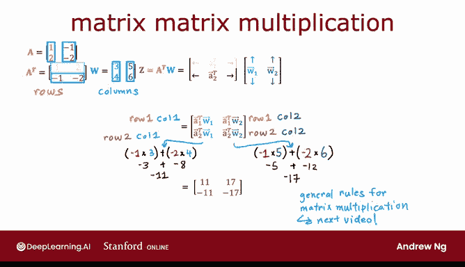

# 57：矩阵乘法 🧮


在本节课中，我们将要学习矩阵乘法的基本概念和计算方法。我们将从向量的点积开始，逐步过渡到向量与矩阵的乘法，最后理解矩阵与矩阵的乘法。核心概念将通过**公式**和**代码**进行描述，确保初学者能够轻松跟上。

## 概述 📋

矩阵乘法是线性代数中的基础运算，在机器学习中应用广泛。理解矩阵乘法有助于我们掌握后续更复杂的模型和算法。本节将从最简单的向量点积讲起，逐步构建对矩阵乘法的直观理解。

## 从向量点积开始

上一节我们介绍了矩阵的基本概念，本节中我们来看看如何计算两个向量的点积。点积是理解矩阵乘法的基石。

假设有两个向量：`a = [1, 2]` 和 `w = [3, 4]`。它们的点积 `z` 计算如下：

**公式**：
`z = a · w = (1 * 3) + (2 * 4) = 3 + 8 = 11`

更一般地，对于向量 `A` 和 `W`，点积 `Z` 的计算公式为：
`Z = A · W = Σ (A_i * W_i)`，即对应元素相乘后求和。

点积还有另一种等价的写法，即利用向量的转置。列向量 `a` 的转置 `a^T` 是一个行向量。

**公式**：
`Z = a^T * w`
这里的 `a^T` 是 `1x2` 的行向量（或矩阵），`w` 是 `2x1` 的列向量，相乘结果 `Z` 是一个标量，与点积结果相同。

**代码描述（Python）**：
```python
import numpy as np
a = np.array([1, 2])
w = np.array([3, 4])
# 方法1: 点积
z_dot = np.dot(a, w)
# 方法2: 转置后相乘
z_transpose = np.dot(a.T, w) # 注意：对于一维数组，a.T 返回自身，此处仅为示意概念
print(z_dot, z_transpose) # 输出: 11 11
```

理解这两种等价的写法，对于后续理解矩阵乘法至关重要。

## 向量与矩阵的乘法

理解了向量的点积后，我们现在可以看看向量与矩阵的乘法。这是从一维运算到二维运算的自然延伸。

我们继续使用向量 `a = [1, 2]`，其转置 `a^T = [1, 2]`（视为 `1x2` 矩阵）。同时，我们定义一个 `2x2` 的矩阵 `W`：

**公式**：
```
    [3, 5]
W = [4, 6]
```
（更标准的写法是列优先，但为理解方便，此处用行表示列向量 `[3, 4]^T` 和 `[5, 6]^T`）

要计算 `Z = a^T * W`（一个 `1x2` 的矩阵），我们需要进行两次点积运算。

以下是计算步骤：

1.  **计算 Z 的第一个元素**：取 `a^T` 与 `W` 的第一列 `[3, 4]^T` 做点积。
    `1*3 + 2*4 = 11`
2.  **计算 Z 的第二个元素**：取 `a^T` 与 `W` 的第二列 `[5, 6]^T` 做点积。
    `1*5 + 2*6 = 17`

因此，结果 `Z = [11, 17]`。

**核心思想**：**向量与矩阵的乘法，就是向量分别与矩阵的每一列做点积，结果构成输出向量的元素。**

## 矩阵与矩阵的乘法

掌握了向量与矩阵的乘法后，让我们将其推广到更一般的矩阵与矩阵的乘法。这是构建复杂神经网络层计算的关键。

假设我们有一个矩阵 `A`，其两列分别为 `[1, 2]^T` 和 `[-1, -2]^T`。

**公式**：
```
    [1,  -1]
A = [2,  -2]
```
以及之前用到的矩阵 `W`。

首先，我们需要计算 `A` 的转置 `A^T`。转置操作是将矩阵的列变为行。

**公式**：
```
A^T = [1,  2]
      [-1, -2]
```

现在，我们的目标是计算 `Z = A^T * W`。我们可以将 `A^T` 的每一行看作一个独立的行向量。

以下是计算过程：

1.  **计算 Z 的第一行**：取 `A^T` 的第一行 `[1, 2]`（即 `a1^T`）与矩阵 `W` 相乘。这正是上一节“向量与矩阵乘法”的例子，我们已计算出结果为 `[11, 17]`。这成为 `Z` 的第一行。
2.  **计算 Z 的第二行**：取 `A^T` 的第二行 `[-1, -2]`（即 `a2^T`）与矩阵 `W` 相乘。
    *   与第一列点积：`(-1)*3 + (-2)*4 = -11`
    *   与第二列点积：`(-1)*5 + (-2)*6 = -17`
    因此，第二行结果为 `[-11, -17]`。

最终，我们得到：

**公式**：
```
Z = A^T * W = [11,   17]
              [-11, -17]
```

**核心思想**：**矩阵与矩阵的乘法 `C = A * B`，可以理解为：结果矩阵 `C` 的第 `i` 行、第 `j` 列的元素，等于矩阵 `A` 的第 `i` 行与矩阵 `B` 的第 `j` 列的点积。**

**代码描述（Python）**：
```python
import numpy as np
A = np.array([[1, -1],
              [2, -2]])
W = np.array([[3, 5],
              [4, 6]])
# 计算 A 的转置与 W 的乘积
Z = np.dot(A.T, W)
print(Z)
# 输出:
# [[ 11  17]
#  [-11 -17]]
```



## 总结 🎯

本节课中我们一起学习了矩阵乘法的核心知识。我们从向量的点积出发，认识到它可以表示为向量转置与另一向量的乘法。接着，我们学习了向量与矩阵的乘法，其本质是向量与矩阵每一列进行点积。最后，我们将此概念推广到矩阵与矩阵的乘法，其通用规则是：输出矩阵的每个元素，都是左矩阵的一行与右矩阵的一列的点积。

记住这个关键点：**矩阵乘法是大量有序的点积运算，以逐个构建输出矩阵的元素。** 虽然初学可能觉得信息量很大，但理解了这个基本模式，就能为后续学习更复杂的线性代数和机器学习算法打下坚实的基础。在接下来的视频中，我们将看到矩阵乘法的更一般化定义，这会使今天的所有内容变得更加清晰。