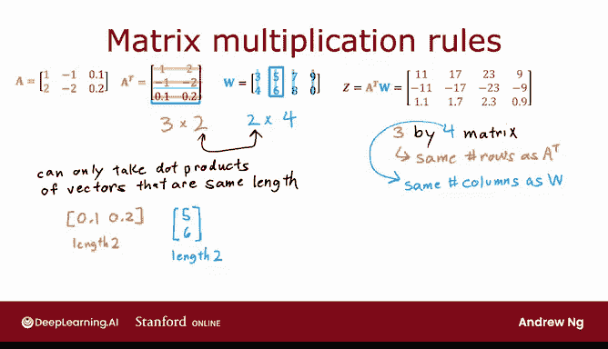

# 58：矩阵乘法规则 🧮

在本节课中，我们将学习矩阵乘法的通用规则。理解矩阵乘法是掌握神经网络向量化实现的关键一步。本节将详细拆解两个矩阵相乘的过程，并通过图示和计算示例帮助你建立清晰的概念。

---

## 矩阵乘法的通用形式

首先，我们来看一个矩阵 **A**，它是一个 2x3 的矩阵（两行三列）。我们可以将其三列视为三个向量：**a₁**、**a₂** 和 **a₃**。

接下来，我们将计算 **A** 的转置（记为 **Aᵀ**）与另一个矩阵 **W** 的乘积。

**Aᵀ** 是通过将 **A** 的每一列“放倒”为行而得到的。因此，**Aᵀ** 的行分别是 **a₁ᵀ**、**a₂ᵀ** 和 **a₃ᵀ**。

矩阵 **W** 是一个 2x4 的矩阵。我们同样可以将其四列视为四个向量：**w₁**、**w₂**、**w₃** 和 **w₄**。

为了清晰地展示计算过程，图中使用不同深浅的橙色标示 **Aᵀ** 的不同行（对应原 **A** 的不同列），使用不同深浅的蓝色标示 **W** 的不同列。

---

## 计算 Aᵀ 与 W 的乘积

我们的目标是计算矩阵 **Z**，其中 **Z = Aᵀ W**。**Z** 将是一个 3x4 的矩阵。

**W** 的每一列会影响 **Z** 中对应列的计算结果。例如，**w₁**（最浅蓝色）影响 **Z** 的第一列，**w₂** 影响第二列，依此类推。

**Aᵀ** 的每一行会影响 **Z** 中对应行的计算结果。例如，**a₁ᵀ**（最浅橙色）影响 **Z** 的第一行，**a₂ᵀ** 影响第二行，**a₃ᵀ** 影响第三行。

计算 **Z** 中每个元素的方法是：取 **Aᵀ** 的对应行与 **W** 的对应列，计算它们的点积（内积）。

以下是几个计算示例：

1.  **计算 Z 第一行第一列的元素（Z₁₁）**：
    *   取 **Aᵀ** 的第一行（**a₁ᵀ** = [1, 2]）和 **W** 的第一列（**w₁** = [3, 4]）。
    *   计算点积：`1*3 + 2*4 = 3 + 8 = 11`。
    *   因此，**Z₁₁ = 11**。

2.  **计算 Z 第三行第二列的元素（Z₃₂）**：
    *   取 **Aᵀ** 的第三行（**a₃ᵀ** = [0.1, 0.2]）和 **W** 的第二列（**w₂** = [5, 6]）。
    *   计算点积：`0.1*5 + 0.2*6 = 0.5 + 1.2 = 1.7`。
    *   因此，**Z₃₂ = 1.7**。

3.  **计算 Z 第二行第三列的元素（Z₂₃）**：
    *   取 **Aᵀ** 的第二行（**a₂ᵀ** = [-1, -2]）和 **W** 的第三列（**w₃** = [7, 8]）。
    *   计算点积：`(-1)*7 + (-2)*8 = -7 - 16 = -23`。
    *   因此，**Z₂₃ = -23**。

按照此规则计算所有元素后，我们得到完整的矩阵 **Z**。

---

## 矩阵乘法的维度要求

矩阵乘法有一个重要的前提条件。在上例中，**Aᵀ** 是 3x2 矩阵，**W** 是 2x4 矩阵。

**第一个矩阵的列数必须等于第二个矩阵的行数**。

这是因为点积运算要求两个向量的长度相同。在此例中，**Aᵀ** 的每一行是长度为2的向量，**W** 的每一列也是长度为2的向量，因此可以计算点积。

输出矩阵 **Z** 的维度由以下规则决定：
*   行数等于第一个矩阵（**Aᵀ**）的行数。
*   列数等于第二个矩阵（**W**）的列数。

因此，**Z** 是一个 3x4 的矩阵。这个规则可以概括为：
`(m × n) 矩阵 * (n × p) 矩阵 = (m × p) 矩阵`

---

## 总结与过渡

本节课我们一起学习了矩阵乘法的核心规则：通过计算第一个矩阵的行与第二个矩阵的列的点积来得到结果矩阵的每个元素，并且必须满足特定的维度匹配条件。

理解了矩阵乘法的机制后，我们就可以将其应用于神经网络的向量化实现中。在接下来的课程中，我们将看到如何利用矩阵运算一次性处理整个训练集的样本，从而极大地提升神经网络的计算效率。正如吴恩达老师所说，第一次理解并应用向量化实现时，其速度的提升令人印象深刻。