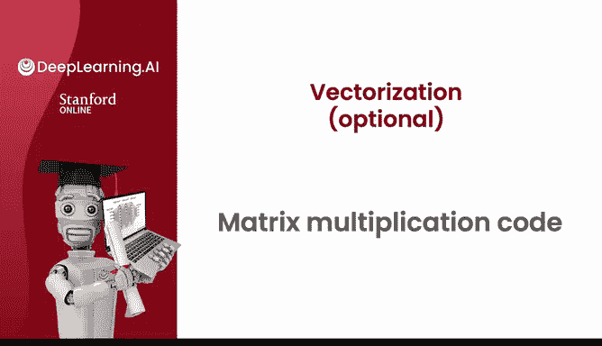
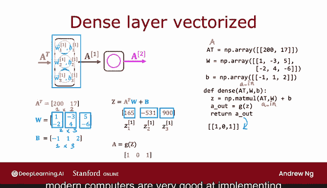

# 59：神经网络向量化实现 🧠💻

## 概述
在本节课中，我们将学习神经网络前向传播的向量化实现方法。我们将通过代码示例，详细解释如何利用矩阵乘法高效地计算神经网络的输出，并理解其背后的数学原理。

---



## 向量化实现入门

上一节我们介绍了神经网络的基本概念，本节中我们来看看如何用代码实现向量化的前向传播。

你之前已经看到，如何通过矩阵 **A** 与 **W** 的转置相乘来计算矩阵 **Z**。


在代码中，矩阵 **A** 是一个 `numpy` 数组，其元素与图中上方所示一致。

**A** 的转置（记为 `A.T`）将是一个行与列互换的矩阵。

在 `numpy` 中，除了直接设置，另一种计算转置的方法是使用 `A.T` 属性。这个转置函数将矩阵的列转换为行。

以下是初始化矩阵 **W** 的代码，它是一个二维的 `numpy` 数组。

为了计算 `Z = A.T * W`，你可以这样写：
```python
Z = np.matmul(A.T, W)
```
这段代码将计算出上图中的矩阵 **Z**，并得到下方显示的结果。

有时你会在别人的代码中看到 `Z = A @ W`，这是调用矩阵乘法函数的另一种方式。不过，我认为使用 `np.matmul` 更清晰。因此，在本课程的代码中，我们使用 `matmul` 函数，而不是 `@` 符号。

---

## 前向传播的向量化实现

现在，让我们看看前向传播的向量化实现是什么样子。

我将设 `A.T` 等于输入特征值 `[200, 17]`。这代表通常的输入特征：200度烘焙，17分钟。因此，`A.T` 是一个 `1x2` 的矩阵。

接着，我将参数 `w1, w2, w3` 按列堆叠，形成矩阵 **W**。同时，将偏置值 `b1, b2, b3` 放入一个 `1x3` 的矩阵 **B** 中。

事实证明，如果你计算 `Z = A.T * W + B`，将会得到三个数字。其计算过程是：取输入特征值，与第一列权重做点积，然后加上 `b1` 得到 `165`；与第二列权重做点积，加上 `b2` 得到 `-531`；与第三列权重做点积，加上 `b3` 得到 `900`。

如果你愿意，可以暂停视频来仔细核对这些计算。这给出了 `Z[1,1]`, `Z[1,2]`, `Z[1,3]` 的值。

最后，如果函数 **g** 将 `sigmoid` 激活函数逐个元素地应用到这三个数字上（即将 `sigmoid` 应用于 `165`, `-531`, `900`），那么你将得到 `A = g(Z)`。结果基本上是 `[1, 0, 1]`，因为 `sigmoid(165)` 非常接近 `1`，而 `sigmoid(-531)` 和 `sigmoid(900)` 由于数值舍入也基本是 `0` 和 `1`。

---

## 代码实现

让我们看看如何在代码中实现这一点。

`A.T` 等于 `[200, 17]` 这个 `1x2` 数组。矩阵 **W** 是 `2x3` 矩阵，**B** 是 `1x3` 矩阵。

因此，实现单层前向传播的方法是：
```python
def dense(A_T, W, B):
    Z = np.matmul(A_T, W) + B
    A_out = g(Z)  # g 是激活函数，如 sigmoid
    return A_out
```
这段代码实现了上述计算。然后，`A_out` 即该层的输出，等于激活函数 **g** 逐元素应用于矩阵 **Z** 的结果，并返回 `A_out`，从而得到最终值。

如果你将此幻灯片与之前视频中的幻灯片进行比较，会发现一个细微的差别。按照惯例，在 `TensorFlow` 的实现中，我们称这个变量为 `A_in` 而不是 `A_T`，因此这也是代码的正确实现方式。

在 `TensorFlow` 中有一个惯例：单个样本实际上是以行的形式排列在矩阵 **X** 中，而不是在矩阵 **X** 的转置中。这就是为什么在 `TensorFlow` 中，代码实现实际上看起来是这样的。

但这解释了为什么仅用几行代码，你就可以实现神经网络的前向传播。更重要的是，由于现代计算机非常擅长高效地实现诸如 `matmul` 这样的矩阵乘法，因此你还能获得巨大的性能提升。




---

## 总结

本节课中我们一起学习了神经网络前向传播的向量化实现。我们通过具体的矩阵乘法示例和代码，理解了如何高效地计算神经网络的输出。你现在已经知道如何在神经网络中进行推理和前向传播，这非常酷。恭喜你！

完成测验和实验后，请在下一周回来，我们将学习如何实际训练一个神经网络。期待下周与你相见！