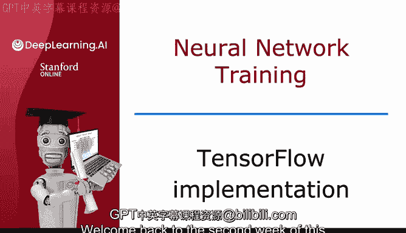
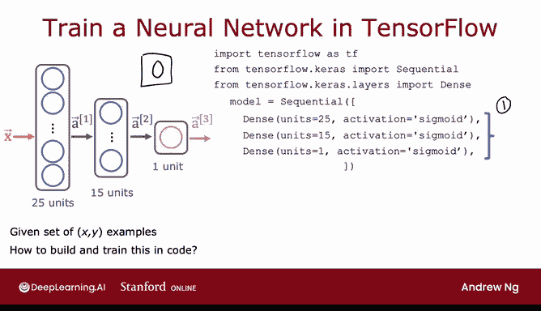

# 60：TensorFlow实现神经网络训练 🧠

在本节课中，我们将学习如何使用TensorFlow训练一个神经网络。上周我们介绍了神经网络如何进行推理（预测），本周我们将重点探讨如何利用数据训练神经网络的参数。



---

## 模型构建与编译

上一节我们介绍了神经网络推理的基本架构，本节中我们来看看如何在TensorFlow中构建并编译一个模型。

首先，我们需要指定神经网络的层结构。以下代码展示了如何构建一个用于手写数字识别（区分0和1）的神经网络：

```python
model = Sequential([
    Dense(units=25, activation='sigmoid'),
    Dense(units=15, activation='sigmoid'),
    Dense(units=1, activation='sigmoid')
])
```

这段代码创建了一个顺序模型，包含：
*   一个具有25个单元和Sigmoid激活函数的隐藏层。
*   一个具有15个单元和Sigmoid激活函数的隐藏层。
*   一个具有1个单元和Sigmoid激活函数的输出层。

接下来，我们需要编译模型，核心是指定所使用的损失函数。

```python
model.compile(loss=BinaryCrossentropy())
```

这里我们使用了**二元交叉熵损失函数**。在后续视频中，我们将详细解释这个函数的具体含义。

---



## 模型训练

在定义了模型结构并指定了损失函数后，最后一步是使用数据对模型进行训练。

我们调用`fit`函数来启动训练过程：

```python
model.fit(X, Y, epochs=100)
```

这个函数告诉TensorFlow，使用第二步中指定的损失函数，对第一步中定义的模型，在数据`X`和标签`Y`上进行训练。

参数`epochs`决定了梯度下降等学习算法运行的步数或轮数。

---

## 实现步骤总结

以下是使用TensorFlow训练神经网络的三个核心步骤：

1.  **指定模型**：定义网络层结构，即如何从输入计算得到输出（推理过程）。
2.  **编译模型**：指定训练所使用的损失函数。
3.  **训练模型**：在数据上运行学习算法（如梯度下降），以最小化损失函数，从而优化模型参数。

---

## 理解代码背后的原理

虽然仅凭这几行代码就能训练模型，但理解其背后的运行机制至关重要。当学习算法初期未能按预期工作时，拥有清晰的概念框架将极大地帮助你进行调试。在接下来的视频中，我们将深入探讨TensorFlow实现中这些步骤的具体细节。

---

本节课中我们一起学习了使用TensorFlow训练神经网络的基本流程：构建模型、编译模型（指定损失函数）以及最终在数据上拟合模型。理解这三个步骤是掌握神经网络训练的关键。