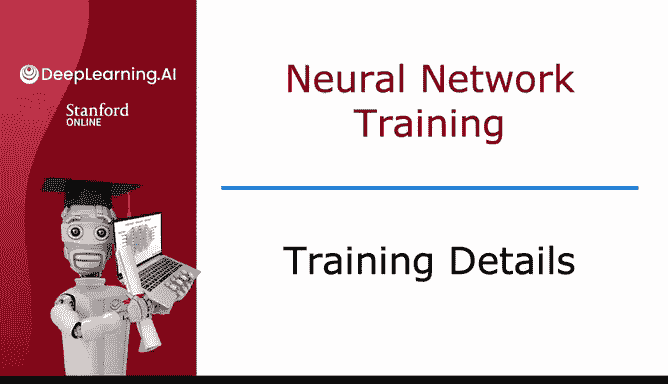
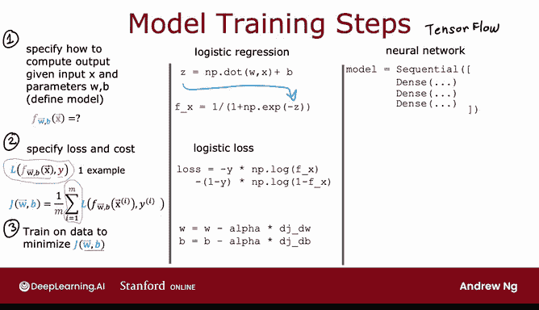
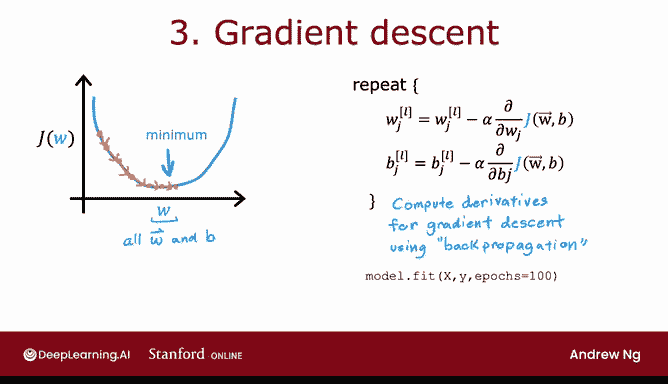
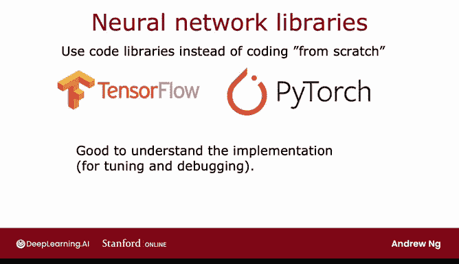

# 61：训练细节详解 🧠



在本节课中，我们将深入探讨使用 TensorFlow 训练神经网络的具体步骤。我们将回顾逻辑回归的训练过程，并将其与神经网络的训练流程进行对比，帮助你理解 TensorFlow 在幕后是如何工作的。

---

## 第一步：定义模型架构 🏗️

上一节我们介绍了训练模型的三个通用步骤。本节中我们来看看如何将这些步骤应用于神经网络。第一步是定义模型如何根据输入 `x` 和参数 `W`、`B` 计算输出。

对于逻辑回归，我们曾定义预测函数为：
`f(x) = g(w·x + b)`
其中 `g(z)` 是 sigmoid 函数：`g(z) = 1 / (1 + e^{-z})`。

对于神经网络，我们使用 TensorFlow 代码来定义其架构。以下代码片段指定了一个具有两个隐藏层和一个输出层的神经网络：

```python
model = Sequential([
    Dense(units=25, activation='relu'),
    Dense(units=15, activation='relu'),
    Dense(units=1, activation='sigmoid')
])
```

这段代码告诉 TensorFlow 网络的结构：第一层有 25 个神经元，第二层有 15 个，输出层有 1 个。它还定义了每层使用的激活函数（这里隐藏层使用 ReLU，输出层使用 sigmoid）。基于此，TensorFlow 能够推导出所有参数（`W1`, `b1`, `W2`, `b2`, `W3`, `b3`）并计算前向传播，得到输出 `a3`（即 `f(x)`）。



---

## 第二步：指定损失与成本函数 📉

定义了模型如何计算输出后，下一步是指定用于评估模型性能的损失函数和成本函数。

对于逻辑回归，单个训练样本 `(x, y)` 的损失函数是：
`L(f(x), y) = -[y * log(f(x)) + (1 - y) * log(1 - f(x))]`
成本函数 `J(W, b)` 则是所有训练样本损失的平均值。

在 TensorFlow 中，对于二分类问题（如手写数字 0/1 识别），我们使用相同的损失函数，它被称为**二元交叉熵损失**。以下是编译模型并指定损失函数的代码：

```python
model.compile(loss=tf.keras.losses.BinaryCrossentropy())
```

通过指定这个损失，TensorFlow 会自动将成本函数定义为所有训练样本损失的平均值，并致力于最小化这个成本 `J(W, B)`。这里的 `W` 和 `B` 代表神经网络中**所有层**的参数集合。

如果需要解决回归问题（例如预测房价），可以使用不同的损失函数，例如**均方误差损失**：

```python
model.compile(loss=tf.keras.losses.MeanSquaredError())
```

此时，TensorFlow 将尝试最小化预测值 `f(x)` 与真实标签 `y` 之间平方误差的平均值。

---

## 第三步：使用优化算法最小化成本函数 ⚙️

指定了成本函数后，最后一步是使用优化算法来调整参数 `W` 和 `B`，以最小化成本 `J(W, B)`。

在逻辑回归中，我们使用梯度下降算法。对于神经网络中的每个参数 `W_{lj}`，更新规则是：
`W_{lj} = W_{lj} - α * (∂J/∂W_{lj})`
其中 `α` 是学习率。计算这些偏导数 `∂J/∂W` 的关键算法是**反向传播**。

幸运的是，TensorFlow 为我们自动处理了反向传播的所有复杂计算。我们只需要调用 `fit` 函数：

```python
model.fit(X, Y, epochs=100)
```

这行代码告诉 TensorFlow 使用训练数据 `X` 和标签 `Y`，运行 100 次迭代（epochs）来优化模型。TensorFlow 内部会使用比标准梯度下降更高效的优化算法（我们将在后续课程中介绍）。

随着技术的发展，成熟的库（如 TensorFlow、PyTorch）让开发者无需从零实现这些复杂算法，就像今天我们直接调用库函数来计算平方根或进行矩阵乘法一样。然而，理解其底层原理仍然至关重要，这样当出现意外情况时，你才能更好地调试和解决问题。

---

## 总结 ✨

本节课中我们一起学习了训练神经网络的三个核心步骤：
1.  **定义模型架构**：使用 `Sequential` 和 `Dense` 层指定网络层数、神经元数量和激活函数。
2.  **编译模型并指定损失函数**：根据问题类型（分类或回归）选择合适的损失函数（如 `BinaryCrossentropy` 或 `MeanSquaredError`）。
3.  **训练模型**：调用 `model.fit` 函数，TensorFlow 将自动执行反向传播和梯度下降（或其变种）来优化所有参数。





现在你已经掌握了训练一个基本神经网络（也称为多层感知机）的方法。在下一个视频中，我们将探讨如何通过使用不同的激活函数（替代 sigmoid 函数）来使神经网络变得更强大。让我们继续学习吧！