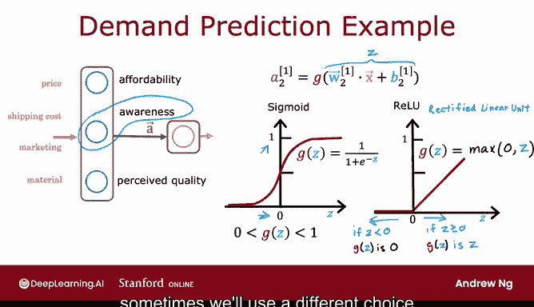
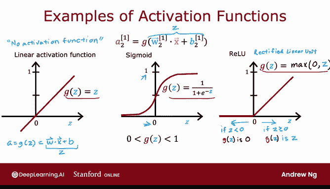

# 62：Sigmoid激活函数的替代方案 🧠

在本节课中，我们将学习除了Sigmoid函数之外，神经网络中其他常用的激活函数。我们将了解为什么需要替代方案，并介绍ReLU和线性激活函数，以及它们各自的适用场景。

---

## 概述

到目前为止，我们在神经网络的所有隐藏层和输出层中，一直使用Sigmoid激活函数。

我们最初这样构建神经网络，是因为我们将逻辑回归单元组合并连接在一起。然而，如果使用其他激活函数，你的神经网络可以变得更强大。让我们来看看如何实现这一点。

## 从Sigmoid到更灵活的激活函数

回顾上周的需求预测例子，给定价格、运输成本、营销材料，我们尝试预测产品是否高度可负担、认知度是否高、质量是否高，并基于此预测是否为畅销品。

但这个模型假设认知度是二元的，即人们要么知道，要么不知道。然而，潜在买家对你销售的T恤的认知程度可能并非二元。他们可能有点了解、比较了解、非常了解，或者产品可能已经彻底爆红。

因此，与其将认知度建模为一个二元数字（0或1），或一个0到1之间的概率值，不如让认知度可以是任何非负数，因为认知度可以从零到非常大的数值。

之前，我们使用以下公式来计算第二个隐藏单元的激活值（估计认知度）：
`a = g(z)`
其中 `g` 是Sigmoid函数，因此输出值在0到1之间。

如果你希望 `a` 能够取更大的正值，我们可以换用不同的激活函数。

## 引入ReLU激活函数

事实证明，神经网络中一个非常常见的激活函数选择是这个函数，它的图像如下所示。当 `z` 小于0时，`g(z)` 为0；当 `z` 大于等于0时，`g(z)` 是一条45度的直线，即 `g(z) = z`。

这个函数的数学公式是：
`g(z) = max(0, z)`

你可以自行验证，`max(0, z)` 的结果就是我在这里绘制的曲线。如果 `a` 是 `g(z)`，那么激活值 `a` 现在可以取0或任何非负值。

这个激活函数有一个名称，它被称为 **ReLU**（使用这种特殊的大小写）。ReLU代表“修正线性单元”。不必过于担心“修正”和“线性单元”的具体含义，这只是作者提出这个特定激活函数时赋予它的名称。在深度学习中，大多数人直接用ReLU来指代这个 `g(z)` 函数。

更广泛地说，你可以选择使用什么作为 `g(z)`，有时我们会选择不同于Sigmoid的激活函数。

## 常用激活函数一览

以下是三种最常用的激活函数：

1.  **Sigmoid激活函数**
    公式为：`g(z) = sigmoid(z)`

2.  **ReLU（修正线性单元）激活函数**
    公式为：`g(z) = max(0, z)`

3.  **线性激活函数**
    公式为：`g(z) = z`
    有时，当使用线性激活函数时，人们会说“我们没有使用任何激活函数”。因为如果 `a = g(z)` 且 `g(z) = z`，那么 `a` 就等于 `w·x + b`，就好像其中根本没有 `g` 一样。在本课程中，我将称之为使用线性激活函数，但如果你听到别人使用“没有激活函数”这个术语，他们指的就是线性激活函数。

这三种可能是目前神经网络中最常用的激活函数。本周晚些时候，我们会提到第四种叫做Softmax的激活函数。但有了这些激活函数，你就能构建出丰富多样的强大神经网络。

## 如何选择激活函数？

在构建神经网络时，对于每个神经元，你是想使用Sigmoid激活函数、ReLU激活函数还是线性激活函数？你如何在不同的激活函数之间做出选择？

我们将在下一个视频中探讨这个问题。

---

## 总结

本节课中，我们一起学习了Sigmoid激活函数的局限性，并认识了两种重要的替代方案：ReLU函数和线性激活函数。我们了解了ReLU函数如何允许神经元输出更大的正值，以及线性激活函数的本质。掌握这些不同的激活函数是构建更强大、更灵活神经网络的基础。下一节，我们将深入探讨如何为神经网络的不同部分选择合适的激活函数。