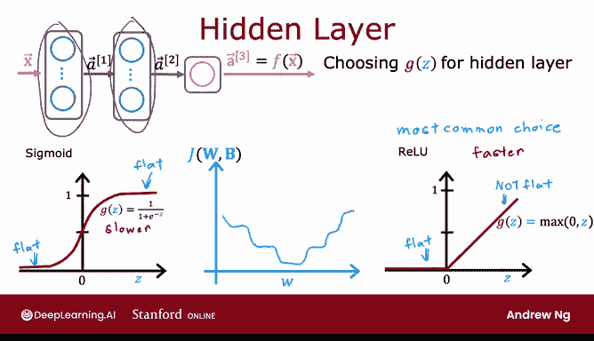
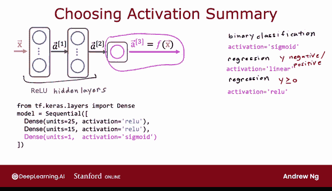

# 63：激活函数选择指南 🧠


在本节课中，我们将学习如何为神经网络中的不同神经元选择合适的激活函数。我们将首先探讨输出层激活函数的选择，然后深入了解隐藏层激活函数的选择，最后总结一些实用的建议。

## 输出层激活函数的选择 📊

上一节我们介绍了激活函数的基本概念，本节中我们来看看如何为输出层选择激活函数。选择输出层激活函数时，通常取决于目标标签 `y` 的性质。以下是具体建议：

*   **二元分类问题**：如果 `y` 的取值为 0 或 1，**Sigmoid** 激活函数几乎总是最自然的选择。因为神经网络可以学习预测 `y=1` 的概率，类似于逻辑回归。公式为：
    `a = σ(z) = 1 / (1 + e^{-z})`

*   **回归问题（y可正可负）**：如果你要预测一个既可为正也可为负的值（例如股价变化），推荐使用**线性**激活函数。这样神经网络的输出 `f(x)` 可以取任意实数值。公式为：
    `a = g(z) = z`

*   **回归问题（y仅非负）**：如果 `y` 只能取非负值（例如房屋价格），最自然的选择是 **ReLU** 激活函数，因为它只输出零或正值。公式为：
    `a = g(z) = max(0, z)`

总之，为输出层选择激活函数时，根据预测目标 `y` 的特性，通常有一个相当直接的选择。

## 隐藏层激活函数的选择 🏗️

了解了输出层的选择后，我们来看看隐藏层。在当今的神经网络实践中，**ReLU（修正线性单元）** 已成为隐藏层最常用的激活函数。

尽管神经网络最初常使用 Sigmoid 函数，但领域已经发展到更频繁地使用 ReLU，而很少使用 Sigmoid（除了输出层的二元分类问题）。

这主要有两个原因：

1.  **计算效率**：ReLU 函数 `max(0, z)` 的计算比需要指数和倒数运算的 Sigmoid 函数更快。
2.  **梯度问题（更关键）**：Sigmoid 函数在图像的两端（z 值很大或很小时）会变得非常平坦，导致梯度很小。在梯度下降训练中，这会造成许多地方的梯度接近零，显著减慢学习速度。虽然梯度下降优化的是代价函数 `J(W, b)`，但激活函数是计算的一部分，平坦的激活函数会导致代价函数中也出现更多平坦区域。



因此，对于大多数应用，在隐藏层默认使用 ReLU 激活函数是一个很好的选择。

## 总结与代码示例 📝

本节课我们一起学习了如何为神经网络选择激活函数。以下是核心建议总结：

*   **输出层**：根据 `y` 选择。
    *   二元分类：**Sigmoid**
    *   回归（y可正可负）：**Linear**
    *   回归（y仅非负）：**ReLU**
*   **隐藏层**：默认使用 **ReLU**。



在 TensorFlow 中，你可以这样实现：

```python
# 假设使用 Sequential 模型
model = tf.keras.Sequential([
    # 隐藏层使用 ReLU
    tf.keras.layers.Dense(units=25, activation='relu'),
    tf.keras.layers.Dense(units=15, activation='relu'),
    # 输出层：例如二元分类使用 sigmoid
    tf.keras.layers.Dense(units=1, activation='sigmoid')
    # 输出层：如需线性激活，则使用 activation='linear'
    # 输出层：如需 ReLU 激活，则使用 activation='relu'
])
```

通过使用这组更丰富的激活函数，你将能够构建比仅使用 Sigmoid 函数更强大的神经网络。

> 补充说明：在研究文献中，你有时会看到其他激活函数，如 Tanh、Leaky ReLU 或 Swish。每隔几年，研究人员可能会提出新的有趣函数，有时它们效果稍好。例如，Leaky ReLU 在某些情况下可能比标准 ReLU 表现更好。但对于绝大多数应用，本节课所学的知识已经足够。如果你有兴趣，可以自行查阅这些函数的资料。

掌握了这些关于激活函数的选择，希望你能在练习中应用这些想法。但这引出了另一个问题：我们为什么必须使用激活函数？为什么不能全部使用线性激活函数甚至不用激活函数？事实证明，这完全行不通。在下一个视频中，我们将探讨原因，并理解激活函数对于神经网络正常工作为何如此重要。