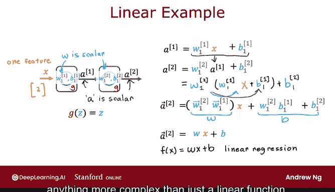
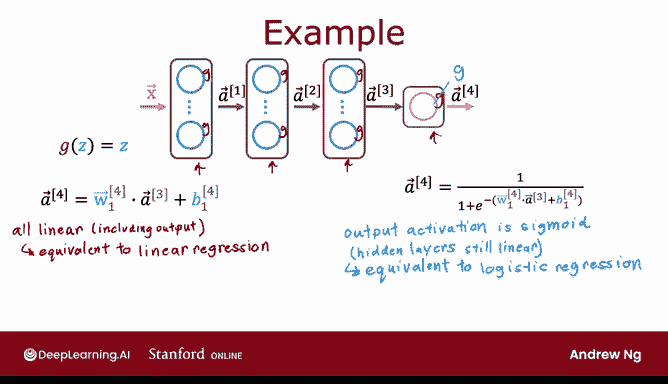

# 64：为什么神经网络需要激活函数？ 🧠

在本节课中，我们将探讨为什么神经网络必须使用非线性激活函数。我们将通过一个简单的例子来说明，如果所有神经元都使用线性激活函数，那么无论神经网络有多少层，其效果都将等同于线性回归模型，从而失去了使用神经网络的意义。

---

## 线性激活函数的问题

上一节我们介绍了神经网络的基本结构。本节中我们来看看，如果在神经网络的所有神经元中都使用线性激活函数，会发生什么情况。

假设我们有一个用于需求预测的神经网络。如果为该网络中的所有节点都使用线性激活函数，那么这个庞大的神经网络将变得与线性回归模型没有区别。这将完全违背我们使用神经网络的初衷，因为它将无法拟合比我们在第一门课程中学到的线性回归模型更复杂的模式。

让我们通过一个更简单的例子来说明这一点。

---

## 一个简化的例子

考虑一个输入 `x` 仅为单个数字的神经网络。它有一个隐藏单元，参数为 `W1` 和 `B1`，输出为 `a1`（也是一个数字）。第二层是输出层，同样只有一个输出单元，参数为 `W2` 和 `B2`，输出为 `A2`（一个标量），也就是神经网络的最终输出 `f(x)`。

现在，让我们看看如果在这个神经网络的每一处都使用线性激活函数 `g(z) = z`，会发生什么。

以下是计算过程：
1.  计算 `a1` 作为 `x` 的函数：
    `a1 = g(W1 * x + B1)`
    由于 `g(z) = z`，所以 `a1 = W1 * x + B1`。
2.  计算 `a2` 作为 `a1` 的函数：
    `a2 = g(W2 * a1 + B2) = W2 * a1 + B2`。
3.  将第一步的 `a1` 表达式代入第二步：
    `a2 = W2 * (W1 * x + B1) + B2`。
4.  展开并简化表达式：
    `a2 = (W2 * W1) * x + (W2 * B1 + B2)`。

如果我们令 `W = W2 * W1`，`B = W2 * B1 + B2`，那么我们就证明了：
`a2 = W * x + B`

**结论**：`a2` 仅仅是输入 `x` 的线性函数。因此，与其使用这个带有一个隐藏层和一个输出层的神经网络，我们不如直接使用一个线性回归模型。从线性代数的角度来看，这是因为线性函数的线性组合本身仍然是线性函数。这就是为什么在神经网络中，如果所有层都是线性的，那么多层结构并不能让网络计算或学习到任何比简单线性函数更复杂的特征。

---

## 一般情况下的结论

在更一般的情况下，如果你有一个多层神经网络，并且在所有隐藏层和输出层都使用线性激活函数，那么这个模型计算出的输出将完全等价于线性回归。

具体来说，输出 `A4` 可以表示为输入特征 `X` 的线性函数加上偏置项 `B`。

另一种情况是，如果在所有隐藏层使用线性激活函数，但在输出层使用逻辑激活函数（Sigmoid），那么可以证明这个模型将等价于逻辑回归。此时，`A4` 可以表示为 `1 / (1 + e^{-(Wx + B)})` 的形式（对于某些 `W` 和 `B` 的值）。这样一来，这个庞大的神经网络并没有做到逻辑回归做不到的事情。

因此，一个常见的经验法则是：**不要在神经网络的隐藏层中使用线性激活函数**。事实上，通常推荐使用 ReLU 激活函数，它在大多数情况下都能很好地工作。

---

## 总结与过渡

本节课中我们一起学习了神经网络需要非线性激活函数的原因。核心在于，线性激活函数的堆叠不会增加模型的表达能力，最终整个网络会退化为一个简单的线性模型（如线性回归或逻辑回归），无法捕捉数据中的复杂非线性关系。

到目前为止，你已经学会了为二分类问题（`y` 为 0 或 1）和回归问题（`y` 取连续值）构建神经网络。在下一个视频中，我将与你分享分类问题的一个推广：当 `y` 不仅可以取两个值，还可以取三个、四个、十个甚至更多类别值时，如何构建用于此类多分类问题的神经网络。让我们一起来看一下。