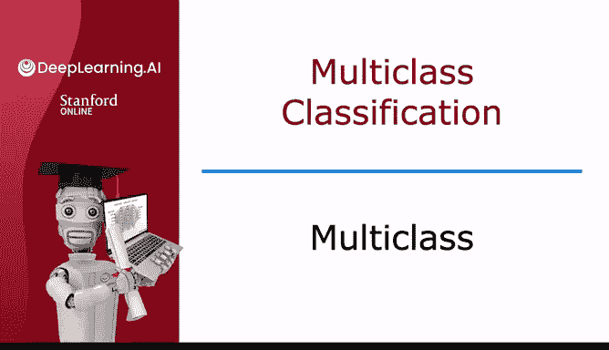
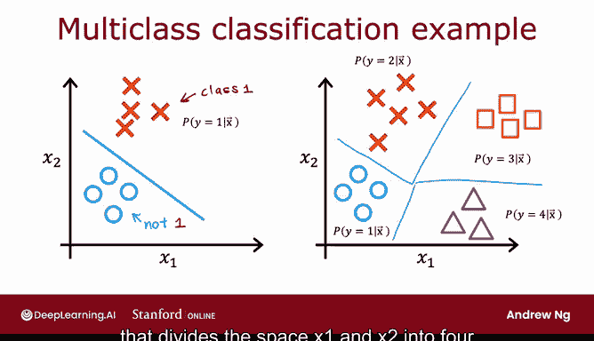

# 65：多类别分类 🎯

在本节课中，我们将要学习**多类别分类**问题。这是一种分类问题，其输出标签不再局限于两个（例如0或1），而是可以有两个以上的可能类别。我们将了解其定义、应用场景，并预览解决此类问题的算法。

---

## 多类别分类的定义

多类别分类指的是输出标签可以有两个以上可能类别的分类问题。

例如，在我们之前看过的手写数字分类问题中，我们只尝试区分数字 **0** 和 **1**。但如果你需要识别信封上的邮政编码，实际上有 **10** 个可能的数字（0-9）需要识别。

或者，在本课程早期，你看到的例子是：如果你试图分类病人是否患有三种或五种不同疾病中的一种，那也是一个多类别分类问题。

另一个我经常接触的例子是工厂零件制造的视觉缺陷检测。你可能需要查看一张制药公司生产的药片图片，并判断它是否有划痕缺陷、变色缺陷或碎裂缺陷。这同样是多个类别，即你可以分类出药片可能具有的多种不同类型的缺陷。

因此，多类别分类问题仍然是一个分类问题，即 **y** 只能取少量离散的类别值（而不是任意数字），但现在 **y** 可以取两个以上的可能值。

---

## 与二元分类的对比

上一节我们介绍了多类别分类的基本概念。本节中，我们来看看它与我们熟悉的二元分类有何不同。

在之前的二元分类中，你可能有一个像下图这样的数据集，具有特征 **X1** 和 **X2**。在这种情况下，逻辑回归会拟合一个模型来估计在给定特征 **x** 时 **y** 等于 **1** 的概率，因为 **y** 只能是 **0** 或 **1**。

对于多类别分类问题，数据集可能看起来像下面这样。我们有四个类别：圆圈代表一个类别，叉号代表另一个类别，三角形代表第三个类别，正方形代表第四个类别。

现在，我们不再仅仅估计 **y** 等于 **1** 的概率，而是需要估计：
*   **y** 等于 **1** 的概率是多少？
*   **y** 等于 **2** 的概率是多少？
*   **y** 等于 **3** 的概率是多少？
*   **y** 等于 **4** 的概率是多少？

事实证明，你在下一个视频中将学到的算法可以学习一个决策边界，可能如下图所示。这个边界将特征空间 **X1** 和 **X2** 划分为四个区域，而不仅仅是两个。

---

## 内容总结与预告

本节课中我们一起学习了多类别分类问题的定义，并了解了它与二元分类在数据集和任务目标上的区别。

在下一个视频中，我们将学习 **Softmax 回归算法**。这是逻辑回归算法的一种推广，使用它你将能够处理多类别分类问题。之后，我们会将 Softmax 回归应用到新的神经网络中，这样你也能够训练神经网络来执行多类别分类任务。

让我们继续观看下一个视频。