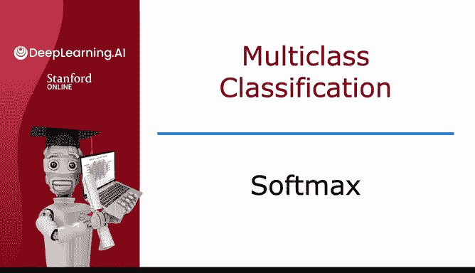
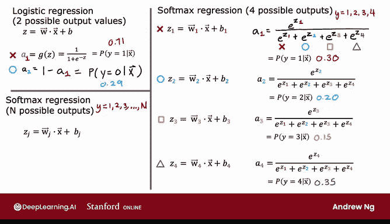
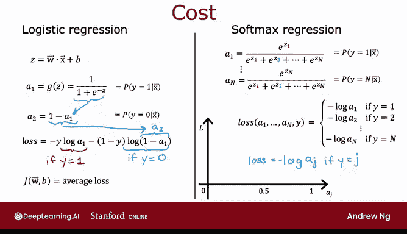

# 66：Softmax 回归 🧮

在本节课中，我们将学习 Softmax 回归算法。这是一种用于多类别分类的算法，是逻辑回归的推广。我们将了解其工作原理、数学公式以及成本函数的定义。

---

## 逻辑回归回顾

上一节我们介绍了逻辑回归，它是一种用于二分类的算法。

逻辑回归适用于输出变量 y 可以取两个可能值（0 或 1）的情况。其计算过程如下：

首先计算：
`z = w · x + b`

然后计算：
`a = g(z)`

其中 `g(z)` 是应用于 z 的 Sigmoid 函数。我们将 `a` 解释为逻辑回归对给定输入特征 X 时 y 等于 1 的概率估计。

一个快速测验：如果 y 等于 1 的概率是 0.71，那么 y 等于 0 的概率是多少？答案是 0.29，因为两个概率之和必须为 1。

为了为推广到 Softmax 回归做准备，我们可以将逻辑回归视为计算两个数字：
*   `a1`：给定 x 时 y 等于 1 的概率。
*   `a2`：给定 x 时 y 等于 0 的概率，即 `1 - a1`。

显然，`a1` 和 `a2` 之和为 1。

---

## Softmax 回归原理

现在，让我们将这个概念推广到 Softmax 回归。我们以一个具体的例子来说明，假设 y 可以取四个可能的输出值：1、2、3 或 4。

以下是 Softmax 回归的步骤：

首先，计算四个线性函数：
*   `z1 = w1 · x + b1`
*   `z2 = w2 · x + b2`
*   `z3 = w3 · x + b3`
*   `z4 = w4 · x + b4`

这里的 `w1`、`w2`、`w3`、`w4` 以及 `b1`、`b2`、`b3`、`b4` 是 Softmax 回归的参数。

接下来，应用 Softmax 函数计算每个类别的概率估计：

`a1 = e^{z1} / (e^{z1} + e^{z2} + e^{z3} + e^{z4})`

`a2 = e^{z2} / (e^{z1} + e^{z2} + e^{z3} + e^{z4})`

`a3 = e^{z3} / (e^{z1} + e^{z2} + e^{z3} + e^{z4})`

`a4 = e^{z4} / (e^{z1} + e^{z2} + e^{z3} + e^{z4})`

*   `a1` 被解释为模型对给定输入特征 x 时 y 等于 1 的概率估计。
*   `a2` 被解释为 y 等于 2 的概率估计。
*   同理，`a3` 和 `a4` 分别是 y 等于 3 和 4 的概率估计。

这些方程构成了 Softmax 回归模型的规范。如果能为所有参数学习到合适的选择，这个模型就能预测给定输入特征 X 时 y 为 1、2、3 或 4 的概率。

快速测验：假设你对一个新输入 X 运行 Softmax 回归，发现 `a1 = 0.30`，`a2 = 0.20`，`a3 = 0.15`。那么 `a4` 会是多少？因为所有概率之和必须为 1，所以 `a4 = 1 - 0.30 - 0.20 - 0.15 = 0.35`。

---

## 通用 Softmax 回归公式

上面我们针对四个输出类别写出了公式，现在让我们写出 Softmax 回归在通用情况下的公式。

在一般情况下，y 可以取 n 个可能的值：1, 2, 3, ..., n。

Softmax 回归的计算如下：

对于每个类别 j（从 1 到 n），计算：
`zj = wj · x + bj`

Softmax 回归的参数是 `w1, w2, ..., wn` 和 `b1, b2, ..., bn`。

最后，计算类别 j 的概率输出 `aj`：

`aj = e^{zj} / (∑_{k=1}^{n} e^{zk})`

这里使用变量 k 作为求和索引，而 j 指代一个特定的固定数字（如 j=1）。`aj` 被解释为模型对给定输入特征 X 时 y 等于 j 的概率估计。根据这个公式的构造，`a1, a2, ..., an` 这些数字相加总和始终为 1。

需要指出的是，如果将 Softmax 回归应用于 `n=2`（即只有两个输出类别）的情况，那么 Softmax 回归最终计算的内容基本上与逻辑回归相同（尽管参数可能略有不同）。这就是为什么说 Softmax 回归模型是逻辑回归的推广。

---

## Softmax 回归的成本函数

定义了 Softmax 回归如何计算输出后，现在我们来看看如何为其指定成本函数。

回顾逻辑回归的成本函数。我们之前将逻辑回归的损失写为：
`L = -y * log(a1) - (1 - y) * log(1 - a1)`

由于 `a2 = 1 - a1`，我们可以将其简化为：
`L = -y * log(a1) - (1 - y) * log(a2)`

换句话说：
*   如果 `y = 1`，损失是 `-log(a1)`。
*   如果 `y = 0`，损失是 `-log(a2)`。

整个模型的成本函数是所有训练样本损失的平均值。

对于 Softmax 回归，通常使用的成本函数定义如下：

对于算法输出 `a1` 到 `an` 且真实标签为 y 的情况，损失定义为：
*   如果 `y = 1`，损失是 `-log(a1)`。
*   如果 `y = 2`，损失是 `-log(a2)`。
*   ...
*   如果 `y = n`，损失是 `-log(an)`。

概括来说，如果 `y = j`，则损失为 `-log(aj)`。

这个函数的作用是：`-log(aj)` 是一条曲线。如果 `aj` 非常接近 1，则损失非常小。如果 `aj` 只有 50% 的概率，损失会稍大一些。`aj` 越小，损失越大。这激励算法尽可能使 `aj` 变大（接近 1），因为无论 y 的实际值是什么，你都希望算法认为 y 等于该值的概率相当大。

需要注意的是，在这个损失函数中，每个训练样本的 y 只能取一个值。因此，你最终只计算一个 `aj`（即该特定训练样本中 y 的实际值 j 对应的那个）的 `-log(aj)`。例如，如果 `y = 2`，你最终计算的是 `-log(a2)`，而不是 `-log(a1)` 或其他项。

---

## 总结

本节课中我们一起学习了 Softmax 回归。我们了解到：
1.  Softmax 回归是逻辑回归向多类别分类的推广。
2.  其核心是通过线性函数计算得分 `zj`，然后使用 Softmax 函数将其转换为概率分布 `aj`。
3.  Softmax 函数的公式确保所有输出概率之和为 1。
4.  用于训练的成本函数是交叉熵损失，它鼓励模型为正确类别输出高概率。

这就是 Softmax 回归模型的规范及其成本函数。训练这个模型可以构建多类别分类算法。接下来，我们可以将这个 Softmax 回归模型融入神经网络，以构建性能更好的神经网络多类别分类器。