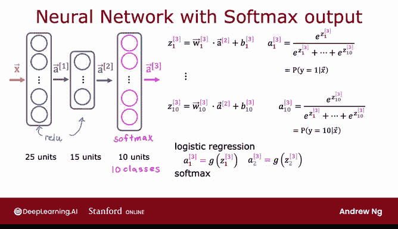
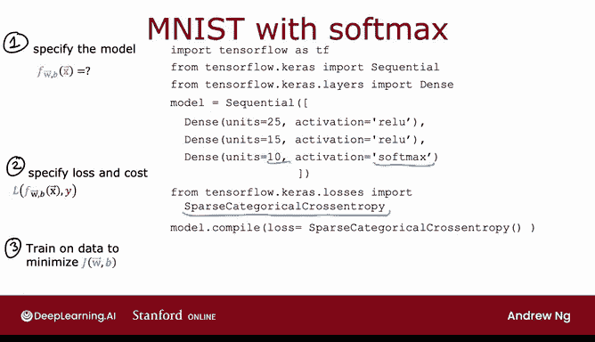

# 67：具有 Softmax 输出的神经网络 🧠

在本节课中，我们将学习如何构建一个能够进行多类别分类的神经网络。我们将把 Softmax 回归模型整合到神经网络的输出层中，并了解其前向传播过程以及在 TensorFlow 中的实现方式。

---

## 神经网络架构的演变

上一节我们介绍了用于二分类的神经网络。为了进行手写数字识别，我们使用了具有特定架构的网络。

现在，如果我们想对 0 到 9 这 10 个数字类别进行分类，就需要修改网络，使其拥有 10 个输出单元。

这个新的输出层将是一个 **Softmax 输出层**。我们有时会说这个神经网络有一个 Softmax 输出，或者说这个输出层是一个 Softmax 层。

---

## 前向传播过程

给定输入 **X** 后，第一层激活值 **a1** 的计算方式与之前完全相同。接着，第二隐藏层的激活值 **a2** 也以同样的方式计算。

现在，我们需要计算输出层的激活值，即 **a3**。以下是其工作原理。

对于 10 个类别，我们使用以下表达式计算 **Z1** 到 **Z10**：

**Z1 = w1 · a2 + b1**

以此类推，计算 **Z1** 到 **Z10**。

然后，**a1** 的计算公式如下：

**a1 = e^(Z1) / (e^(Z1) + e^(Z2) + ... + e^(Z10))**

这给出了 **y** 等于类别 1 的概率估计。

类似地，我们可以计算出 **a2** 到 **a10**，它们分别对应 **y** 等于类别 2 到 10 的概率估计。

为了表述完整，如果我们想表明这些是第 3 层的量，技术上应该加上上标 3。虽然这会使符号略显复杂，但它明确了例如 **Z1** 是第 3 层的第一个单元的 **Z** 值。

这样，你的 Softmax 层就给出了对 10 个可能输出标签中任何一个的概率估计。

---

## Softmax 激活函数的特性

我想提一下，Softmax 层有时也被称为 Softmax 激活函数。与我们目前见过的其他激活函数（如 Sigmoid、ReLU 和线性函数）相比，它在一个方面有点不同。

当我们看 Sigmoid、ReLU 或线性激活函数时，**a1** 是 **Z1** 的函数，**a2** 是 **Z2** 的函数，且仅依赖于 **Z2**。换句话说，为了获得激活值，我们可以将激活函数 **g**（无论是 Sigmoid、ReLU 还是其他函数）逐元素地应用于 **Z1**、**Z2** 等，从而得到 **a1**、**a2**、**a3**、**a4**。

但对于 Softmax 激活函数，请注意 **a1** 是 **Z1**、**Z2**、**Z3** 一直到 **Z10** 的函数。因此，每个激活值都依赖于 **Z** 的所有值。这是 Softmax 输出或 Softmax 激活函数的一个独特属性。

换句话说，如果你想计算 **a1** 到 **a10**，它们是同时依赖于 **Z1** 到 **Z10** 的函数。这与我们目前见过的其他激活函数不同。

---

## 在 TensorFlow 中的实现

如果你想实现本幻灯片中展示的神经网络，以下是相应的代码。

与之前类似，指定和训练模型有三个步骤。

第一步是告诉 TensorFlow 按顺序串联三个层：
*   第一层：25 个单元，使用 ReLU 激活函数。
*   第二层：15 个单元，使用 ReLU 激活函数。
*   第三层：因为有 10 个输出单元，所以设置 10 个单元，并告诉 TensorFlow 使用 Softmax 激活函数。

第二步是指定损失函数。上一视频中介绍的损失函数，在 TensorFlow 中被称为 **稀疏分类交叉熵** 函数。

我知道这个名字有点拗口。对于逻辑回归，我们使用的是二元交叉熵函数。这里我们使用稀疏分类交叉熵函数。“稀疏分类”指的是你将 **y** 分类到不同的类别中（因此是“分类”），**y** 取值从 1 到 10。“稀疏”指的是 **y** 只能取这 10 个值中的一个。每张图片要么是 0，要么是 1，依此类推直到 9，你不会看到一张图片同时是数字 2 和数字 7。所以，“稀疏”指的是每个数字只属于其中一个类别。这就是为什么上一视频中的损失函数在 TensorFlow 中被称为稀疏分类交叉熵损失函数。

第三步，训练模型的代码与之前完全相同。

如果你使用这段代码，就可以在多类别分类问题上训练神经网络。

---

## 一个重要说明

如果你完全按照我在这里写的方式使用这段代码，它会工作。但请不要实际使用这段代码，因为在 TensorFlow 中有一个更好的代码版本，可以使 TensorFlow 工作得更好。所以，尽管本幻灯片中展示的代码可以工作，但不要使用我在这里写的方式。在本周后面的一个视频中，你会看到一个不同的版本，那实际上是实现此功能的推荐版本，效果会更好。我们将在后面的视频中详细查看。

所以，现在你知道了如何训练一个带有 Softmax 输出层的神经网络，但有一个注意事项：有一个不同的代码版本可以使 TensorFlow 更准确地计算这些概率。

让我们在下一个视频中看看那个版本，它也将展示我推荐你使用的、用于训练 Softmax 神经网络的实际代码。让我们继续下一个视频。

---

## 总结

本节课中，我们一起学习了如何构建用于多类别分类的 Softmax 输出神经网络。我们了解了其网络架构的变化、前向传播的数学原理，以及 Softmax 激活函数同时依赖所有输入的特性。最后，我们初步探讨了在 TensorFlow 中的实现步骤，并了解到有一个更优的实现版本将在后续课程中介绍。