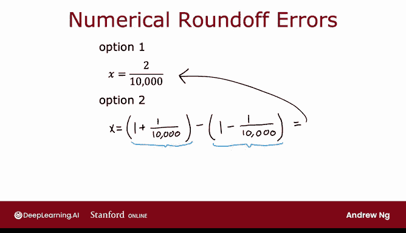
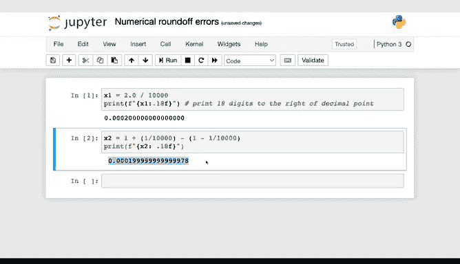
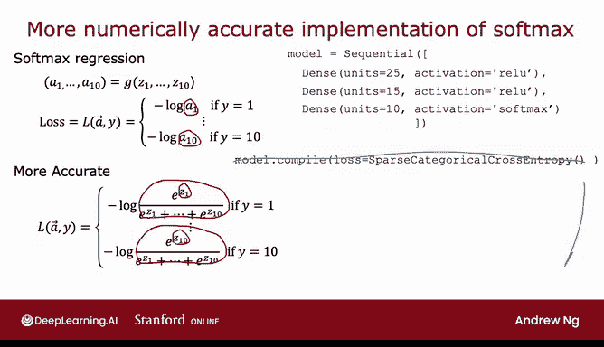
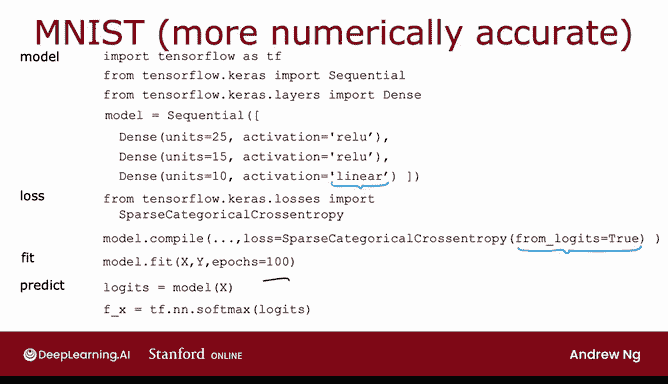
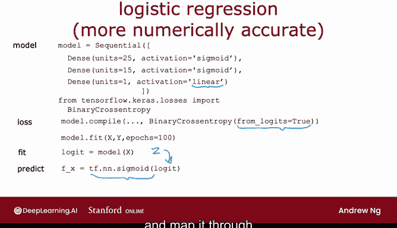

# 68：Softmax 的改进实现 🚀


在本节课中，我们将学习如何更稳定地实现 Softmax 输出层。我们将探讨数值舍入误差的问题，并介绍一种能减少这些误差的改进实现方法。

---

## 数值舍入误差问题



上一节我们介绍了带有 Softmax 层的神经网络的基本实现。本节中，我们来看看该实现可能存在的问题以及如何改进。

计算机使用有限的内存存储数字（称为浮点数），这可能导致数值舍入误差。根据计算方式的不同，结果的精度会受到影响。

例如，计算同一个值 `2/10000` 有两种方式：
*   **方式一**：直接计算 `x = 2/10000`
*   **方式二**：计算 `x = (1 + 1/10000) - (1 - 1/10000)`

理论上两者结果相同，但在计算机中，第二种方式可能因中间步骤的舍入而产生微小误差。

```python
# 方式一：直接计算
x = 2 / 10000
print(f"{x:.20f}")  # 输出：0.00020000000000000001

# 方式二：间接计算
x = (1 + 1/10000) - (1 - 1/10000)
print(f"{x:.20f}")  # 输出：0.00019999999999997797
```



虽然我们之前计算 Softmax 损失函数的方式在数学上是正确的，但存在一种不同的公式化方法，可以减少这类数值舍入误差，从而在 TensorFlow 中进行更精确的计算。

---

## 从逻辑回归理解改进思路

为了更好地理解这个改进思路，我们先回顾逻辑回归，然后再将其应用到 Softmax。

在逻辑回归中，对于一个样本，我们首先计算输出激活值 `a`：
**公式**：`a = g(z) = 1 / (1 + e^{-z})`

然后使用二元交叉熵公式计算损失：
**公式**：`loss = -[y * log(a) + (1-y) * log(1-a)]`

以下是实现此计算的两步代码：
```python
# 原始实现（两步计算）
a = tf.keras.activations.sigmoid(z)
loss = tf.keras.losses.BinaryCrossentropy()(y_true, a)
```

这种实现通常可行，数值误差并不严重。但如果我们允许 TensorFlow 不将 `a` 作为中间项显式计算，而是直接指定损失为 `z` 的函数，TensorFlow 就可以重新排列计算项，找到数值更稳定的计算方式。

改进后的实现将激活函数和损失计算合并：
```python
# 改进实现（合并计算，数值更稳定）
loss = tf.keras.losses.BinaryCrossentropy(from_logits=True)(y_true, z)
```
参数 `from_logits=True` 告诉 TensorFlow：输入的 `z` 是逻辑值（logits），尚未经过 Sigmoid 激活。TensorFlow 会将 `a = 1/(1+e^{-z})` 的表达式代入损失公式，并优化计算过程以减少舍入误差。这种实现的缺点是代码可读性略有下降。

---

## 应用于 Softmax 回归

现在，让我们将这一思路应用到 Softmax 回归中。

回顾上一节的实现，我们首先计算 Softmax 激活值 `a_j`：
**公式**：`a_j = e^{z_j} / (sum_{k=1}^{10} e^{z_k})`

然后根据真实标签 `y` 计算损失：
**公式**：`loss = -log(a_y)`

原始实现代码如下：
```python
# 原始实现：显式计算 Softmax 激活值
outputs = tf.keras.layers.Dense(10, activation='softmax')(previous_layer)
loss = tf.keras.losses.SparseCategoricalCrossentropy()(y_true, outputs)
```

同样，我们可以通过合并计算来改进。我们不再让输出层计算 Softmax 概率，而是让它直接输出逻辑值 `z1` 到 `z10`。然后，在损失函数中指定 `from_logits=True`。

以下是改进后的实现：
```python
# 改进实现：输出层为线性，损失函数合并计算
outputs = tf.keras.layers.Dense(10, activation='linear')(previous_layer) # 输出 logits (z)
loss = tf.keras.losses.SparseCategoricalCrossentropy(from_logits=True)(y_true, outputs)
```

这样做的原理是：当某些 `z_j` 的值非常大或非常小时，`e^{z_j}` 可能产生极大或极小的数值，容易导致计算不稳定（上溢或下溢）。通过将 Softmax 计算整合进损失函数，TensorFlow 可以在内部重新排列数学项，避免直接计算这些极值，从而得到更精确的损失值。



---

## 改进实现的注意事项

采用这种改进实现后，需要注意一个细节：神经网络的最后一层现在输出的是逻辑值 `z1` 到 `z10`，而不是概率 `a1` 到 `a10`。

*   **在训练时**：这没有问题，因为损失函数会处理 `z`。
*   **在推理时（进行预测时）**：如果你需要得到具体的类别概率，则需要手动将输出 `z` 通过 Softmax 函数进行转换。

```python
# 推理时，如果需要概率，需手动应用 Softmax
logits = model.predict(input_data)
probabilities = tf.nn.softmax(logits).numpy()
predicted_class = np.argmax(probabilities)
```

对于逻辑回归，如果采用了类似的合并实现，在需要得到最终概率时，同样需要将输出 `z` 通过 Sigmoid 函数进行转换。

---



## 总结

本节课中我们一起学习了 Softmax 层的改进实现方法。



1.  **问题根源**：直接分步计算 Softmax 激活值和交叉熵损失可能因中间值的极端大小（`e^{z}`）引入数值舍入误差。
2.  **解决方案**：将输出层改为线性激活，直接输出逻辑值（logits），并在损失函数中使用 `SparseCategoricalCrossentropy(from_logits=True)`。这允许 TensorFlow 优化计算图，实现数值更稳定的损失计算。
3.  **核心代码**：使用 `Dense(10, activation='linear')` 和 `SparseCategoricalCrossentropy(from_logits=True)` 进行组合。
4.  **注意事项**：改进后的模型在推理时，若需概率输出，需对 logits 额外应用 `tf.nn.softmax`。

这种实现方式虽然牺牲了一点代码的直观性，但换来了更好的数值稳定性，是实践中更推荐的做法。