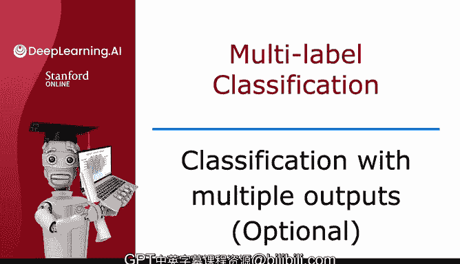
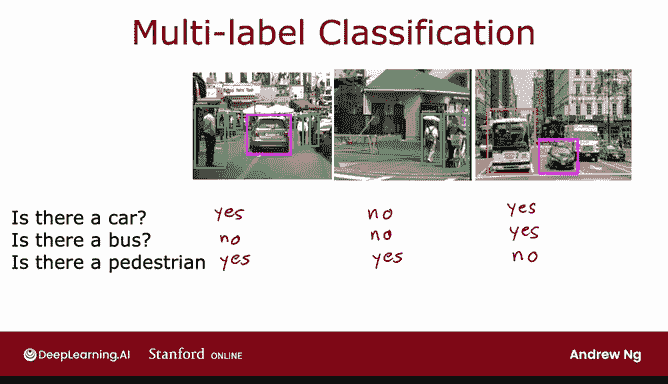
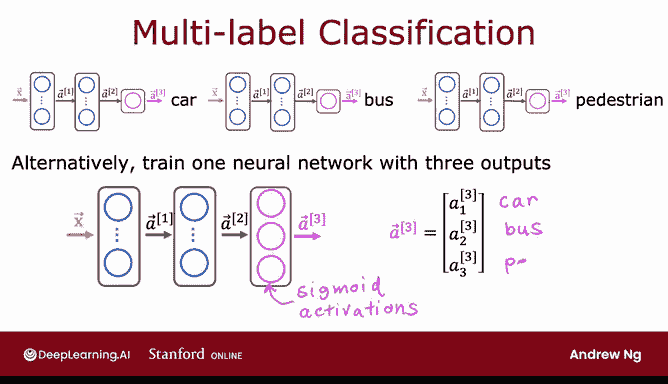

# 69：多输出分类（可选）🚗🚌🚶

在本节课中，我们将学习一种与多类别分类不同的分类问题——多标签分类。我们将了解其定义、应用场景，并学习如何构建神经网络来解决此类问题。

---

## 多标签分类的定义

你已经学习了多类别分类，其输出标签 **Y** 可以是两个或更多个可能类别中的任意一个。多标签分类是一种不同类型的分类问题，其特点是**每个输入图像可以关联多个标签**。

让我用一个例子来说明。如果你正在构建一辆自动驾驶汽车或驾驶辅助系统，那么给定一张汽车前方的图片，你可能需要询问一系列问题：**图片中是否有汽车？是否有公交车？是否有行人？**

*   在第一张图片中：有汽车，没有公交车，至少有一个行人。
*   在第二张图片中：没有汽车，没有公交车，有行人。
*   在第三张图片中：有汽车，有公交车，没有行人。

这些都是多标签分类问题的例子，因为**单个输入图像 X 关联了三个不同的标签**。

这些标签分别对应图像中是否存在汽车、公交车或行人。因此，在这种情况下，目标值 **Y** 实际上是一个由三个数字组成的向量。

这与多类别分类不同。例如在手写数字识别中，**Y** 只是一个单一的数字，即使这个数字可以取10个不同的可能值。

---

## 如何构建多标签分类神经网络

上一节我们介绍了多标签分类的概念，本节中我们来看看如何构建神经网络来解决它。

一种方法是将其视为三个完全独立的机器学习问题。你可以构建一个神经网络来判断是否有汽车，第二个网络检测公交车，第三个网络检测行人。这种方法并非不合理。

但还有另一种方法，即**训练一个单一的神经网络来同时检测汽车、公交车和行人**。

以下是这种方法的神经网络架构：

1.  输入 **X**。
2.  第一个隐藏层输出 **a1**。
3.  第二个隐藏层输出 **a2**。
4.  最后的输出层将有三个输出神经元，输出 **a3**，这是一个包含三个数字的向量。

因为我们解决的是三个二元分类问题（是否有汽车？是否有公交车？是否有行人？），所以可以在输出层的这三个节点上使用 **Sigmoid** 激活函数。

因此，这里的 **a3** 将是 `[a31, a32, a33]`，分别对应学习算法认为图像中是否存在汽车、公交车和行人。

---

## 多类别 vs. 多标签分类

多类别分类和多标签分类有时会被混淆。这就是为什么在本视频中，我想与你分享多标签分类问题的定义，以便你能根据具体应用场景，选择适合任务的正确方法。

我发现多类别分类和多标签分类有时会被混淆，这就是为什么我特意在本视频中向你明确什么是多标签分类，以便你能根据应用需求，选择正确的方法来完成工作。关于多类别和多标签分类的部分到此结束。

---

## 总结与预告

本节课中我们一起学习了：
1.  **多标签分类**的定义：一个输入可以对应多个输出标签。
2.  其应用场景，如自动驾驶中的物体检测。
3.  构建神经网络的两种思路：独立网络与单一多输出网络。
4.  多输出网络的架构和 **Sigmoid** 激活函数的使用。
5.  明确了多标签分类与多类别分类的核心区别。

在下一个视频中，我们将开始学习一些更高级的神经网络概念，包括一种比梯度下降更优的优化算法。让我们在下一个视频中看看这个算法，因为它将帮助你的学习算法学习得更快。让我们继续下一个视频。