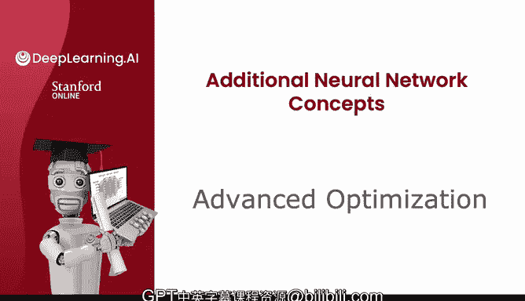
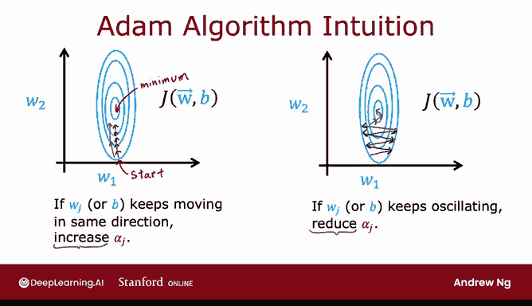
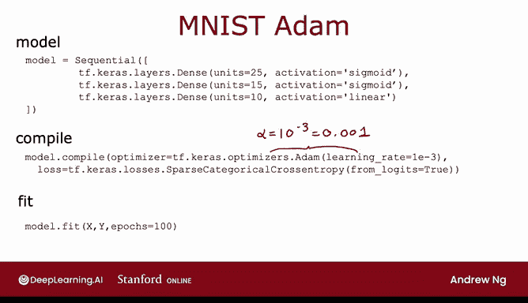

# 70：高级优化算法 🚀



在本节课中，我们将学习一种比梯度下降更高效的优化算法——Adam算法。我们将了解它的工作原理、优势以及如何在代码中实现它。

---

## 梯度下降回顾

上一节我们介绍了梯度下降算法，它是机器学习中广泛使用的优化方法，是线性回归、逻辑回归以及早期神经网络实现的基础。

梯度下降的每一步更新参数 `Wj` 的公式如下：

**Wj := Wj - α * ∂J/∂Wj**

其中，`α` 是学习率，`∂J/∂Wj` 是成本函数 `J` 对参数 `Wj` 的偏导数。

---

## 梯度下降的局限性

本节中我们来看看梯度下降在实际应用中可能遇到的问题。

下图展示了一个成本函数的等高线图，其最小值位于椭圆中心。


如果学习率 `α` 设置得太小，梯度下降的每一步都会朝着大致相同的方向移动，但步长非常小。这会导致收敛速度缓慢。你可能会想，我们能否自动增大学习率，让算法迈出更大的步伐，从而更快地到达最小值？

相反，如果学习率 `α` 设置得太大，梯度下降的步骤可能会在最小值附近来回振荡，无法稳定收敛。这时，你又会希望算法能自动减小学习率。

---

## Adam 算法介绍

为了解决上述问题，Adam 算法应运而生。Adam 代表自适应矩估计，它能根据每个参数的情况自动调整学习率。

Adam 算法的核心思想是：
*   如果一个参数（如 `Wj` 或 `B`）持续朝着大致相同的方向更新，则增大该参数的学习率，使其在该方向上更快前进。
*   如果一个参数持续来回振荡，则减小该参数的学习率，以稳定其更新路径。

与使用单一全局学习率的梯度下降不同，Adam 为模型中的每一个参数都维护一个独立的学习率。例如，如果你的模型有参数 `W1` 到 `W10` 以及 `B`，那么 Adam 实际上会管理 11 个学习率参数：`α1` 到 `α10` 对应 `W1` 到 `W10`，`α11` 对应 `B`。

Adam 算法如何实现这一点的具体细节较为复杂，超出了本课程的范围。在后续更高级的深度学习课程中，你可能会学到更多。

---

## Adam 算法的代码实现

以下是 Adam 算法在代码中的实现方式。模型定义与之前完全相同。




编译模型的方式也与之前非常相似，区别在于我们需要在 `compile` 函数中添加一个额外的参数，指定要使用的优化器为 Adam。

```python
# 示例代码
model.compile(optimizer=tf.keras.optimizers.Adam(learning_rate=1e-3),
              loss='...',
              metrics=['accuracy'])
```

Adam 优化算法需要一个默认的初始学习率 `α`，在这个例子中我将其设置为 `1e-3`。在实践中使用 Adam 算法时，值得尝试几个不同的初始学习率值，包括较大和较小的值，以观察哪个能带来最快的训练性能。

与你在先前课程中学到的原始梯度下降算法相比，Adam 算法由于能自动适应学习率，因此对你所选学习率的具体值不那么敏感，鲁棒性更强。不过，稍微调整这个参数以尝试获得更快的训练速度仍然是值得的。

---

## 总结与对比



本节课中我们一起学习了 Adam 优化算法。


Adam 算法通常比梯度下降工作得更快，并且已经成为从业者训练神经网络时实际上的标准选择。如果你在决定使用哪种学习算法来训练神经网络，一个稳妥的选择就是使用 Adam 优化算法。如今，大多数从业者都会使用 Adam 而非原始的梯度下降算法。

掌握了这个方法，希望你的学习算法能够更快地进行学习。

在接下来的几个视频中，我将介绍一些更高级的神经网络概念。特别是在下一个视频中，让我们来看看一些其他类型的网络层。