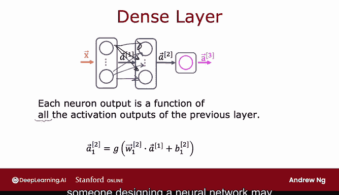
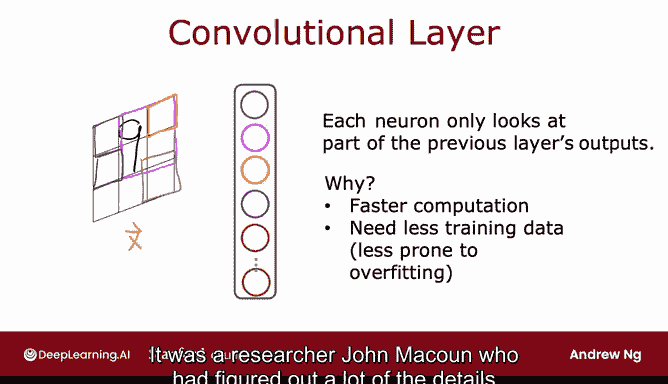
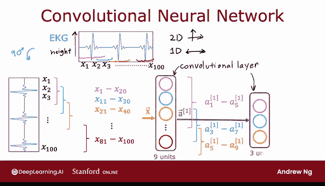

# 71：其他层类型 🧠

## 概述

在本节课中，我们将学习神经网络中除密集层（Dense Layer）之外的其他层类型。我们将重点介绍**卷积层（Convolutional Layer）**，了解其工作原理、优势以及适用场景。通过本课，你将初步理解神经网络架构的多样性。

---

## 密集层回顾

到目前为止，我们使用的所有神经网络层都是密集层类型。在这种层中，**层中的每个神经元都能访问前一层所有神经元的激活值**。

事实证明，仅使用密集层类型，你实际上可以构建一些相当强大的学习算法。

为了帮助你进一步建立关于神经网络能力的直觉，实际上还存在一些具有其他属性的层类型。在本视频中，我将简要介绍这一点，并为你展示一个不同类型的神经网络层示例。

---

## 卷积层简介

在密集层中，例如第二隐藏层中某个神经元的激活值，是前一层所有激活值（a1）的函数。但对于某些应用，神经网络的设计者可能会选择使用不同类型的层。

你可能会在一些工作中看到的另一种层类型称为**卷积层**。

让我用一个例子来说明。左边显示的是输入 X，它是一个手写数字 9。我将构建一个隐藏层，该层将根据这个输入图像 X 计算不同的激活值。

但我可以这样做：对于第一个隐藏单元（用蓝色绘制），我不让这个神经元查看图像中的所有像素，而是规定它只能查看这个小矩形区域内的像素。第二个神经元（用洋红色表示）同样不会查看整个输入图像，而是只查看图像中有限区域的像素。第三个、第四个神经元依此类推，直到最后一个神经元，它可能只查看图像的那个区域。

那么，为什么要这样做呢？为什么不让每个神经元都查看所有像素，而只让它们查看部分像素？

这样做的好处是：首先，它**加快了计算速度**。其次，使用这种称为卷积层的数字类型层的神经网络，可以**需要更少的训练数据**，或者也可以**更不容易过拟合**。我在之前的课程中简要提到过过拟合，下周当我们讨论使用学习算法的实用技巧时，也会更详细地探讨这个问题。

这种每个神经元只查看输入图像一个区域的优选层类型，就称为**卷积层**。研究人员 Yann LeCun 在如何使卷积层工作并推广其使用方面，贡献了许多细节。

---

## 卷积层详细示例

让我更详细地说明卷积层。如果一个神经网络中有多个卷积层，有时它被称为**卷积神经网络**。

为了在本幻灯片上说明卷积层或卷积神经网络，我将不使用二维图像输入，而是使用一维输入。我将使用的激励示例是**心电图信号（EKG 或 ECG）的分类**。如果你在胸部放置两个电极，你会记录到类似这样的电压，对应你的心跳。这实际上是我的斯坦福研究小组曾研究过的内容，我们读取类似这样的心电图信号，试图诊断患者是否可能有心脏问题。

心电图信号（在某些地方称为 ECG，某些地方称为 EKG）只是一系列数字，对应这条曲线在不同时间点的高度。因此，你可能有大约 100 个数字，对应这条曲线在 100 个不同时间点的高度。

学习任务是：给定这个时间序列，给定这个心电图信号，进行分类，例如判断该患者是否患有心脏病或某种可诊断的心脏状况。

以下是卷积神经网络可能做的事情：

我将把心电图信号旋转 90 度放在侧面，这样我们就有了 100 个输入 x1, x2, ..., x100。

当我构建第一个隐藏层时，我不让第一个隐藏单元接收所有 100 个数字作为输入，而是让它只查看 x1 到 x20。这对应于只查看这个心电图信号的一个小窗口。

这里用不同颜色显示的第二个隐藏单元将查看 x11 到 x30，因此它查看这个心电图信号的另一个窗口。第三个隐藏单元查看另一个窗口 x21 到 x40，依此类推。在这个例子中，最后一个隐藏单元将查看 x81 到 x100，因此它查看这个心电图时间序列末尾的一个小窗口。

这就是一个卷积层，因为该层中的每个单元只查看输入的一个有限窗口。

现在，神经网络的这一层有 9 个单元。

下一层也可以是卷积层。在第二个隐藏层中，我设计我的第一个单元不查看前一层所有的激活值，而是只查看前五个激活值。然后，这个第二隐藏层中的第二个单元可能只查看另外五个数字，例如 a3 到 a7。该层中的第三个也是最后一个隐藏单元将只查看 a5 到 a9。

然后，也许最终，这些激活值 a2 被输入到一个 Sigmoid 单元，该单元确实会查看 a2 的这三个值，以便对是否存在心脏病进行二元分类。

这就是一个神经网络的例子，其第一个隐藏层是卷积层，第二个隐藏层也是卷积层，输出层是 Sigmoid 层。

事实证明，对于卷积层，你有很多架构选择，例如单个神经元应该查看多大的输入窗口，以及每层应该有多少个神经元。通过有效地选择这些架构参数，你可以为某些应用构建比密集层更有效的神经网络新版本。

---

## 总结与展望

回顾一下，这就是关于卷积层和卷积神经网络的内容。在本课程中，我不会更深入地探讨卷积网络，你也不需要了解它们就能完成作业并成功完成本课程。但我希望你会发现这个额外的直觉——神经网络也可以有其他类型的层——是有用的。

事实上，如果你有时听说最新的尖端架构，如 Transformer 模型、LSTM 或注意力模型，很多关于神经网络的研究，即使在今天，也涉及研究人员试图为神经网络发明新类型的层，并将这些不同类型的层作为构建块连接起来，以形成更复杂、更强大的神经网络。

这就是本周所需视频的全部内容。感谢你一直坚持学习到这里。我期待下周也能见到你，届时我们将开始讨论关于如何构建机器学习系统的实用建议。我希望你下周学到的技巧能帮助你更有效地构建有用的机器学习系统。我也期待下周见到你。😊