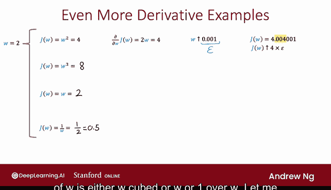
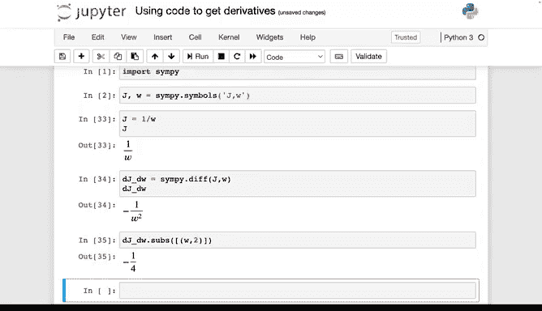
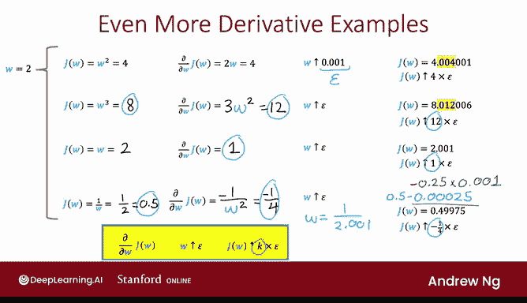
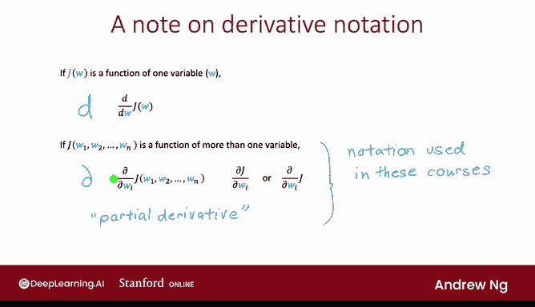

# 72：什么是导数（可选）📚

在本节课中，我们将学习导数的基本概念。导数在神经网络的反向传播算法中至关重要，它帮助我们理解当参数发生微小变化时，成本函数如何变化。我们将通过简单的例子和代码演示，让初学者也能轻松理解导数的含义和计算方法。

---

## 概述

你已经看到在 TensorFlow 中，可以指定神经网络架构来计算输出 `y` 作为输入 `x` 的函数，并指定成本函数。TensorFlow 会自动使用反向传播计算导数，并使用梯度下降或 Adam 等算法训练神经网络的参数。

反向传播算法计算成本函数关于参数的导数，是神经网络学习中的关键算法。在本节和接下来的几个可选视频中，我们将探讨反向传播如何计算导数。这些视频完全是可选的，会涉及一些微积分知识。如果你已经熟悉微积分，希望你能享受这些视频；如果不熟悉，我们将从微积分的基础开始，确保你拥有理解反向传播工作原理所需的所有直觉。

---

## 导数的直观理解

我将使用一个简化的成本函数：`J(W) = W²`。成本函数是参数 `W` 和 `B` 的函数。在这个简化的例子中，我们假设 `J(W) = W²`，并暂时忽略 `B`。假设参数 `W` 的值等于 3。

那么 `J(W)` 将等于 9，因为 `W²` 即 `3²`。如果我们把 `W` 增加一个微小的量，比如 `ε = 0.001`，`J(W)` 的值会如何变化？

如果 `W` 增加 0.001，那么 `W` 变为 `3.001`，所以 `J(W)` 现在是 `3.001² = 9.006001`。我们看到，如果 `W` 增加 0.001，`J(W)` 大约增加了 6 倍那么多，即大约增加 `6 * 0.001`。这并不完全精确，实际上增加到 9.006001 而不是 9.006，但如果 `ε` 是无穷小（即非常非常小），这个比例会越来越精确。

在这个例子中，我们看到如果 `W` 增加 `ε`，那么 `J` 大约增加 `6 * ε`。在微积分中，我们会说 `J(W)` 关于 `W` 的导数等于 6。这意味着如果 `W` 增加一个微小的量，`J(W)` 会增加六倍那么多。

如果 `ε` 取不同的值，比如 `ε = 0.002`，那么 `W` 变为 `3.002`，`W²` 变为 `3.002² = 9.012004`。在这种情况下，我们会得出结论：如果 `W` 增加 0.002，`J(W)` 大约增加 `6 * 0.002`，即大约增加到 9.012。这个 0.012 大约是 `6 * 0.002`。同样，由于 `ε` 不是无穷小，这里有一点误差（额外的 0.000004）。我们再次看到 `W` 的增加量与 `J(W)` 的增加量之间的比例是 6:1，这就是为什么 `J(W)` 关于 `W` 的导数等于 6。`ε` 越小，这个比例就越精确。

你可以暂停视频，用其他 `ε` 值自己尝试这个计算。关键是只要 `ε` 足够小，`J(W)` 的增加量与 `W` 的增加量之比应该是 6:1。

这引出了导数的非正式定义：如果每当 `W` 增加一个微小量 `ε`，导致 `J(W)` 增加 `K * ε`（在我们刚才的例子中，`K` 等于 6），那么我们说 `J(W)` 关于 `W` 的导数等于 `K`。

你可能记得在实现梯度下降时，会反复使用以下规则更新参数 `W`：

`W := W - α * (dJ/dW)`

其中 `α` 是学习率。梯度下降做了什么？注意，如果导数很小，那么这个更新步骤会对参数 `W` 做小的更新；如果这个导数项很大，则会导致参数 `W` 发生大的变化。这是合理的，因为如果导数小，意味着改变 `W` 对 `J` 的值影响不大，所以我们不必对 `W` 做大的改变。但如果导数大，意味着即使对 `W` 做微小的改变，也能显著改变或减少成本函数 `J(W)`，所以在这种情况下，让我们对 `W` 做更大的改变，因为这样做实际上能显著减少成本函数 `J`。

---

## 更多导数示例

我们刚才看到的例子是，如果 `W = 3`，`J(W) = W² = 9`，那么如果 `W` 增加 `ε = 0.001`，`J(W)` 变为 `J(3.001) = 9.006001`。换句话说，`J` 增加了大约 0.006，即 `6 * 0.001` 或 `6 * ε`，这就是为什么 `J(W)` 关于 `W` 的导数等于 6。

让我们看看对于所有 `W` 值，导数会是什么。取 `W = 2`。在这种情况下，`J(W) = W² = 4`，如果 `W` 增加 0.001，那么 `J(W)` 变为 `J(2.001) = 4.004001`。所以 `J(W)` 从 4 增加到这个值，大约增加了 `4 * ε`，这就是为什么现在的导数是 4，因为 `W` 增加 `ε` 导致 `J(W)` 增加了四倍那么多。同样，这里额外的 0.000001 是因为不够精确，因为 `ε` 不是无穷小。

再看另一个例子，如果 `W = -3`，`J(W) = W²` 仍然是 9，因为 `(-3)² = 9`。如果 `W` 再次增加 `ε`，那么现在 `W = -2.999`，`(-2.999)² = 8.994001`。注意，这里 `J(W)` 下降了大约 0.006，即 `6 * ε`。所以在这个例子中，`J` 从 9 开始，但现在下降了（注意这里是向下箭头而不是向上箭头），下降了 `6 * ε`，或者等价地说，它增加了 `-6 * ε`，这就是为什么在这种情况下导数等于 -6，因为当 `ε` 很小时，`W` 增加 `ε` 导致 `J(W)` 增加 `-6 * ε`。

可视化这一点的一种方法是绘制函数 `J(W)`。如果横轴是 `W`，纵轴是 `J(W)`，那么当 `W = 3` 时，`J(W) = 9`；当 `W = -3` 时，也是 9；当 `W = 2` 时，`J(W) = 4`。

如果你以前上过微积分课，可能会注意到导数对应于一条直线在 `J(W)` 函数某点（比如 `W = 3`）处的斜率。这条直线在该点的斜率（高度除以宽度）在 `W = 3` 时等于 6，在 `W = 2` 时等于 4，在 `W = -3` 时等于 -6。在微积分中，这些直线的斜率对应于函数的导数。但如果你以前没有上过微积分课，没有见过斜率的概念，不用担心。

在继续之前，做一个观察：在这三个例子中，`J(W)` 是同一个函数，`J(W) = W²`，但 `J(W)` 的导数取决于 `W`。当 `W = 3` 时，导数是 6；当 `W = 2` 时，导数是 4；当 `W = -3` 时，导数是 -6。如果你熟悉微积分（如果不熟悉也没关系），微积分可以让我们计算出 `J(W)` 关于 `W` 的导数为 `2 * W`。稍后，我将展示如何使用一个名为 SymPy 的 Python 包自己计算这些导数。

因为微积分告诉我们 `W²` 的导数是 `2W`，所以当 `W = 3` 时，导数是 `2 * 3 = 6`；当 `W = 2` 时，是 `2 * 2 = 4`；当 `W = -3` 时，是 `2 * (-3) = -6`。`W` 的值乘以 2 就得到导数。

---

## 使用 SymPy 计算导数

在结束之前，让我们再看几个例子。对于这些例子，我将设 `W = 2`。你在上一张幻灯片中看到，如果 `J(W) = W²`，那么导数我说是 `2 * W`，即 4。所以如果 `W` 增加 0.001（即 `ε`），`J(W)` 变为大约增加 `4 * ε`。

让我们看看其他几个函数。如果 `J(W) = W³`，那么 `2³ = 8`。如果 `J(W) = W`，那么 `W = 2`。如果 `J(W) = 1/W`，那么 `1/2 = 0.5`。当成本函数 `J(W)` 是 `W³`、`W` 或 `1/W` 时，`J(W)` 关于 `W` 的导数是什么？

让我展示如何使用名为 SymPy 的库和包来计算这些导数。

首先，导入 SymPy。我将告诉 SymPy 使用 `J` 和 `W` 作为符号来计算导数。

对于第一个例子，成本函数 `J = W²`。注意 SymPy 如何以漂亮的字体渲染它。如果使用 SymPy 计算 `J` 关于 `W` 的导数，可以这样做。你会看到 SymPy 告诉你这个导数是 `2W`。

让我选择一个变量 `dJ_dW` 并将其设置为等于这个表达式，然后在这里打印出来。所以是 `2W`。如果你想将 `W` 的值代入这个表达式求值，可以这样做：`derivative.subs(W, 2)`，这意味着将 `W` 的值代入这个表达式并求值，得到 4，这就是为什么当 `W` 接近 2 时，我们看到 `J` 的导数等于 4。

让我们看其他一些例子。如果 `J = W³` 呢？那么导数变为 `3 * W²`。所以根据微积分，这是 SymPy 为我们计算的。如果 `J` 是 `W³`，那么 `J` 关于 `W` 的导数是 `3W²`，并且根据 `W` 是什么，导数的值也会改变。我们可以代入：如果 `W = 2`，在这种情况下得到 12。

或者如果 `J = W` 呢？在这种情况下，导数就等于 1。

我们最后一个例子是，如果 `J = 1/W` 呢？在这种情况下，导数结果是 `-1 / W²`，所以这是 `-1/4`。

我将取出我们计算出的导数：对于 `W²`，是 `2W`；对于 `W³`，是 `3W²`；对于 `W`，就是 1；对于 `1/W`，是 `-1 / W²`。让我们把这些复制回另一张幻灯片。

所以 SymPy（实际上是微积分）展示的是：如果 `J(W)` 是 `W³`，导数是 `3W²`，当 `W = 2` 时等于 12；当 `J(W) = W` 时，导数就等于 1；当 `J(W) = 1/W` 时，导数是 `-1 / W²`，当 `W = 2` 时是 `-1/4`。这双重检查了我们从 SymPy 得到的这些表达式是正确的。

让我们尝试将 `W` 增加 `ε`。在这种情况下，`J(W)`（同样，你可以暂停视频，如果愿意，在自己的计算器上检查这个映射）是 `2.001³` 变成这个值，所以 `J` 从 8 增加到大约 8.012，因此大约增加了 `12 * ε`，所以导数确实是 12。

或者如果 `J(W) = W`，那么如果 `W` 增加 `ε`，那么 `J(W)`（就是 `W`）现在是 2.001，所以它增加了 0.001，这正好是 `ε` 的值。所以 `J(W)` 增加了 `1 * ε`，因此导数确实等于 1。注意，这里实际上是精确的 `ε`，即使 `ε` 不是无穷小。

最后一个例子：如果 `J(W) = 1/W`，如果 `W` 增加 `ε`，那么 `W` 是 `1/2.001`，结果 `J(W)` 大约是 0.49975（截断了一些额外数字）。但这结果是 `0.5 - 0.00025`。所以 `J(W)` 从 0.5 开始，下降了 0.00025。这个 0.00025 是 `0.25 * ε`，它下降了这么多，或者说增加了 `-0.25 * ε`，因为 `-0.25 * ε` 等于这里的这个项。

所以我们看到，如果 `W` 增加 `ε`，`J(W)` 增加 `-1/4` 或 `-0.25 * ε`，这就是为什么在这种情况下导数是 `-1/4`。

---

## 导数符号说明

在结束这个视频之前，我想简要提一下在其他文本中可能看到的用于书写导数的符号。如果 `J(W)` 是单变量（比如 `W`）的函数，那么数学家有时会将导数写为 `d/dW [J(W)]`。注意，在 SymPy 中，这个符号使用小写字母 `d`。

相比之下，如果 `J` 是多变量的函数，那么数学家有时会使用这个花体的 `∂` 来表示关于其中一个参数 `W_i` 的导数。在我看来，区分这个常规的 `d` 和这个风格化的微积分导数符号 `∂` 的符号，对我来说没有多大意义，而且在我看来，这种符号使微积分和导数符号变得复杂。

但由于历史原因，微积分文本会根据 `J` 是单变量函数还是多变量函数使用这两种不同的符号。但我认为，出于实际目的，这种符号约定往往只会使事情复杂化，我认为这实际上是不必要的。

所以对于本课程，我将到处使用 `∂` 符号，即使只有一个变量。事实上，对于我们的大多数应用，函数 `J` 是多变量的，所以这个有时称为偏导数符号的符号，实际上是大多数情况下正确的符号，因为 `J` 通常有多个变量。但我希望在本课程中始终使用这种符号，以简化演示，使导数更容易理解。

事实上，这个符号是你在迄今为止的视频中一直看到的符号。为了简洁，有时你也会看到简写为 `∂J/∂W_i` 或写成这样，这些只是这里这个表达式的简化缩写形式。

---

## 总结

本节课中，我们一起学习了导数的基本概念。导数描述了当参数 `W` 发生微小变化 `ε` 时，成本函数 `J(W)` 的变化量。如果 `J(W)` 的变化量是 `K * ε`，那么 `K` 就是 `J(W)` 关于 `W` 的导数。我们通过具体例子和 SymPy 代码演示了如何计算不同函数的导数，并简要介绍了导数的符号表示。理解导数是理解神经网络反向传播算法的基础。在下一节中，我们将学习如何通过计算图在神经网络中计算导数。