# 74：更大神经网络示例与反向传播直觉 🧠

在本节课中，我们将通过一个更大的神经网络示例，深入理解计算图的工作原理以及反向传播的直觉。我们将一步步构建计算图，并解释如何高效地计算所有参数的梯度。

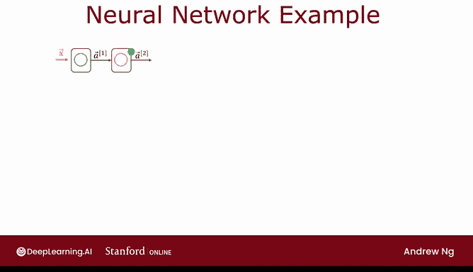

---

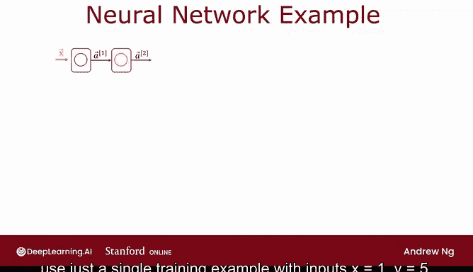

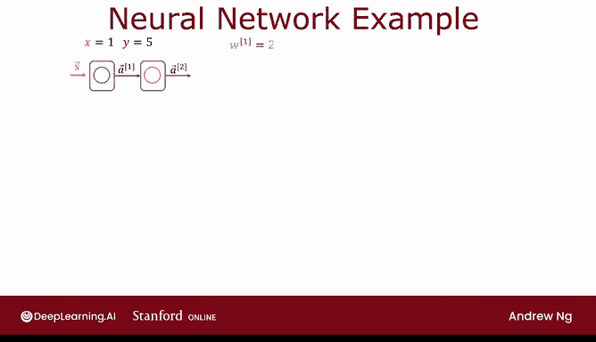

## 概述

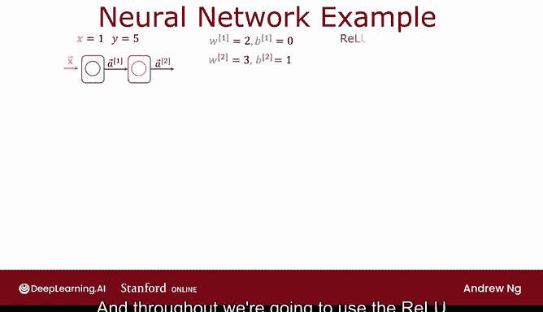

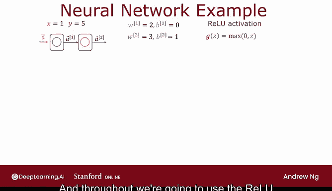

在之前的课程中，我们学习了计算图和反向传播的基本概念。本节我们将把这些概念应用到一个包含单个隐藏层的更大神经网络示例中。我们将使用一个训练样本，并采用ReLU激活函数和平方误差成本函数，来演示前向传播和反向传播的计算过程。

---

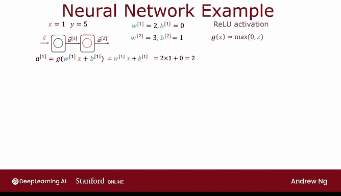

## 网络结构与参数

我们使用的网络结构如下：一个输入层、一个包含单个神经元的隐藏层，以及一个输出层。为了使计算更易于处理，我们使用一个训练样本：输入 `x = 1`，真实标签 `y = 5`。

网络参数设定为：
*   **W1 = 2**
*   **B1 = 0**
*   **W2 = 3**
*   **B2 = 1**

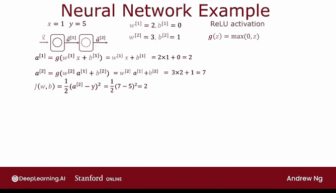

我们使用ReLU作为激活函数，其定义为：
**g(z) = max(0, z)**

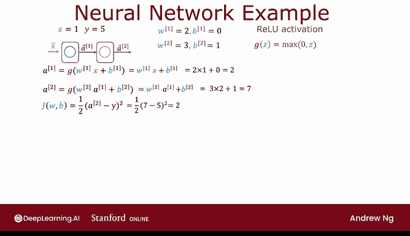

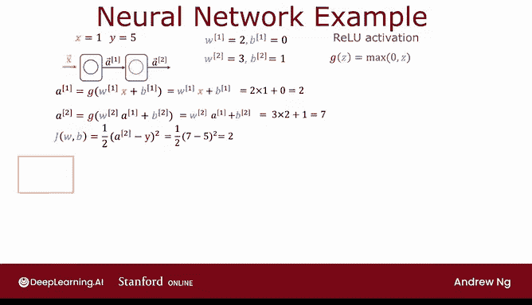

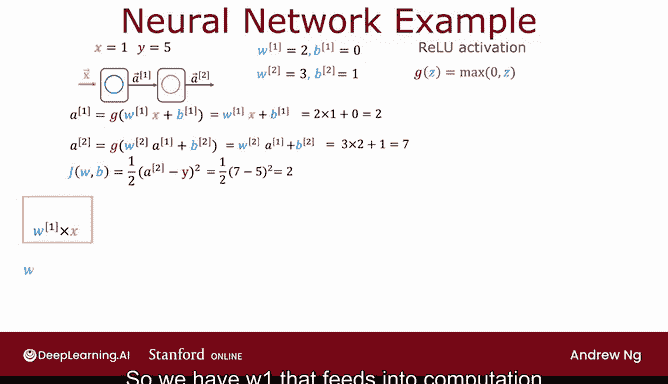

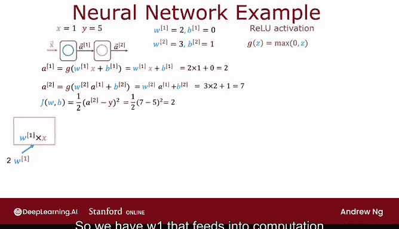

---

## 前向传播计算

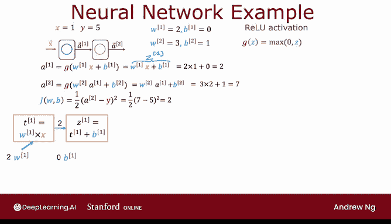

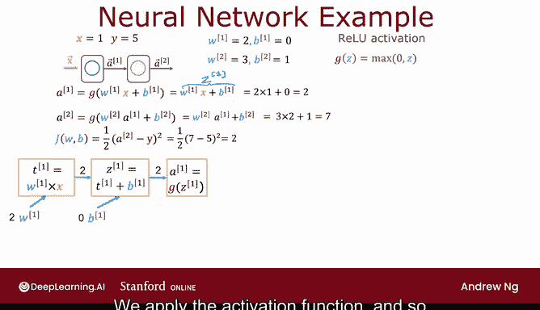

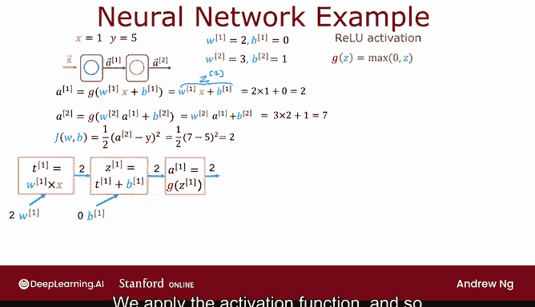

首先，我们进行前向传播，计算网络的预测值和成本。

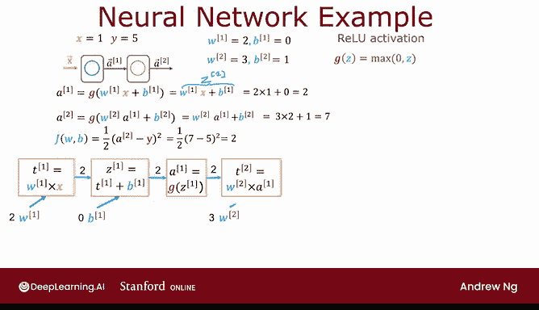

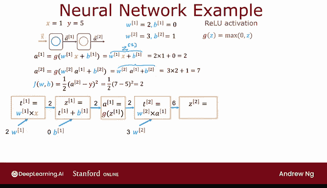

以下是计算步骤：

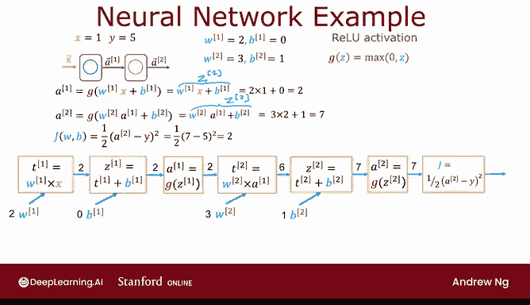

1.  **计算隐藏层激活值 a1**：
    *   `z1 = W1 * x + B1 = 2 * 1 + 0 = 2`
    *   由于 `z1 > 0`，ReLU激活函数的输出等于其输入。
    *   因此，**a1 = g(z1) = 2**

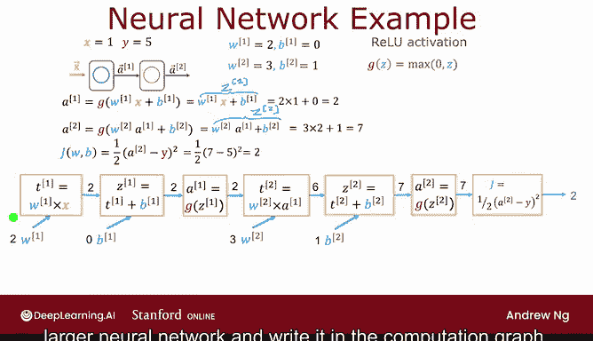

2.  **计算输出层激活值 a2**：
    *   `z2 = W2 * a1 + B2 = 3 * 2 + 1 = 7`
    *   同样，`z2 > 0`，所以 **a2 = g(z2) = 7**

3.  **计算成本 J**：
    *   我们使用平方误差成本函数：`J = 1/2 * (a2 - y)^2`
    *   代入数值：**J = 1/2 * (7 - 5)^2 = 1/2 * 4 = 2**

至此，我们完成了网络的前向传播，得到了成本 `J = 2`。

---

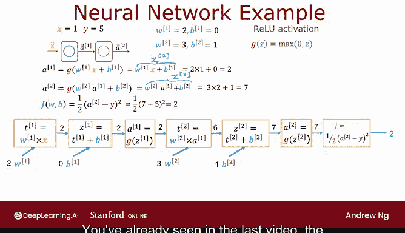

## 构建计算图

为了更清晰地展示计算过程，并为反向传播做准备，我们将上述步骤构建成一个计算图。

以下是计算图中的节点和计算顺序：

*   **T1 = W1 * x**：计算得到 `2`
*   **z1 = T1 + B1**：计算得到 `2`
*   **a1 = g(z1)**：应用ReLU，得到 `2`
*   **T2 = W2 * a1**：计算得到 `6`
*   **z2 = T2 + B2**：计算得到 `7`
*   **a2 = g(z2)**：应用ReLU，得到 `7`
*   **J = 1/2 * (a2 - y)^2**：计算得到 `2`

这个计算图清晰地展示了从输入 `x` 到最终成本 `J` 的数据流。

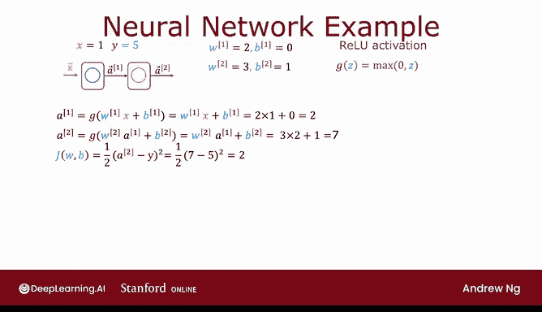

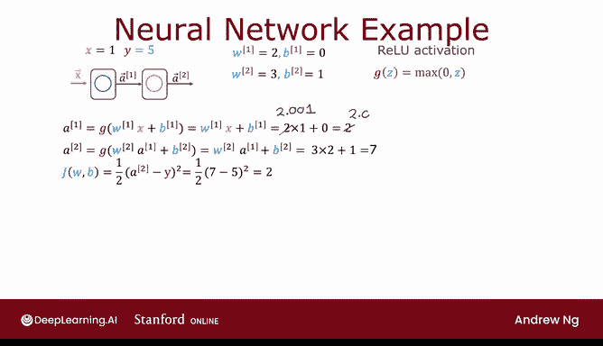

---

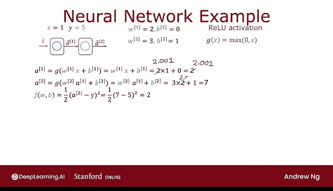

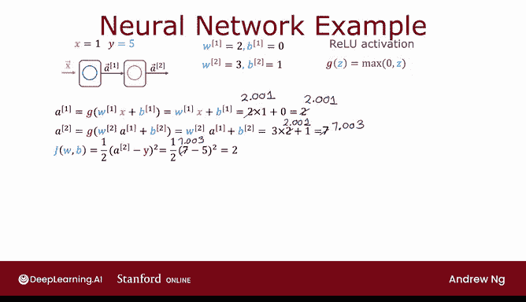

## 反向传播直觉

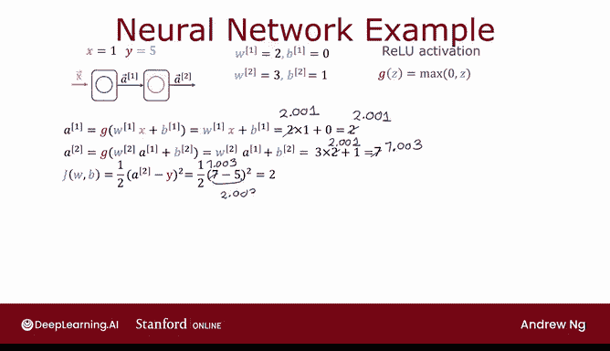

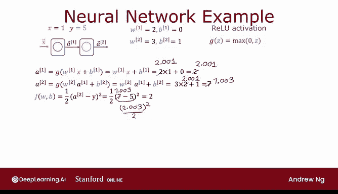

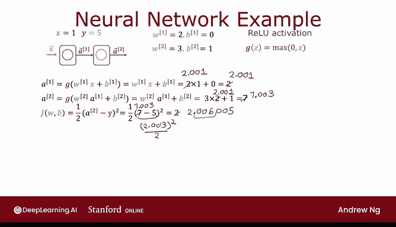

上一节我们构建了前向传播的计算图。本节中，我们来看看如何利用这个图进行反向传播，以高效计算所有参数（W1, B1, W2, B2）相对于成本 `J` 的梯度。

反向传播的核心是链式法则。我们从计算图的末端（成本 `J`）开始，逆向计算每个中间变量和参数的梯度。

以下是反向传播计算出的部分梯度值（具体推导过程遵循上一课的原理，此处省略详细步骤）：

*   **dJ/da2 = 2**
*   **dJ/dz2 = 2**
*   **dJ/dB2 = 2**
*   **dJ/dT2 = 2**
*   **dJ/dW1 = 6**

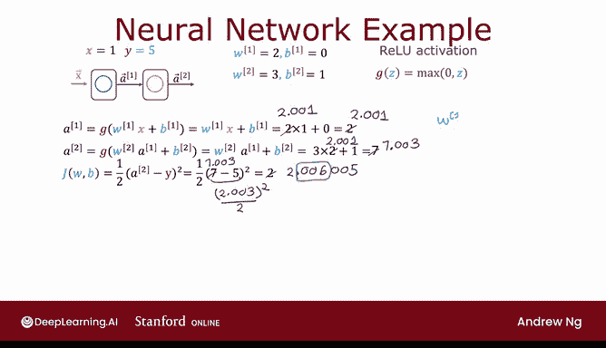

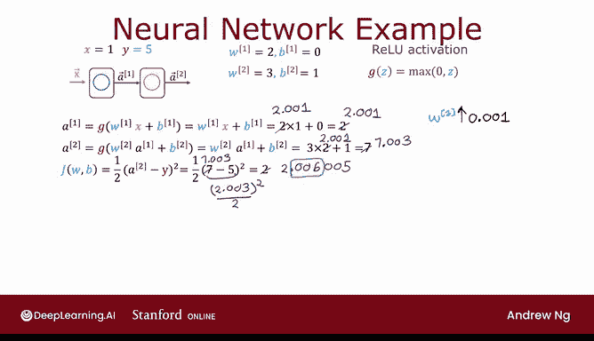

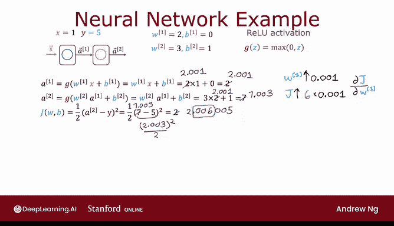

我们以 `dJ/dW1 = 6` 为例进行验证。根据梯度的定义，它意味着如果 `W1` 增加一个微小值 `ε`，成本 `J` 将增加大约 `6ε`。

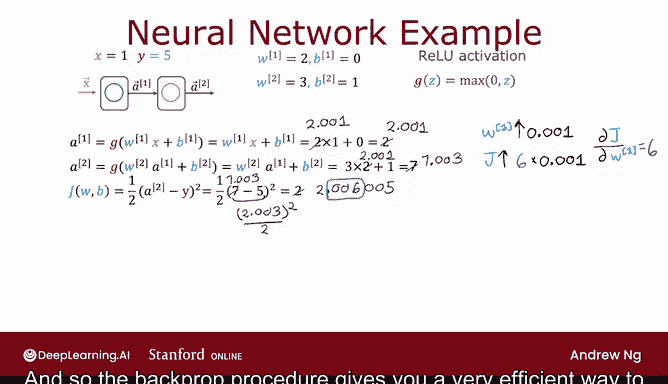

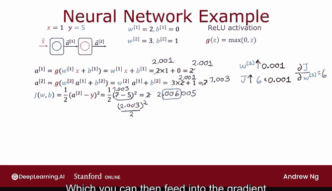

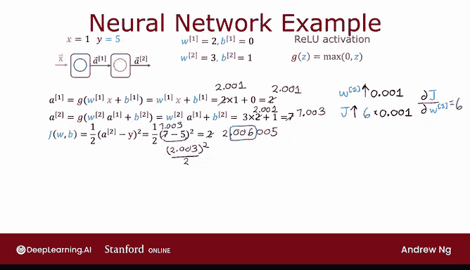

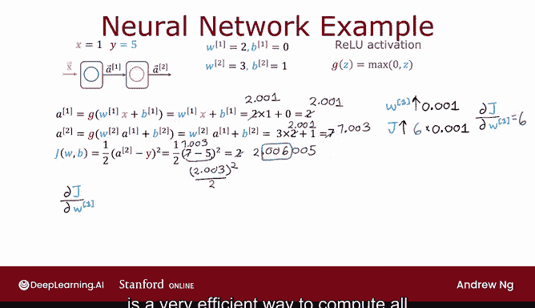

**验证**：
*   假设 `W1` 从 `2` 变为 `2.001`（增加 `ε=0.001`）。
*   重新进行前向传播：
    *   `a1` 变为 `2.001`
    *   `a2` 变为 `3 * 2.001 + 1 = 7.003`
    *   `J` 变为 `1/2 * (7.003 - 5)^2 ≈ 2.006005`
*   成本 `J` 从 `2` 增加到了约 `2.006`，增量约为 `0.006`，这正好是 `6 * 0.001`。因此，`dJ/dW1 = 6` 的结论是正确的。

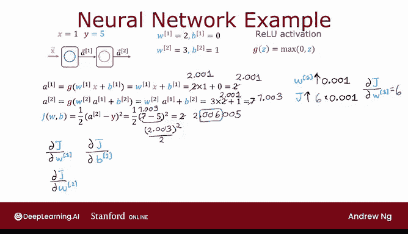

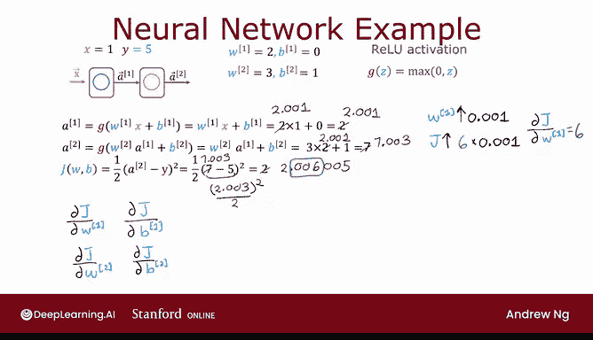

---

## 反向传播的效率优势

如果不使用反向传播，而采用“扰动法”逐个计算每个参数的梯度，效率会非常低下。

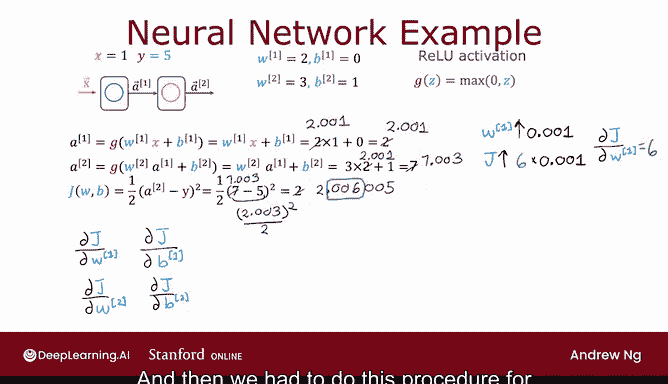

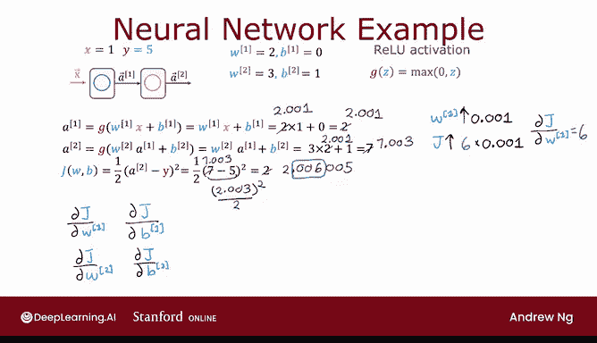

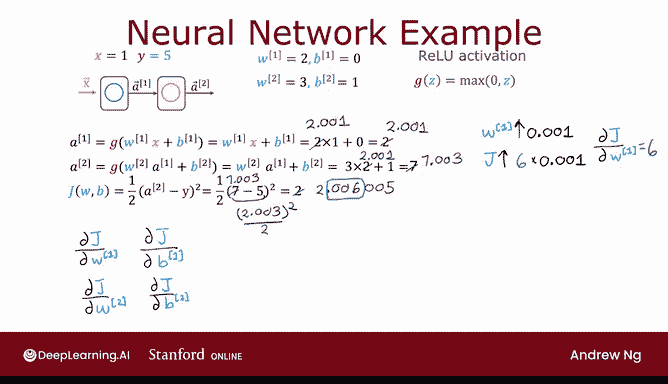

考虑一个有 `n` 个计算节点和 `p` 个参数的图：
*   **扰动法**：需要分别扰动 `p` 个参数，每次扰动需要进行一次完整的前向传播（`n` 步计算）。总计算复杂度为 **O(n * p)**。
*   **反向传播**：只需进行一次前向传播（`n` 步）和一次反向传播（约 `n` 步），即可得到所有 `p` 个参数的梯度。总计算复杂度为 **O(n)**。

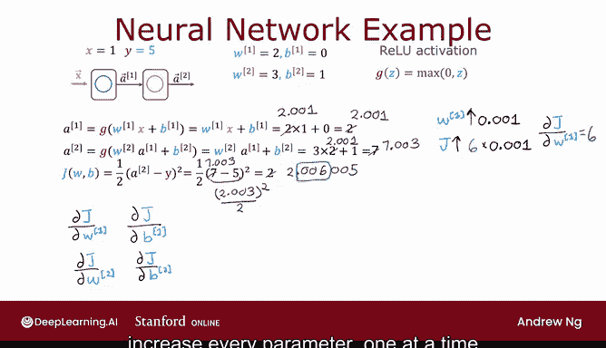

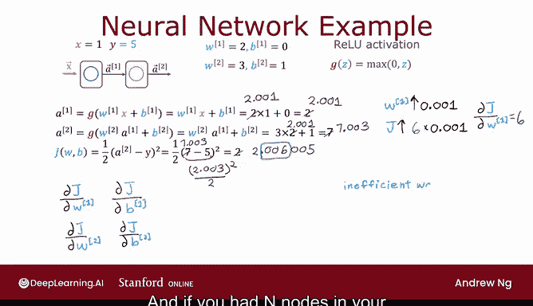

对于现代大型神经网络（参数 `p` 可能达到数百万甚至数十亿），反向传播带来的效率提升是巨大的，它使得训练深度神经网络成为可能。

---

## 自动微分与现代框架

在TensorFlow、PyTorch等现代深度学习框架出现之前，研究人员必须手动推导并实现反向传播的数学公式。这个过程繁琐且容易出错。

如今，得益于**自动微分**技术（通常基于计算图实现），我们只需定义网络的前向传播，框架就能自动计算所有梯度。这大大降低了应用机器学习的门槛，让开发者能更专注于模型结构的设计。

---

## 总结

本节课中，我们一起学习了如何将计算图和反向传播的直觉应用到一个更大的神经网络示例中。

我们回顾了以下关键点：
1.  如何为给定网络和样本执行**前向传播**并计算成本。
2.  如何将计算过程组织成**计算图**。
3.  **反向传播**如何利用链式法则，高效地计算成本函数对所有参数的梯度。
4.  通过数值验证了反向传播计算出的梯度是正确的。
5.  理解了反向传播相比传统“扰动法”的**巨大效率优势**，这是训练深度神经网络的基础。
6.  认识了**自动微分**在现代深度学习框架中的核心作用，它解放了研究者，使其无需手动计算复杂的导数。

掌握这些直觉，将帮助你更好地理解当你使用高级框架训练神经网络时，其底层究竟是如何高效工作的。