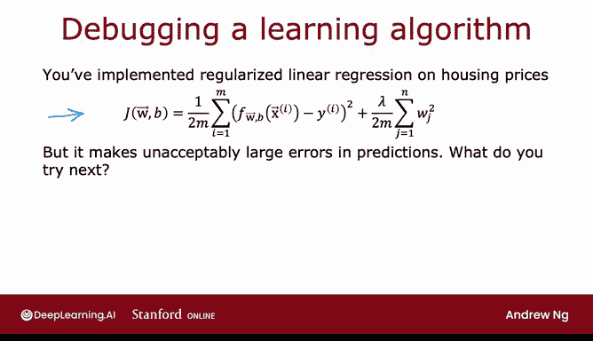
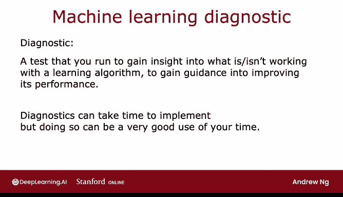

# 75：决定下一步尝试什么 🧭

在本节课中，我们将学习如何在一个机器学习项目中，系统性地决定下一步应该尝试什么来改进模型性能。我们将探讨多种可能的改进方向，并介绍如何通过诊断测试来高效地指导我们的决策，避免浪费数月时间在无效的尝试上。

---

现在，你已经学习了许多不同的机器学习算法，包括线性回归、逻辑回归，甚至深度学习和神经网络。下周你还会学到决策树。因此，你现在拥有了许多强大的机器学习工具。但如何有效地使用这些工具呢？我见过有些团队花费六个月来构建一个机器学习系统，而我认为一个更有经验的团队可能只需要几周。你能否快速构建一个高效的机器学习系统，很大程度上取决于你能否在项目过程中反复做出关于下一步该做什么的正确决策。

所以，在本周，我希望与你分享一些关于如何在机器学习项目中做出下一步决策的技巧，希望能为你节省大量时间。让我们来看看关于如何构建机器学习系统的一些建议。

让我们从一个例子开始。假设你已经实现了正则化线性回归来预测房价，因此你的学习算法有通常的成本函数：**J(θ) = (1/2m) Σ (hθ(x⁽ⁱ⁾) - y⁽ⁱ⁾)² + (λ/2m) Σ θⱼ²**。但如果你训练模型后发现，它的预测存在不可接受的大误差，那么当你构建机器学习算法时，下一步应该尝试什么呢？

通常，你可以尝试很多不同的事情。以下是几种常见的选项：

*   **获取更多训练数据**：因为似乎拥有更多数据应该会有所帮助，对吗？
*   **尝试更少的特征**：也许你认为特征太多了。
*   **获取额外的特征**：例如，寻找房屋的额外属性添加到数据中，也许这会有帮助。
*   **添加多项式特征**：你可以对现有特征x1、x2等，尝试添加如x1²、x2²、x1x2等多项式特征。
*   **调整正则化参数λ**：你可能想知道λ值是否选择得当，可以尝试减小或增大它。

在任何给定的机器学习应用中，往往这些尝试中有些是富有成效的，有些则不是。能否高效地构建机器学习算法的关键在于，你是否能找到一种方法来明智地选择将时间投入到哪里。例如，我见过团队花费数月时间收集更多训练数据，认为更多数据会有帮助，但结果有时帮助很大，有时却没有。

因此，在本周，你将学习如何进行一系列诊断。所谓诊断，我指的是一种可以运行的测试，它能让你深入了解学习算法哪些部分有效、哪些无效，从而为改进其性能提供指导。其中一些诊断会告诉你，是否值得花费数周甚至数月去收集更多训练数据。如果值得，你就可以投入精力去获取更多数据，这有望带来性能提升；如果不值得，那么运行该诊断可能为你节省数月时间。

本周你还会看到，实现诊断可能需要时间，但运行它们可能是对你时间非常好的利用。

---

所以，本周我们将花大量时间讨论不同的诊断方法，这些方法可以指导你如何改进学习算法的性能。但首先，让我们看看如何评估学习算法的性能。我们将在下一个视频中进行。