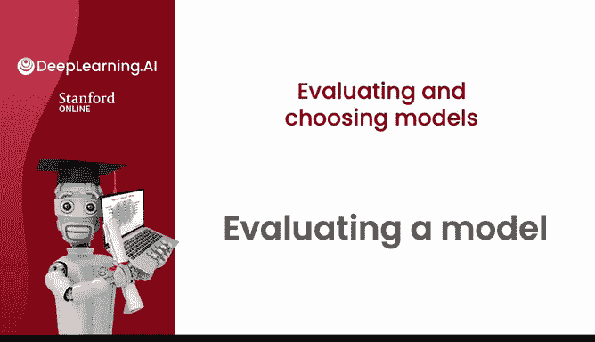
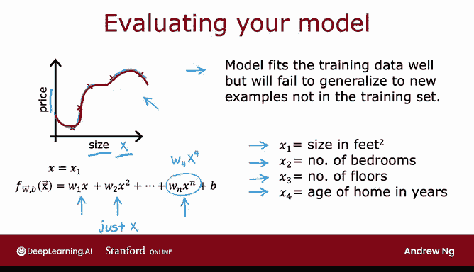
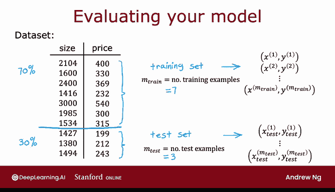
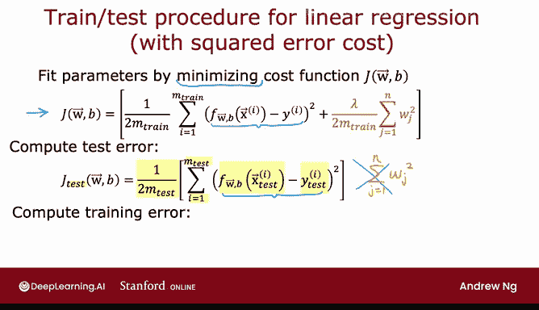
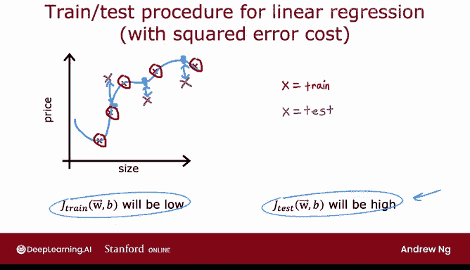
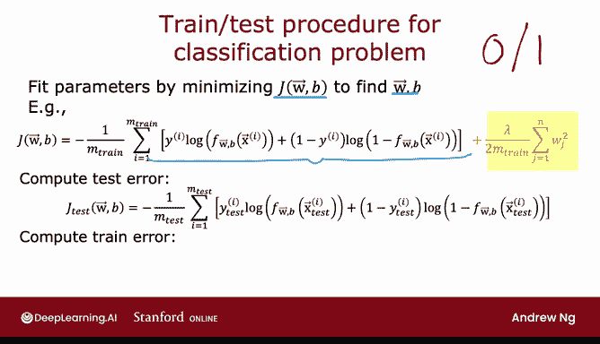
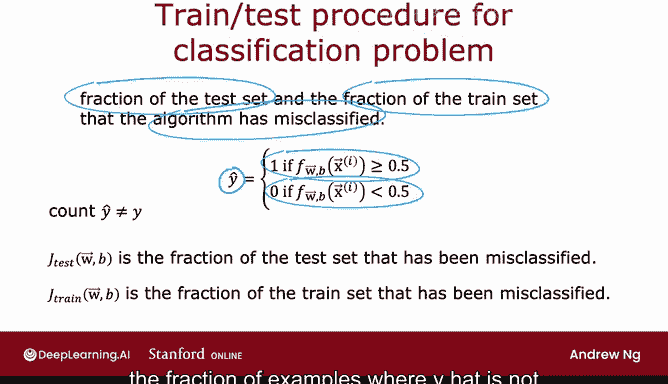

# 76：模型评估 🧪

在本节课中，我们将学习如何评估机器学习模型的性能。掌握系统性的评估方法，不仅能判断模型的好坏，还能为后续的性能优化指明方向。



## 概述 📋

假设你已经训练了一个机器学习模型，接下来需要评估它的表现。系统性的评估方法有助于更清晰地规划如何提升模型性能。我们以预测房价为例，探讨模型评估的具体步骤。

## 模型评估的重要性 🔍

假设你训练了一个模型，根据房屋面积 `x` 来预测房价。该模型是一个四阶多项式，包含特征 `x`、`x²`、`x³` 和 `x⁴`。

**公式**：`f(x) = w₀ + w₁x + w₂x² + w₃x³ + w₄x⁴`



由于我们使用五个数据点拟合了一个四阶多项式，模型在训练数据上表现得非常好。然而，我们并不满意这个模型，因为尽管它在训练数据上拟合得很好，但我们认为它无法泛化到训练集之外的新样本。

当仅使用房屋面积这一特征进行预测时，你可以绘制出模型曲线。从图中可以看出，曲线非常曲折，因此我们知道这不是一个好模型。

但是，如果你使用更多特征来拟合模型，例如 `x₁`（房屋面积）、`x₂`（卧室数量）、`x₃`（楼层数）和 `x₄`（房屋年龄），那么绘制 `f` 函数就变得困难得多，因为 `f` 现在是 `x₁` 到 `x₄` 的函数。如何绘制一个四维函数呢？

因此，为了判断模型是否表现良好，尤其是在特征超过一两个、难以绘制 `f(x)` 的应用场景中，我们需要一种更系统的方法来评估模型的表现。

## 数据集划分 📊

以下是一种你可以使用的技术。假设你有一个训练集，这里展示的是一个仅包含10个样本的小型训练集。

与其使用所有数据来训练模型的参数 `W` 和 `B`，不如将训练集分成两个子集。我在这里画一条线，将70%的数据放入第一部分，我称之为**训练集**；将剩余30%的数据放入第二部分，我称之为**测试集**。

我们将使用训练集（即前70%的数据）来训练模型参数，然后使用测试集来评估其性能。

在符号表示上，我将使用 `(x₁, y₁)` 到 `(xₘ, yₘ)` 来表示训练样本，与之前相同。但在这个小例子中，我们会有七个训练样本。为了明确区分，我引入一个新的符号：`m_train` 表示训练样本的数量，在这个小数据集中是7。下标 `train` 强调我们正在查看数据的训练集部分。

对于测试集，我使用符号 `(x₁_test, y₁_test)` 表示第一个测试样本，依此类推直到 `(x_m_test, y_m_test)`。`m_test` 是测试样本的数量，在这个例子中是3。



按照70/30或80/20的比例划分数据集是常见的做法，大部分数据进入训练集，较小部分进入测试集。

## 线性回归模型评估 📈

为了训练并评估一个模型，如果你使用的是带有平方误差成本的线性回归，过程如下。

首先，通过最小化成本函数 `J(W, B)` 来拟合参数。这是通常的平方误差成本函数加上正则化项。

**公式**：`J(W, B) = (1/(2m)) * Σ (f(xⁱ) - yⁱ)² + (λ/(2m)) * Σ wⱼ²`

然后，为了判断模型的表现，你需要计算测试误差 `J_test(W, B)`，它等于测试集上的平均误差。



**公式**：`J_test(W, B) = (1/(2 * m_test)) * Σ (f(x_testⁱ) - y_testⁱ)²`

请注意，测试误差公式 `J_test` 不包含正则化项。这将帮助你了解学习算法的表现如何。

另一个通常有用的量是训练误差，它衡量了学习算法在训练集上的表现。

**公式**：`J_train(W, B) = (1/(2 * m_train)) * Σ (f(x_trainⁱ) - y_trainⁱ)²`

同样，这个公式也不包含正则化项，与你用于拟合参数而最小化的成本函数不同。

在本视频前面看到的模型中，`J_train(W, B)` 会很低，因为训练样本的平均误差将为0或非常接近0，所以 `J_train` 将非常接近0。但是，如果你的测试集中有一些算法未训练过的额外样本，那么这些测试样本可能看起来像这样。算法预测的估计房价与这些房价的实际值之间存在很大差距，因此 `J_test` 会很高。看到 `J_test` 在这个模型上很高，让你意识到即使它在训练集上表现很好，实际上在泛化到训练集之外的新样本、新数据点时并不好。

## 逻辑回归模型评估 🧮



以上是使用平方误差成本的回归问题。现在让我们看看如何将此过程应用于分类问题，例如，如果你要对是0还是1的手写数字进行分类。

与之前一样，你通过最小化成本函数来拟合参数，以找到参数 `W` 和 `B`。例如，如果你在训练逻辑回归，那么这就是成本函数 `J(W, B)`。

**公式**：`J(W, B) = - (1/m) * Σ [yⁱ * log(f(xⁱ)) + (1 - yⁱ) * log(1 - f(xⁱ))] + (λ/(2m)) * Σ wⱼ²`



然后计算测试误差 `J_test`，它是在测试集（即那30%不在训练集中的数据）上逻辑损失的平均值。

**公式**：`J_test = (1/m_test) * Σ L(f(x_testⁱ), y_testⁱ)`，其中 `L` 是逻辑损失函数。

训练误差也可以使用类似的公式计算，即算法用于最小化成本函数 `J(W, B)` 的训练数据上的平均逻辑损失。

## 分类错误率评估 ⚖️

我在这里描述的方法，通过观察测试误差的表现来判断学习算法是否做得好，是可行的。然而，在将机器学习应用于分类问题时，实际上还有另一种定义 `J_test` 和 `J_train` 的方式，可能更常用。那就是不使用逻辑损失来计算测试误差和训练误差，而是测量算法在测试集和训练集上错误分类的比例。

具体来说，在测试集上，你可以让算法对每个测试样本做出1或0的预测。回想一下，如果 `f(x) ≥ 0.5`，我们预测 `ŷ` 为1；如果 `f(x) < 0.5`，则预测为0。然后，你可以在测试集中统计 `ŷ` 不等于实际真实标签 `y` 的样本比例。



**代码示例（概念性）**：
```python
# 假设 predictions 是模型对测试集的预测结果（0或1），y_test 是真实标签
misclassified = sum(predictions != y_test)
J_test_error_rate = misclassified / len(y_test)
```

具体来说，如果你在对0和1的手写数字进行分类，那么 `J_test` 就是测试集中0被分类为1或1被分类为0的比例。类似地，`J_train` 是训练集中被错误分类的比例。

## 总结 🎯

本节课中，我们一起学习了如何系统性地评估机器学习模型的性能。

*   **核心方法**：将数据集划分为训练集和测试集，例如70/30或80/20的比例。
*   **评估指标**：
    *   对于**回归问题**，通常使用**均方误差（MSE）** 作为训练误差 `J_train` 和测试误差 `J_test` 的衡量标准。
    *   对于**分类问题**，除了使用**逻辑损失**，更常用且直观的指标是**错误分类率**，即模型预测错误的样本比例。
*   **关键洞察**：比较 `J_train` 和 `J_test` 至关重要。一个很低的 `J_train` 配合一个很高的 `J_test`，通常表明模型出现了**过拟合**，即在训练集上表现完美，但无法泛化到新数据。

通过计算 `J_test` 和 `J_train`，你现在可以衡量模型在测试集和训练集上的表现。这个过程是自动为给定机器学习应用选择模型的第一步。例如，在预测房价时，你应该用直线、二阶多项式、三阶还是四阶多项式来拟合数据？事实证明，通过对本视频中看到的概念进行一点改进，你将能够拥有一个算法来帮助你自动做出这类决策。让我们在下一个视频中看看如何做到这一点。