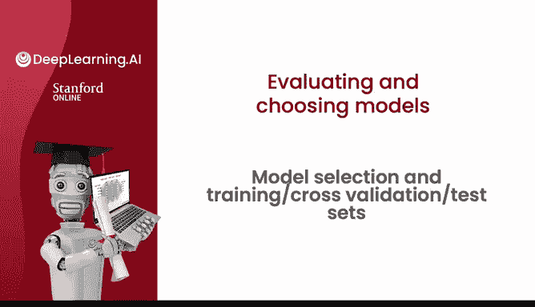
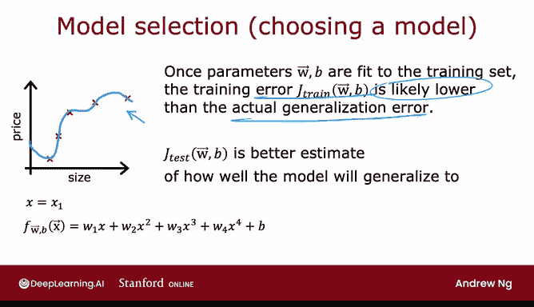
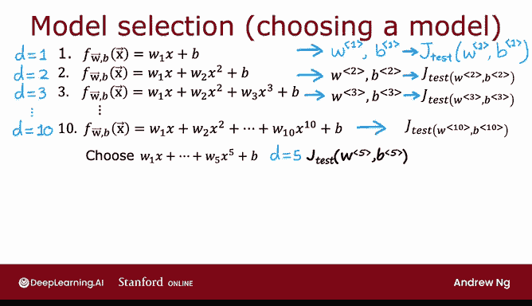
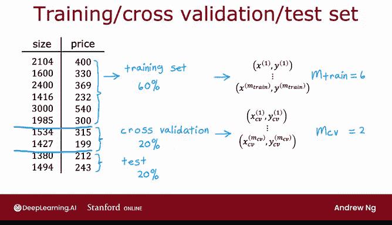
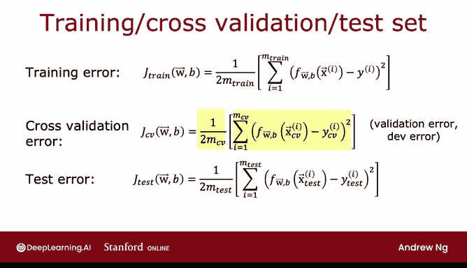
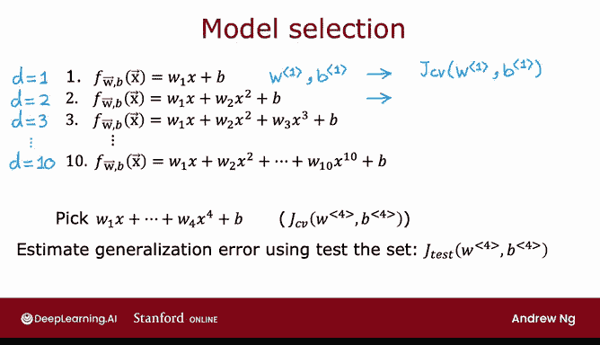
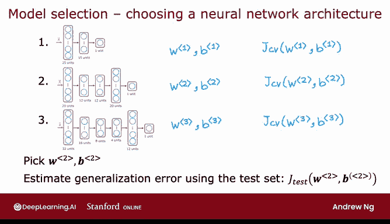

# 77：模型选择与训练 🎯

## 概述

在本节课中，我们将学习如何使用交叉验证集和测试集来选择机器学习模型。我们将探讨为什么仅使用训练集和测试集进行模型选择可能存在问题，并介绍一种更可靠的三步数据划分方法。

---

## 模型选择的问题

上一节我们介绍了如何使用测试集评估模型性能。本节中，我们来看看如何改进这一方法，以便自动为机器学习算法选择合适的模型。

我们已经看到，当模型参数 **W** 和 **B** 在训练集上拟合后，训练误差可能无法很好地反映算法在未见数据上的表现。具体来说，训练误差可能接近于零，这通常远低于实际的泛化误差，即模型在训练集之外的新样本上的平均误差。

上一节提到，测试集上的性能指标 **J_test** 能更好地预测模型在新数据上的表现。现在，我们来看看这如何影响我们使用测试集为特定机器学习应用选择模型的过程。

---

## 初始模型选择方法

假设我们正在拟合一个预测房价的回归模型。

以下是可能考虑的模型：

*   **一阶多项式（线性模型）**：我们使用 **d = 1** 表示拟合一个一阶多项式。在训练集上拟合后，得到参数 **W1, B1**，然后计算 **J_test(W1, B1)** 来估计其泛化能力。
*   **二阶多项式（二次模型）**：这是模型 **y = w1*x + w2*x² + b**。拟合后得到参数 **W2, B2**，并计算 **J_test(W2, B2)**。
*   **更高阶多项式**：可以继续尝试 **d = 3** 直到 **d = 10** 的多项式，分别得到参数和对应的 **J_test** 值。

一个可能（但并非最佳）的流程是：查看所有这些 **J_test** 值，选择数值最低的那个。例如，如果 **J_test(W5, B5)** 最低，那么你可能会选择五阶多项式（**d = 5**）作为最终模型。如果你想估计这个模型的性能，一个可能（但有缺陷）的做法是直接报告 **J_test(W5, B5)**。

---

## 初始方法的缺陷

这个流程存在缺陷。**J_test(W5, B5)** 很可能是一个对泛化误差的乐观估计，即它可能低于实际的泛化误差。

原因在于，我们在上述流程中实际上拟合了一个额外的参数——多项式的阶数 **d**，并且我们使用了测试集来选择这个参数。正如之前所见，如果用训练数据拟合 **W, B**，那么训练误差会是泛化误差的过度乐观估计。同样，如果使用测试集来选择参数 **d**，那么测试集误差 **J_test** 现在也变成了对泛化误差的过度乐观（即偏低）估计。

因此，我们不推荐使用上述有缺陷的流程。相反，如果你想自动选择模型（例如决定使用几阶多项式），以下是修改后的训练和测试流程。

---

## 改进方法：引入交叉验证集

为了进行模型选择（即在可能用于机器学习应用的不同模型中进行选择），我们将修改流程，将数据划分为三个子集，而不是两个。

我们将数据分为：
1.  **训练集**
2.  **交叉验证集**
3.  **测试集**

例如，对于10个训练样本，我们可以这样划分：
*   **训练集**：占数据的60%。记作 **{(x_train^(i), y_train^(i))}**, **i = 1...m_train**，其中 **m_train = 6**。
*   **交叉验证集**：占数据的20%。记作 **{(x_cv^(i), y_cv^(i))}**, **i = 1...m_cv**，其中 **m_cv = 2**。
*   **测试集**：占数据的20%。记作 **{(x_test^(i), y_test^(i))}**, **i = 1...m_test**，其中 **m_test = 2**。

交叉验证集这个名称指的是我们将用这部分额外数据来检查或验证不同模型的有效性或准确性。它有时也被简称为**验证集**、**开发集**或**dev集**。

---

## 使用三个子集进行模型选择

有了训练集、交叉验证集和测试集这三个数据子集，我们可以使用以下三个公式计算误差：

*   **训练误差**：**J_train(W, B) = (1/(2*m_train)) * Σ (y_train^(i) - f(x_train^(i)))^2**
*   **交叉验证误差**：**J_cv(W, B) = (1/(2*m_cv)) * Σ (y_cv^(i) - f(x_cv^(i)))^2**
*   **测试误差**：**J_test(W, B) = (1/(2*m_test)) * Σ (y_test^(i) - f(x_test^(i)))^2**

注意，这些公式通常不包括训练目标函数中的正则化项。交叉验证误差也常被称为**验证误差**或**开发集误差**。

以下是进行模型选择的步骤：

对于之前提到的10个模型（**d = 1** 到 **d = 10**）：
1.  使用**训练集**拟合每个模型的参数 **W^d, B^d**。
2.  使用**交叉验证集**计算每个模型的交叉验证误差 **J_cv(W^d, B^d)**。
3.  查看哪个模型的交叉验证误差最低。例如，如果 **J_cv(W^4, B^4)** 最低，那么你将选择四阶多项式作为最终模型。
4.  最后，如果你想报告这个模型在新数据上泛化误差的估计，你应使用**测试集**，报告 **J_test(W^4, B^4)**。

请注意，在整个过程中，你使用训练集拟合参数 **W, B**，使用交叉验证集选择参数 **d**（多项式阶数）。直到这一步，你都没有使用测试集来拟合任何参数（无论是 **W, B** 还是 **d**）。这就是为什么在这个例子中，**J_test** 将是模型 **W^4, B^4** 泛化误差的一个公平估计。

---

## 方法的应用与最佳实践

这个模型选择流程也适用于其他类型的模型选择，例如选择神经网络架构。

如果你正在为手写数字识别拟合模型，可能会考虑几种不同的神经网络结构（例如小型、中型、大型网络）。你可以：
1.  训练所有这些模型，得到各自的参数。
2.  使用**交叉验证集**评估每个模型的性能（对于分类问题，**J_cv** 通常是误分类样本的比例）。
3.  选择交叉验证误差最低的模型。
4.  使用**测试集**来估计最终所选模型的泛化误差。

机器学习中的最佳实践是：如果你需要对模型做出决策（例如拟合参数、选择模型架构如神经网络层数或多项式阶数），请仅使用**训练集**和**交叉验证集**来做出所有这些决策。在仍在调整学习算法时，完全不要查看测试集。只有在确定了最终模型之后，才在测试集上进行评估。因为你没有使用测试集做出任何决策，这确保了你的测试集是对模型在新数据上泛化能力的公平且不过度乐观的估计。

---

## 总结

本节课中，我们一起学习了：
1.  仅使用训练集和测试集进行模型选择的缺陷，即会导致对泛化误差的乐观估计。
2.  如何通过将数据划分为**训练集**、**交叉验证集**和**测试集**三个部分来改进流程。
3.  使用交叉验证集进行模型选择（如选择多项式阶数或神经网络架构）的具体步骤。
4.  机器学习的最佳实践：在模型开发阶段仅使用训练集和交叉验证集，仅在最终评估时使用测试集，以确保评估的公正性。

掌握了评估学习算法和自动选择模型的方法后，我们将在接下来的视频中深入探讨一些强大的诊断工具，例如偏差与方差分析。