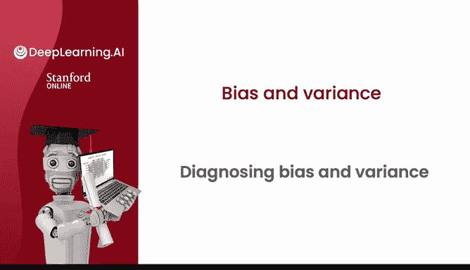
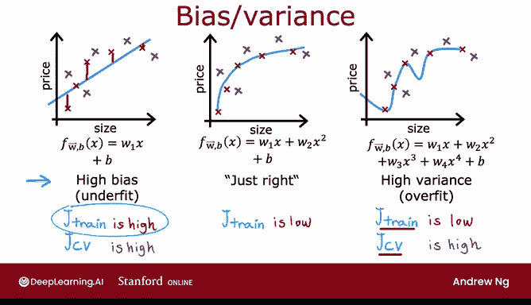
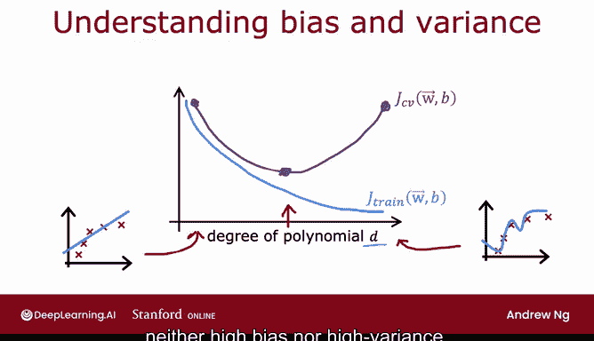
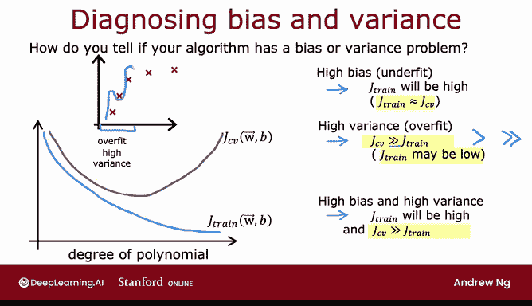

# 78：诊断偏差与方差 📊

在本节课中，我们将学习如何诊断机器学习模型中的偏差与方差问题。理解这两个核心概念是改进模型性能的关键。

## 概述

开发机器学习系统的典型流程是：提出想法、训练模型，但模型首次表现往往不尽如人意。构建系统的关键在于决定下一步如何改进性能。通过分析学习算法的偏差与方差，可以获得有效的改进指导。

## 偏差与方差的直观理解

上一节我们介绍了诊断偏差与方差的重要性，本节中我们来看看它们的直观含义。

你可能在线性回归课程中见过这个例子。给定这些数据：

*   如果拟合一条直线，效果不佳。我们说该模型**偏差高**或**欠拟合**数据集。
*   如果拟合一个四次多项式，则**方差高**或**过拟合**。
*   如果拟合一个二次多项式，效果看起来很好，恰到好处。

由于这是一个仅包含单个特征 `X` 的问题，我们可以绘制函数 `F` 的图像来观察。但如果特征更多，则无法轻易绘制并可视化其表现。

## 系统化的诊断方法

与其依赖可视化，更系统化的诊断方法是观察算法在训练集和交叉验证集上的性能。

以下是基于不同拟合情况的性能分析：

*   **左侧示例（欠拟合/高偏差）**：
    *   计算 `J_train`（训练集误差）：算法在训练集上表现不佳，因此 `J_train` 值高。
    *   计算 `J_CV`（交叉验证误差）：对于未见过的示例，模型表现也不好，因此 `J_CV` 值也高。
    *   **高偏差算法的特征**：即使在训练集上表现也不好。`J_train` 高是表明算法存在高偏差的强指标。

*   **右侧示例（过拟合/高方差）**：
    *   计算 `J_train`：模型在训练集上表现极佳，因此 `J_train` 值低。
    *   计算 `J_CV`：在训练集之外的房屋数据上评估时，交叉验证误差 `J_CV` 会相当高。
    *   **高方差算法的特征**：`J_CV` 远大于 `J_train`。换句话说，它在已见数据上的表现远好于未见数据。这是算法存在高方差的强指标。

通过计算 `J_train` 和 `J_CV`，并观察 `J_train` 是否高，或 `J_CV` 是否远大于 `J_train`，即使无法绘制函数 `F`，也能判断算法是否存在高偏差或高方差。

*   **中间示例（拟合良好）**：
    *   `J_train` 较低，因为模型在训练集上表现很好。
    *   对于交叉验证集中的新示例，`J_CV` 也较低。
    *   `J_train` 不高表明没有高偏差问题，`J_CV` 不比 `J_train` 差很多表明也没有高方差问题。

因此，二次模型对这个应用来说似乎是一个相当好的模型。

**总结**：
*   当 `d=1`（线性多项式）时，`J_train` 高，`J_CV` 高。
*   当 `d=4` 时，`J_train` 低，但 `J_CV` 高。
*   当 `d=2` 时，两者都相当低。

## 偏差与方差的另一种视角

现在我们从另一个角度看待偏差与方差，特别是 `J_train` 和 `J_CV` 如何随拟合多项式次数的变化而变化。

绘制一张图，横轴表示我们拟合数据的**多项式次数 `d`**。左侧对应较小的 `d` 值（如 `d=1`，拟合直线），右侧对应较大的 `d` 值（如 `d=4` 或更高，拟合高阶多项式）。

*   **`J_train` 随 `d` 的变化**：随着拟合多项式的次数增加，训练误差 `J_train` 倾向于下降。因为当使用非常简单的线性函数时，它不能很好地拟合训练数据；而使用二次、三次或四次多项式时，它能越来越好地拟合训练数据。所以，随着多项式次数增加，`J_train` 通常会下降。
*   **`J_CV` 随 `d` 的变化**：`J_CV` 衡量模型在未用于拟合的数据上的表现。当 `d=1`（多项式次数很低）时，`J_CV` 相当高，因为它欠拟合，在交叉验证集上表现不佳。在右侧，当多项式次数非常大（如 `d=4`）时，它在交叉验证集上表现也不好，因此 `J_CV` 也高。但如果 `d` 适中（如二次多项式），则表现好得多。因此，随着多项式次数变化，`J_CV` 曲线会先下降后上升。
    *   如果多项式次数太低，会欠拟合，在交叉验证集上表现不佳。
    *   如果次数太高，会过拟合，在交叉验证集上表现也不佳。
    *   只有当次数适中时，才恰到好处。这就是为什么在我们的例子中，二次多项式最终具有较低的交叉验证误差，既没有高偏差也没有高方差问题。

## 如何诊断偏差与方差

以下是诊断学习算法偏差与方差的方法总结：

*   **诊断高偏差（欠拟合）**：关键指标是 **`J_train` 高**。这对应于曲线的最左侧部分，那里 `J_train` 高，通常 `J_train` 和 `J_CV` 彼此接近。
*   **诊断高方差（过拟合）**：关键指标是 **`J_CV` >> `J_train`**（`>>` 在数学中表示“远大于”）。这对应于曲线的最右侧部分，那里 `J_CV` 远大于 `J_train`，通常 `J_train` 会相当低。

## 同时存在高偏差与高方差的情况

尽管我们刚刚分别讨论了偏差与方差，但在某些情况下，可能同时存在高偏差和高方差。

*   对于线性回归，这种情况不常发生。但对于神经网络，有些应用可能不幸地同时存在高偏差和高方差。
*   识别这种情况的方法是：**`J_train` 高**（在训练集上表现不佳），但更糟糕的是，交叉验证误差 `J_CV` 比训练集误差 `J_train` 还要大得多。
*   高偏差和高方差的概念对于应用于一维数据的线性模型并不常见。但为了直观理解，可以想象为：对于部分输入，模型非常复杂以至于过拟合；而对于其他部分输入，模型甚至不能很好地拟合训练数据，即欠拟合。在这个看起来有些人为的单特征输入例子中，我们在部分输入上过拟合（拟合训练集很好），在另一部分输入上欠拟合（甚至不能很好拟合训练数据）。这就是在某些应用中可能同时出现高偏差和高方差的方式。

这种情况的指标是：算法在训练集上表现差，并且在交叉验证集上的表现比在训练集上差得多。对于大多数学习应用，你可能主要面临高偏差或高方差问题，而不是两者同时存在，但有时两者确实可能同时发生。

## 总结

本节课中我们一起学习了诊断机器学习模型偏差与方差的核心方法。

*   **高偏差**意味着模型甚至在训练集上表现也不好。
*   **高方差**意味着模型在交叉验证集上的表现远差于在训练集上的表现。

当我训练机器学习算法时，几乎总是试图弄清楚算法在多大程度上存在高偏差（欠拟合）问题，还是高方差（过拟合）问题。这将为我们本周后续课程中如何改进算法性能提供良好的指导。

接下来，让我们看看正则化如何影响学习算法的偏差和方差，因为这有助于你更好地理解何时应该使用正则化。我们将在下一个视频中探讨。