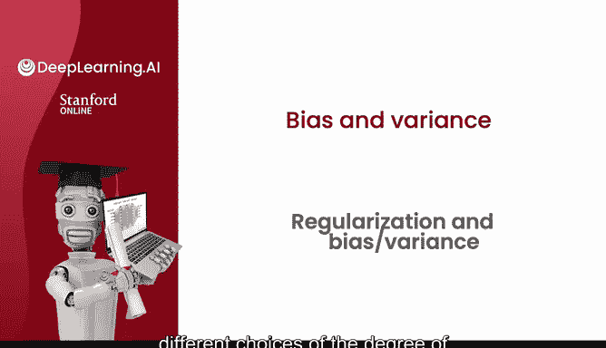
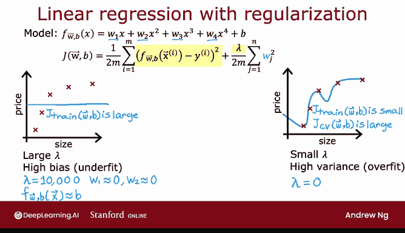
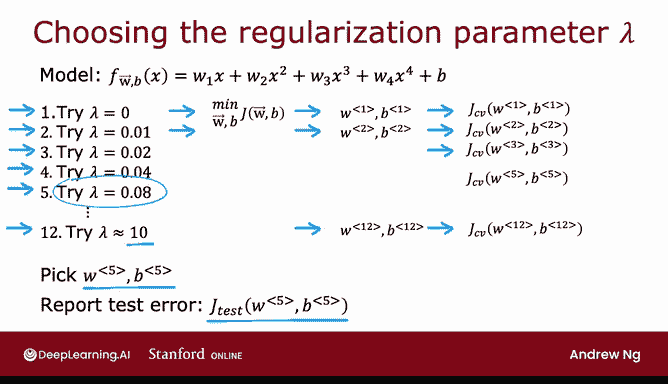
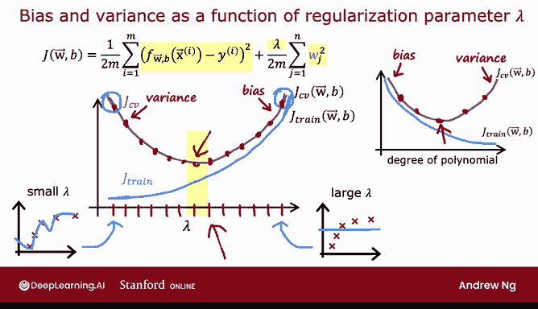

# 79：正则化与偏差-方差分析 📊

在本节课中，我们将学习正则化参数 λ 如何影响学习算法的偏差、方差以及整体性能。通过理解 λ 的不同取值对模型拟合的影响，你将能够为算法选择合适的正则化参数。

## 概述

上一节我们介绍了多项式次数 D 对偏差和方差的影响。本节中，我们来看看正则化参数 λ 如何以类似的方式影响模型的性能。具体来说，我们将探讨 λ 的极端取值和中间取值如何导致欠拟合、过拟合或“恰到好处”的拟合，并学习如何使用交叉验证来选择最佳的 λ 值。

## λ 对模型拟合的影响

我们使用一个四次多项式模型作为示例，该模型使用正则化进行拟合，其中 λ 是控制参数 W 大小与训练数据拟合程度之间权衡的正则化参数。

**模型公式**：
`J(w, b) = (1/(2m)) * Σ(y_hat - y)^2 + (λ/(2m)) * Σ w_j^2`

### λ 值极大的情况

假设我们将 λ 设置为一个非常大的值，例如 λ = 10000。

以下是这种情况下的结果：
*   算法会极力保持参数 W 非常小。
*   最终，W1, W2 等所有参数都会接近于零。
*   模型近似为 `f(x) ≈ b`，即一个常数值函数。

因此，你会得到一个类似这样的模型，它显然具有**高偏差**，并且**欠拟合**训练数据，因为即使在训练集上表现也很差，`J_train` 很大。

### λ 值极小的情况

假设我们将 λ 设置为一个非常小的值，极端情况下 λ = 0。

以下是这种情况下的结果：
*   此时没有正则化。
*   我们只是在不使用正则化的情况下拟合完整的四次多项式。
*   最终会得到之前见过的、**过拟合**数据的曲线。

正如之前所见，这种模型的 `J_train` 很小，但 `J_CV` 远大于 `J_train`（或者说 `J_CV` 很大），这表明模型具有**高方差**，并且过拟合了数据。

### λ 值适中的情况

如果 λ 取一个中间值，既不是极大的 10000，也不是极小的 0，那么你希望得到一个像这样“恰到好处”的模型，它能很好地拟合数据，同时具有较小的 `J_train` 和 `J_CV`。

## 使用交叉验证选择 λ

如果你正在尝试为正则化参数 λ 决定一个合适的值，交叉验证也提供了一种方法。

我们正在解决的问题是：如果你正在拟合一个四次多项式模型并使用正则化，如何选择一个好的 λ 值？这个过程类似于之前使用交叉验证选择多项式次数 D 的过程。

具体步骤如下：
1.  尝试 λ = 0，最小化成本函数，得到参数 `(w1, b1)`，然后计算交叉验证误差 `J_CV(w1, b1)`。
2.  尝试 λ = 0.01，再次最小化成本函数，得到第二组参数 `(w2, b2)`，并评估其在交叉验证集上的表现。
3.  继续尝试其他 λ 值，例如将其翻倍至 λ = 0.02，得到 `J_CV(w3, b3)`。
4.  持续翻倍尝试，经过多次后，λ 可能达到约 10，得到参数 `(w12, b12)` 和 `J_CV(w12, b12)`。

通过尝试 λ 的大范围可能值，使用这些不同的正则化参数拟合模型，然后在交叉验证集上评估性能，你就可以尝试挑选出正则化参数的最佳值。

具体来说，如果在本例中，你发现 `J_CV(w5, b5)` 在所有交叉验证误差中值最低，那么你可能会决定选择这个 λ 值，并使用 `(w5, b5)` 作为最终选定的参数。最后，如果你想报告泛化误差的估计值，可以报告测试集误差 `J_test(w5, b5)`。

## 训练误差与交叉验证误差随 λ 的变化

为了进一步理解这个算法在做什么，我们来看看训练误差和交叉验证误差如何随参数 λ 的变化而变化。

在这个图中，X 轴标注的是正则化参数 λ 的值。

*   **左侧极端 (λ = 0)**：对应不使用任何正则化，我们最终会得到那条非常弯曲的曲线（当 λ 很小或为零时）。在这种情况下，我们有一个**高方差**模型，因此 `J_train` 会很小，而 `J_CV` 会很大，因为模型在训练数据上表现很好，但在交叉验证数据上表现差得多。
*   **右侧极端 (λ 非常大，如 10000)**：最终拟合出一个类似这样的模型，因此具有**高偏差**，它欠拟合数据。实际上，`J_train` 会很高，`J_CV` 也会很高。

观察 `J_train` 随 λ 的变化：
`J_train` 会像这样上升，因为在优化成本函数时，λ 越大，算法就越倾向于保持 W 的平方较小（即给正则项赋予更多权重），从而越少关注在训练集上实际表现良好。因此，随着 λ 增加，训练误差 `J_train` 往往会像这样增加。

观察交叉验证误差 `J_CV` 随 λ 的变化：
`J_CV` 会呈现这样的形状。因为我们已经看到，如果 λ 太小或太大，它在交叉验证集上表现都不会好——在左侧会过拟合，在右侧会欠拟合。会存在某个中间的 λ 值，使得算法表现最佳。

交叉验证所做的就是尝试许多不同的 λ 值（正如上一张幻灯片所示，尝试 λ=0, 0.01, 0.02 等），并在许多不同的点上评估交叉验证误差，然后希望选择一个具有低交叉验证误差的值，这有望对应你应用程序的一个好模型。

如果将这个图与上一节中横轴为多项式次数 D 的图进行比较，这两个图看起来有点像彼此的镜像。这是因为在拟合多项式次数时，曲线的左侧部分对应欠拟合和高偏差，右侧部分对应过拟合和高方差；而在这个图中，高方差在左侧，高偏差在右侧。这就是为什么这两个图像有点像彼此的镜像。但在两种情况下，交叉验证通过评估不同的值，都可以帮助你选择一个好的 D 值或一个好的 λ 值。

## 总结

本节课中，我们一起学习了正则化参数 λ 的选择如何影响算法的偏差、方差和整体性能。你也看到了如何使用交叉验证来为正则化参数 λ 做出一个好的选择。

到目前为止，我们讨论了高训练集误差（高 `J_train`）如何指示高偏差问题，以及高交叉验证误差 `J_CV`（特别是当它远高于 `J_train` 时）如何指示方差问题。但是，“高”或“远高于”这些词的实际含义是什么？在下一节视频中，我们将看看如何通过观察 `J_train` 和 `J_CV` 的数值来判断它们是否过高或过低。事实证明，建立性能基线这一概念的进一步细化，将使你更容易查看 `J_train` 和 `J_CV` 这些数字并判断它们的高低。让我们在下一节视频中看看这一切意味着什么。