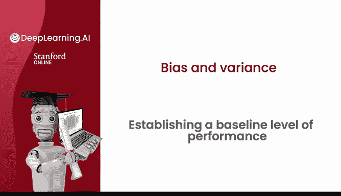
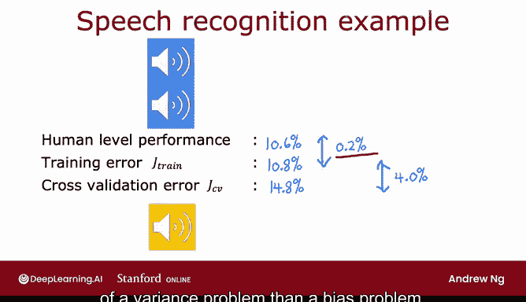
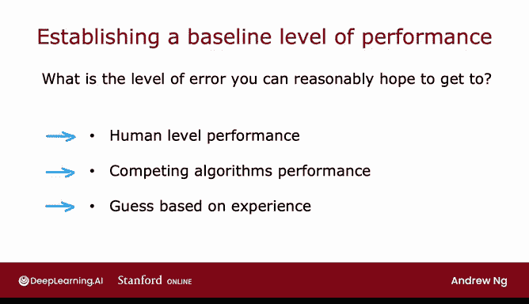
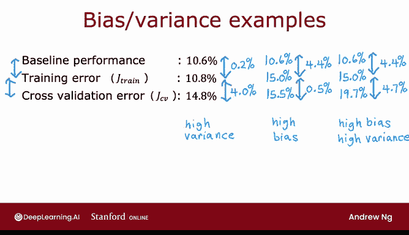

# 80：建立性能基线水平 📊

在本节课中，我们将学习如何通过具体的训练误差和交叉验证误差数值，来判断一个学习算法是否存在高偏差或高方差问题。我们将以语音识别应用为例，并引入“性能基线水平”这一关键概念，它能帮助我们更准确地评估算法性能。

---

## 性能基线水平的概念

上一节我们讨论了通过误差判断偏差与方差。本节中我们来看看，当数据本身存在噪声、无法达到零误差时，如何建立一个合理的性能基准。

性能基线水平，指的是你的学习算法最终可以合理期望达到的误差水平。一个常见的建立基线的方法是**测量人类在该任务上的表现**。因为人类在处理非结构化数据（如音频、图像、文本）方面通常非常出色。

以下是几种建立基线水平的方法：
*   测量人类在该任务上的表现。
*   参考已有的竞争算法或先前实现的性能。
*   基于先验经验进行估算。

---

## 语音识别案例分析

让我们通过一个语音识别的具体例子来理解这些概念。假设我们训练了一个语音识别系统。

*   **训练误差**：算法在训练集上未能完全正确转录的音频片段百分比。假设为 **10.8%**。
*   **交叉验证误差**：算法在交叉验证集上的错误率。假设为 **14.8%**。

如果只看这两个数字，10.8%的训练误差似乎很高，可能让人误以为存在高偏差问题。然而，关键在于建立性能基线。

我们测量了**人类水平性能**，发现人类转录这些音频的平均错误率为 **10.6%**。这个错误率之所以不低，是因为网络搜索中存在大量嘈杂的音频，即使人类也难以准确识别。

有了这个基线，我们的分析就发生了变化：
*   训练误差（10.8%）仅比人类水平（10.6%）高出 **0.2%**。这表明算法在训练集上表现得相当好，并非高偏差。
*   交叉验证误差（14.8%）比训练误差（10.8%）高出 **4.0%**。这个较大的差距表明算法存在**高方差**问题，即过拟合。

---

## 判断偏差与方差的通用方法

因此，要判断算法是否存在高偏差或高方差，我们需要关注两个关键差距：

1.  **训练误差与基线水平的差距**：如果这个差距很大，则存在**高偏差**问题。公式表示为：`J_train - Baseline`。
2.  **交叉验证误差与训练误差的差距**：如果这个差距很大，则存在**高方差**问题。公式表示为：`J_cv - J_train`。

让我们看另一个假设的例子：
*   基线水平（人类错误率）：**1.0%**
*   训练误差：**5.4%**
*   交叉验证误差：**6.1%**

分析如下：
*   训练误差与基线的差距为 `5.4% - 1.0% = 4.4%`，差距很大，表明存在**高偏差**。
*   交叉验证与训练误差的差距为 `6.1% - 5.4% = 0.7%`，差距很小，表明**方差问题不严重**。

一个算法也可能同时存在**高偏差和高方差**。例如：
*   基线水平：**1.0%**
*   训练误差：**5.4%**
*   交叉验证误差：**10.1%**

此时，第一个差距（4.4%）和第二个差距（4.7%）都很大，说明算法同时受高偏差和高方差困扰。

---

## 总结

本节课中我们一起学习了如何利用性能基线水平来更准确地诊断学习算法的问题。

*   在数据嘈杂、零误差不现实的任务中，建立性能基线（如人类水平表现）至关重要。
*   通过比较**训练误差与基线水平的差距**，可以判断是否存在**高偏差**问题。
*   通过比较**交叉验证误差与训练误差的差距**，可以判断是否存在**高方差**问题。
*   这种方法比单纯看训练误差绝对值更为可靠，能让我们更清楚地了解算法性能与期望目标之间的距离。

为了进一步深化对算法性能的直觉理解，还有一个有用的工具——**学习曲线**。让我们在下一个视频中探讨它的含义。