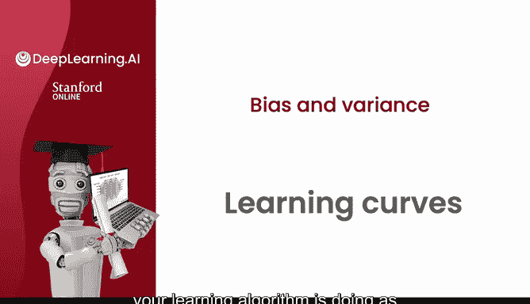
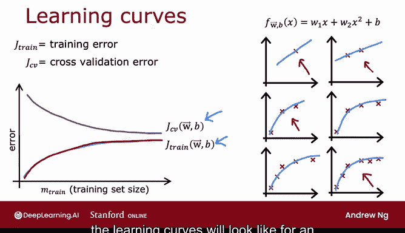
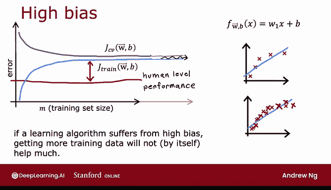
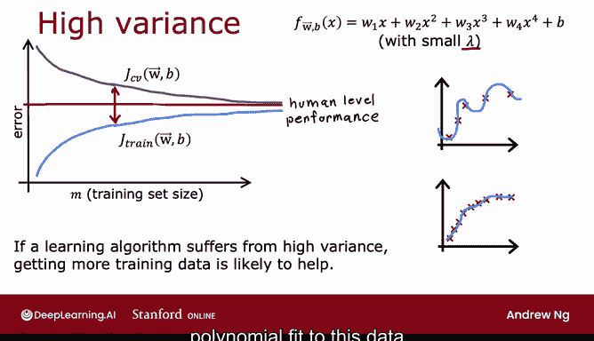

# 81：📈 学习曲线

在本节课中，我们将要学习**学习曲线**。学习曲线是一种工具，它能帮助我们理解学习算法的性能如何随着**经验量**（例如训练样本的数量）的变化而变化。通过分析学习曲线的形状，我们可以诊断模型是存在**高偏差**（欠拟合）还是**高方差**（过拟合）问题，从而指导我们采取正确的改进措施。

---

## 什么是学习曲线？📊

上一节我们介绍了偏差与方差的概念，本节中我们来看看如何用学习曲线来可视化它们。

学习曲线通常绘制两种误差随训练集大小 `M_train` 变化的曲线：
*   **训练误差 `J_train`**
*   **交叉验证误差 `J_cv`**

横轴代表训练集大小，纵轴代表误差值。随着训练样本的增加，这两种误差会呈现出特定的变化趋势。

---

## 学习曲线的典型形状

以下是学习曲线通常如何变化：

*   随着训练集规模 `M_train` 增大，模型能学到更多，因此**交叉验证误差 `J_cv` 会下降**。
*   有趣的是，**训练误差 `J_train` 通常会随着训练集增大而上升**。

### 为什么训练误差会上升？

以下是原因分析：

1.  **训练样本极少时**（例如1-3个），一个足够复杂的模型（如二次函数）可以完美拟合所有数据点，训练误差接近0。
2.  **训练样本增多时**（例如4个或更多），模型要完美拟合所有样本变得困难，拟合曲线可能会出现微小偏差，因此训练误差会上升。
3.  **训练样本非常多时**，模型几乎不可能完美拟合每一个样本，训练误差会持续上升并最终趋于平缓。

此外，交叉验证误差通常高于训练误差，因为模型参数是在训练集上优化的，因此在训练集上的表现通常会更好。

---

## 高偏差（欠拟合）的学习曲线 🔍

上一节我们了解了高偏差意味着模型过于简单。本节中我们来看看它在学习曲线上的表现。

当模型存在**高偏差**（例如用线性函数拟合非线性数据）时，学习曲线具有以下特征：

*   **训练误差 `J_train`**：初始较高，并随着样本增加而上升，但很快会**趋于平缓（达到平台期）**。因为简单的模型（如直线）其拟合能力有限，增加更多数据也不会让它发生本质改变。
*   **交叉验证误差 `J_cv`**：初始很高，随样本增加而下降，但同样会**快速趋于平缓**，且始终高于训练误差。
*   **与基准的差距**：`J_train` 和 `J_cv` 最终都会稳定在一个较高的水平，与人类水平性能等基准存在明显差距。这个差距是存在高偏差的明确信号。

### 一个重要结论

如果学习算法存在高偏差，**仅仅增加更多训练数据本身，并不会显著提升模型性能**。因为模型本身太简单，无法从额外数据中获益。因此，在投入大量精力收集数据前，应先检查是否存在高偏差问题，并考虑使用更复杂的模型或增加特征。

---

## 高方差（过拟合）的学习曲线 🎯

现在，让我们看看存在**高方差**（例如用高阶多项式且正则化很弱）时，学习曲线是什么样子。

*   **训练误差 `J_train`**：通常非常低（可能接近0，甚至低于人类水平），并随着样本增加而缓慢上升。
*   **交叉验证误差 `J_cv`**：初始非常高，远高于训练误差，两者之间存在**巨大差距**。这个巨大差距是存在高方差的典型标志。
*   **趋势**：随着训练样本增加，`J_cv` 有持续下降并逐渐接近 `J_train` 的趋势。

### 与高偏差的关键区别

对于高方差问题，**增加更多的训练数据很可能会有帮助**。因为更多的数据可以让复杂的模型学到更通用的模式，而不是仅仅记住训练集，从而使交叉验证误差有效降低，模型性能得以提升。

---

## 如何绘制与应用学习曲线 🛠️

在实际构建机器学习应用时，你可以通过以下步骤绘制学习曲线来辅助诊断：

以下是绘制学习曲线的步骤：
1.  准备不同大小的训练子集（例如，用100、200、400个样本）。
2.  分别用每个子集训练模型。
3.  计算并记录每个模型在**自身训练集**上的误差 `J_train` 和在**固定的交叉验证集**上的误差 `J_cv`。
4.  以训练集大小为横轴，误差为纵轴，绘制 `J_train` 和 `J_cv` 的曲线。

通过观察曲线的形状（是像高偏差还是高方差），你可以判断模型当前的主要问题。

> **注意**：绘制完整的学习曲线需要训练多个不同规模的模型，计算成本较高，因此在实践中并不总是进行。但理解其背后的原理，能帮助你在脑海中形成直观判断。

---

## 回顾与总结 🎓

本节课中我们一起学习了**学习曲线**这一重要诊断工具。

*   **学习曲线**描绘了训练误差 `J_train` 和交叉验证误差 `J_cv` 随训练集大小变化的趋势。
*   **高偏差（欠拟合）**：`J_train` 和 `J_cv` 都很高且较早趋于平缓，两者差距小，但与理想性能差距大。**增加数据帮助不大**，需要更复杂的模型或更多特征。
*   **高方差（过拟合）**：`J_train` 很低，`J_cv` 很高，两者差距巨大。**增加训练数据很可能有效**，此外也可以尝试增强正则化或减少特征。

理解这些模式，能帮助你有针对性地改进机器学习模型，避免盲目尝试。在接下来的视频中，我们将回到房价预测的例子，看看如何运用偏差、方差和学习曲线的知识来做出具体决策。