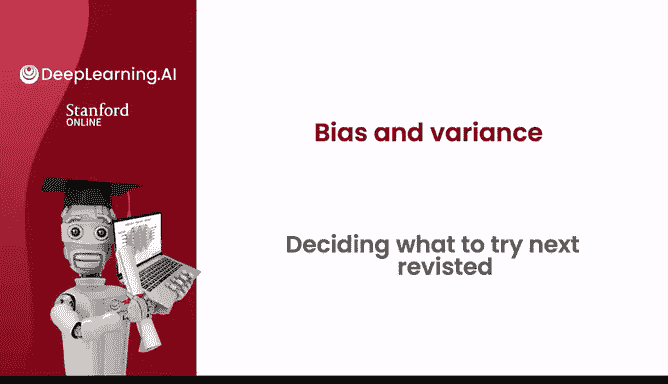

# 82：重新审视决定下一步尝试什么 🔍

在本节课中，我们将学习如何通过分析训练误差和交叉验证误差，来判断学习算法是否存在高偏差或高方差问题。掌握这一诊断方法，将帮助我们更有效地选择改进策略，从而提升算法性能。

---

## 诊断偏差与方差

上一节我们介绍了通过观察训练误差和交叉验证误差来诊断算法问题。本节中，我们来看看如何根据诊断结果，决定下一步应该尝试哪些改进措施。

通过绘制学习曲线或直接比较 `J_train`（训练误差）和 `J_CV`（交叉验证误差），你可以判断学习算法是存在高偏差（欠拟合）还是高方差（过拟合）问题。这是我训练学习算法时常规的步骤。

---

## 改进措施分类

以下是六种常见的改进学习算法性能的思路。每种方法主要针对高偏差或高方差中的某一类问题。

*   **获取更多训练样本**
*   **尝试更小的特征集**
*   **获取额外的特征**
*   **增加多项式特征**
*   **减小正则化参数 λ**
*   **增大正则化参数 λ**

事实证明，这六项措施中，每一项要么有助于解决高方差问题，要么有助于解决高偏差问题。具体来说，如果你的学习算法存在高偏差，其中三项技术会很有用；如果存在高方差，则另外三项技术会很有用。

---

## 措施与问题的对应关系

让我们逐一分析，看看每项措施对应解决哪种问题。

**1. 获取更多训练样本**
我们在上一节看到，如果你的算法存在高偏差，仅仅获取更多训练数据本身可能帮助不大。相反，如果你的算法存在高方差（例如对很小的训练集过拟合），那么获取更多训练样本会有很大帮助。因此，获取更多训练样本有助于解决**高方差**问题。

**2. 尝试更小的特征集**
有时，如果你的学习算法特征过多，会赋予算法过大的灵活性去拟合非常复杂的模型。这有点像你拥有 `x, x², x³, x⁴, x⁵` 等特征。如果你能消除其中一些，你的模型就不会那么复杂，也就不会出现高方差。因此，如果你怀疑算法中有许多不相关或冗余的特征，减少特征数量将有助于降低算法过拟合数据的灵活性。这是一种解决**高方差**问题的策略。

**3. 获取额外的特征**
这与采用更小的特征集正好相反。增加额外特征有助于解决**高偏差**问题。举一个具体例子：如果你仅根据房屋面积来预测房价，但房价实际上还很大程度上取决于卧室数量、楼层数和房龄，那么算法永远无法做得很好，除非你添加这些额外特征。这是一个高偏差问题，因为仅知道面积时，即使在训练集上也无法做好。只有当你告诉算法卧室数量、楼层数和房龄时，它才拥有足够的信息在训练集上表现得更好。

**4. 增加多项式特征**
这有点类似于增加额外特征。如果你的线性函数（直线）不能很好地拟合训练集，那么增加多项式特征可以帮助你在训练集上做得更好。帮助你在训练集上做得更好是解决**高偏差**问题的一种方法。

**5. 减小正则化参数 λ**
这意味着我们将减少对正则化项的重视，更多地关注拟合训练数据。这再次帮助你解决**高偏差**问题。

**6. 增大正则化参数 λ**
这与上一项相反。如果你过拟合了数据，增大 λ 是合理的，因为它迫使算法拟合一个更平滑、波动更小的函数。这用于解决**高方差**问题。

---

## 核心策略总结

我知道本节内容信息量很大，但希望你能掌握以下要点：

*   如果你发现算法存在**高方差**，那么两个主要的解决方法是：
    1.  获取更多训练数据。
    2.  简化你的模型。
        *   简化模型意味着：获取更小的特征集，或增大正则化参数 λ，从而降低算法拟合非常复杂、波动剧烈曲线的灵活性。

*   相反，如果你的算法存在**高偏差**，这意味着即使在训练集上表现也不佳。在这种情况下，主要的解决方法是使你的模型更强大，或赋予它更多灵活性以拟合更复杂或波动更大的函数。实现这一点的一些方法是：
    1.  提供额外特征。
    2.  添加多项式特征。
    3.  减小正则化参数 λ。

顺便提一下，如果你想知道是否可以通过减少训练集大小来解决高偏差问题，这实际上没有帮助。减少训练集大小可能会让你更好地拟合训练集，但这往往会恶化你的交叉验证误差和算法性能。因此，不要为了试图解决高偏差问题而随意丢弃训练样本。

---

## 持续实践与神经网络应用

我的一位斯坦福博士生在毕业多年后曾对我说，他在斯坦福学习时了解了偏差和方差，觉得自己懂了。但在多家公司工作多年后，他意识到偏差和方差是那种“短时间内学会，却需要一生去掌握”的概念之一。我认为偏差和方差是一个非常强大的思想。当我训练学习算法时，我几乎总是试图弄清楚它是存在偏差问题还是方差问题，而系统性地解决它的方法，我认为需要通过反复实践才能不断进步。

你会发现，理解这些概念将极大地帮助你在开发学习算法时，更有效地决定下一步该尝试什么。

我知道本节内容很多，如果你觉得信息量太大，没关系，不用担心。本周后续的实践练习和测验中，将提供更多机会来复习这些概念，让你能通过思考不同学习算法的偏差和方差来获得额外练习。所以，如果现在觉得内容很多，没关系，你将在本周晚些时候练习这些概念，并有望在那时加深对它们的理解。

在继续之前，偏差和方差在思考如何训练神经网络时也非常有用。因此，在下一节中，让我们看看这些概念如何应用于神经网络训练。让我们进入下一节。

---

**本节课中，我们一起学习了如何通过诊断高偏差或高方差问题，来有针对性地选择改进学习算法性能的措施。我们明确了六种常见改进方法各自适用的场景，并总结了解决高方差和高偏差问题的核心策略。掌握这一诊断与决策框架，是高效进行机器学习模型迭代优化的关键。**